# RailMind AI - 完整系统架构设计

> 版本：v1.0 | 日期：2026-06-27

---

## 一、全局架构图

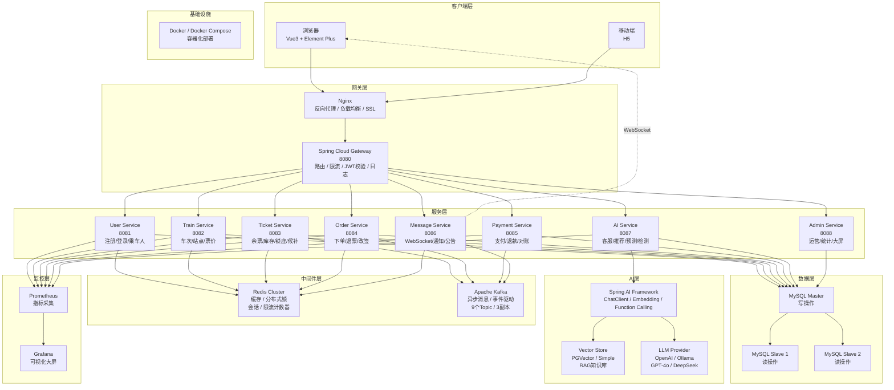
```mermaid
graph TB
    subgraph Client["客户端层"]
        Browser["浏览器<br/>Vue3 + Element Plus"]
        Mobile["移动端<br/>H5"]
    end

    subgraph GatewayLayer["网关层"]
        Nginx["Nginx<br/>反向代理 / 负载均衡 / SSL"]
        Gateway["Spring Cloud Gateway<br/>8080<br/>路由 / 限流 / JWT校验 / 日志"]
    end

    subgraph ServiceLayer["服务层"]
        UserSvc["User Service<br/>8081<br/>注册/登录/乘车人"]
        TrainSvc["Train Service<br/>8082<br/>车次/站点/票价"]
        TicketSvc["Ticket Service<br/>8083<br/>余票/库存/锁座/候补"]
        OrderSvc["Order Service<br/>8084<br/>下单/退票/改签"]
        PaySvc["Payment Service<br/>8085<br/>支付/退款/对账"]
        MsgSvc["Message Service<br/>8086<br/>WebSocket/通知/公告"]
        AiSvc["AI Service<br/>8087<br/>客服/推荐/预测/检测"]
        AdminSvc["Admin Service<br/>8088<br/>运营/统计/大屏"]
    end

    subgraph Middleware["中间件层"]
        Redis["Redis Cluster<br/>缓存 / 分布式锁<br/>会话 / 限流计数器"]
        Kafka["Apache Kafka<br/>异步消息 / 事件驱动<br/>9个Topic / 3副本"]
    end

    subgraph DataLayer["数据层"]
        MySQLMaster["MySQL Master<br/>写操作"]
        MySQLSlave1["MySQL Slave 1<br/>读操作"]
        MySQLSlave2["MySQL Slave 2<br/>读操作"]
    end

    subgraph AILayer["AI层"]
        SpringAI["Spring AI Framework<br/>ChatClient / Embedding / Function Calling"]
        VectorStore["Vector Store<br/>PGVector / Simple<br/>RAG知识库"]
        LLM["LLM Provider<br/>OpenAI / Ollama<br/>GPT-4o / DeepSeek"]
    end

    subgraph Monitor["监控层"]
        Prometheus["Prometheus<br/>指标采集"]
        Grafana["Grafana<br/>可视化大屏"]
    end

    subgraph Infra["基础设施"]
        Docker["Docker / Docker Compose<br/>容器化部署"]
    end

    Browser --> Nginx
    Mobile --> Nginx
    Nginx --> Gateway

    Gateway --> UserSvc
    Gateway --> TrainSvc
    Gateway --> TicketSvc
    Gateway --> OrderSvc
    Gateway --> PaySvc
    Gateway --> MsgSvc
    Gateway --> AiSvc
    Gateway --> AdminSvc

    UserSvc --> Redis
    TrainSvc --> Redis
    TicketSvc --> Redis
    TicketSvc --> Kafka
    OrderSvc --> Redis
    OrderSvc --> Kafka
    PaySvc --> Kafka
    MsgSvc --> Redis
    MsgSvc --> Kafka
    AiSvc --> SpringAI

    UserSvc --> MySQLMaster
    TrainSvc --> MySQLMaster
    TicketSvc --> MySQLMaster
    OrderSvc --> MySQLMaster
    PaySvc --> MySQLMaster
    AiSvc --> MySQLMaster
    AdminSvc --> MySQLMaster

    MySQLMaster --> MySQLSlave1
    MySQLMaster --> MySQLSlave2

    SpringAI --> VectorStore
    SpringAI --> LLM

    UserSvc --> Prometheus
    TrainSvc --> Prometheus
    TicketSvc --> Prometheus
    OrderSvc --> Prometheus
    PaySvc --> Prometheus
    AiSvc --> Prometheus
    Prometheus --> Grafana

    MsgSvc -.->|WebSocket| Browser
```

---

## 二、分层架构详解

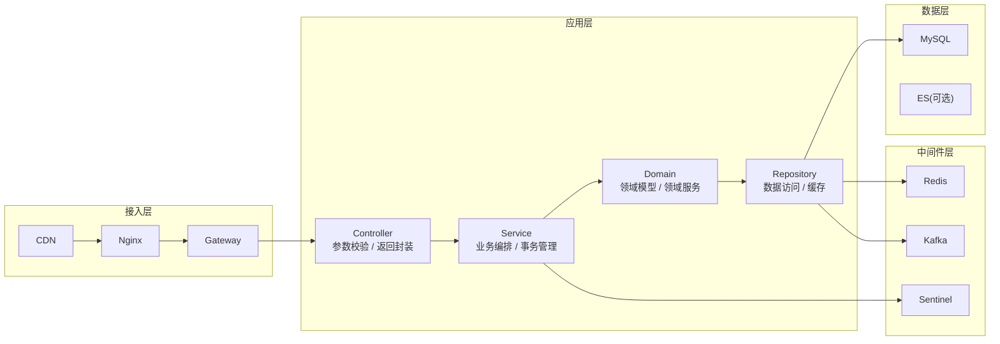
```mermaid
graph LR
    subgraph Layer1["接入层"]
        A1["CDN"] --> A2["Nginx"]
        A2 --> A3["Gateway"]
    end

    subgraph Layer2["应用层"]
        B1["Controller<br/>参数校验 / 返回封装"]
        B2["Service<br/>业务编排 / 事务管理"]
        B3["Domain<br/>领域模型 / 领域服务"]
        B4["Repository<br/>数据访问 / 缓存"]
    end

    subgraph Layer3["中间件层"]
        C1["Redis"]
        C2["Kafka"]
        C3["Sentinel"]
    end

    subgraph Layer4["数据层"]
        D1["MySQL"]
        D2["ES(可选)"]
    end

    A3 --> B1
    B1 --> B2
    B2 --> B3
    B3 --> B4
    B4 --> C1
    B4 --> C2
    B2 --> C3
    B4 --> D1
```

---

## 三、请求流程

### 3.1 通用请求链路

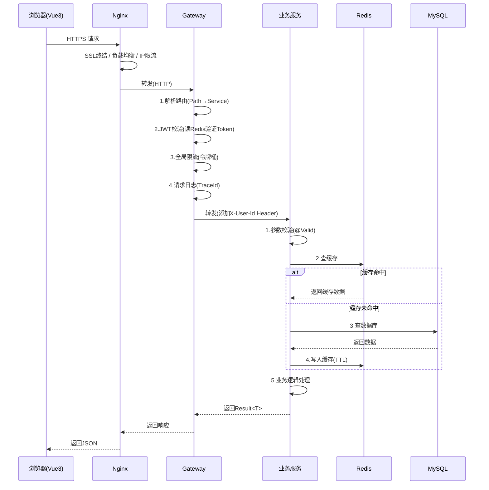
```mermaid
sequenceDiagram
    participant C as 浏览器(Vue3)
    participant N as Nginx
    participant G as Gateway
    participant S as 业务服务
    participant R as Redis
    participant M as MySQL

    C->>N: HTTPS 请求
    N->>N: SSL终结 / 负载均衡 / IP限流
    N->>G: 转发(HTTP)

    G->>G: 1.解析路由(Path→Service)
    G->>G: 2.JWT校验(读Redis验证Token)
    G->>G: 3.全局限流(令牌桶)
    G->>G: 4.请求日志(TraceId)

    G->>S: 转发(添加X-User-Id Header)

    S->>S: 1.参数校验(@Valid)
    S->>R: 2.查缓存
    alt 缓存命中
        R-->>S: 返回缓存数据
    else 缓存未命中
        S->>M: 3.查数据库
        M-->>S: 返回数据
        S->>R: 4.写入缓存(TTL)
    end
    S->>S: 5.业务逻辑处理
    S-->>G: 返回Result<T>
    G-->>N: 返回响应
    N-->>C: 返回JSON
```

### 3.2 认证流程

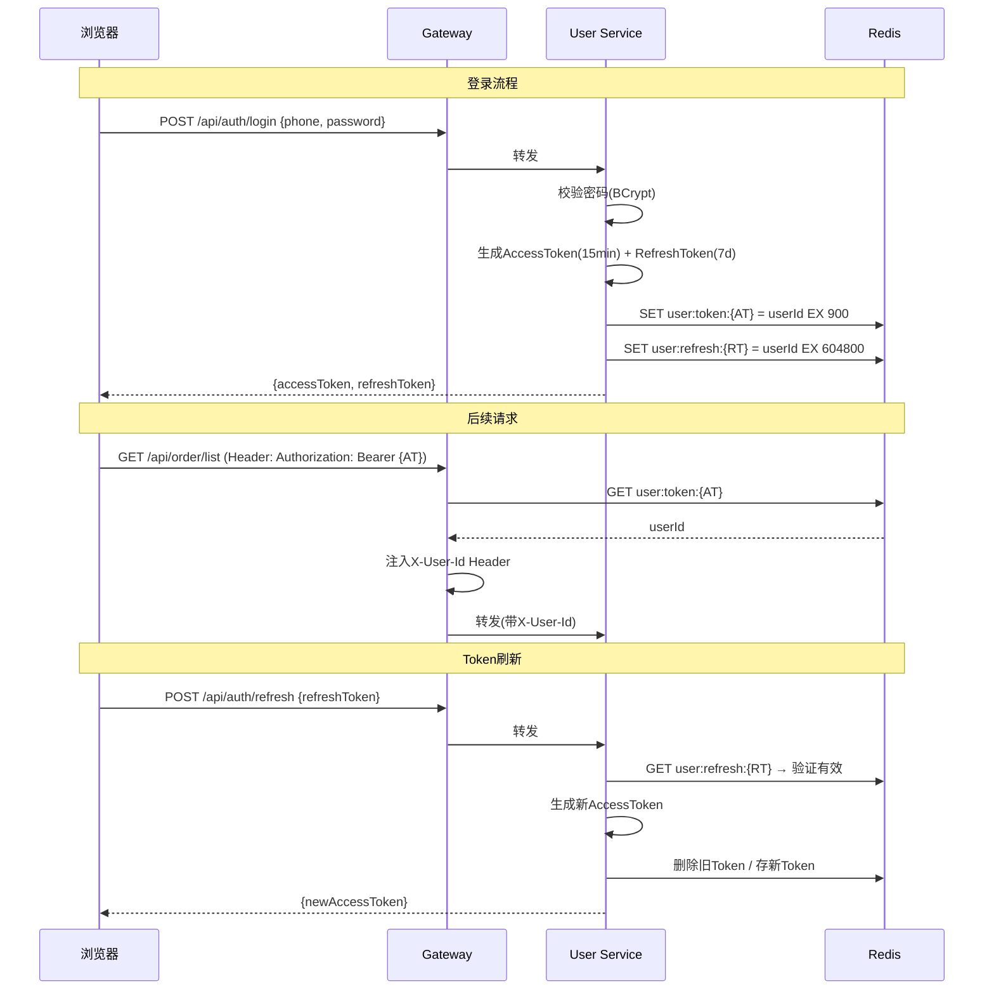
```mermaid
sequenceDiagram
    participant C as 浏览器
    participant G as Gateway
    participant U as User Service
    participant R as Redis

    Note over C,R: 登录流程
    C->>G: POST /api/auth/login {phone, password}
    G->>U: 转发
    U->>U: 校验密码(BCrypt)
    U->>U: 生成AccessToken(15min) + RefreshToken(7d)
    U->>R: SET user:token:{AT} = userId EX 900
    U->>R: SET user:refresh:{RT} = userId EX 604800
    U-->>C: {accessToken, refreshToken}

    Note over C,R: 后续请求
    C->>G: GET /api/order/list (Header: Authorization: Bearer {AT})
    G->>R: GET user:token:{AT}
    R-->>G: userId
    G->>G: 注入X-User-Id Header
    G->>U: 转发(带X-User-Id)

    Note over C,R: Token刷新
    C->>G: POST /api/auth/refresh {refreshToken}
    G->>U: 转发
    U->>R: GET user:refresh:{RT} → 验证有效
    U->>U: 生成新AccessToken
    U->>R: 删除旧Token / 存新Token
    U-->>C: {newAccessToken}
```

---

## 四、抢票流程（核心高并发）

### 4.1 流程总览

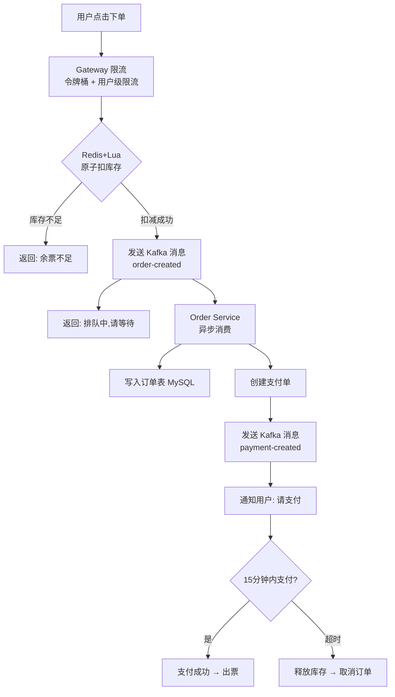
```mermaid
graph TB
    A["用户点击下单"] --> B["Gateway 限流<br/>令牌桶 + 用户级限流"]
    B --> C{"Redis+Lua<br/>原子扣库存"}
    C -->|库存不足| D["返回: 余票不足"]
    C -->|扣减成功| E["发送 Kafka 消息<br/>order-created"]
    E --> F["返回: 排队中,请等待"]
    E --> G["Order Service<br/>异步消费"]
    G --> H["写入订单表 MySQL"]
    G --> I["创建支付单"]
    I --> J["发送 Kafka 消息<br/>payment-created"]
    J --> K["通知用户: 请支付"]
    K --> L{"15分钟内支付?"}
    L -->|是| M["支付成功 → 出票"]
    L -->|超时| N["释放库存 → 取消订单"]
```

### 4.2 抢票详细时序

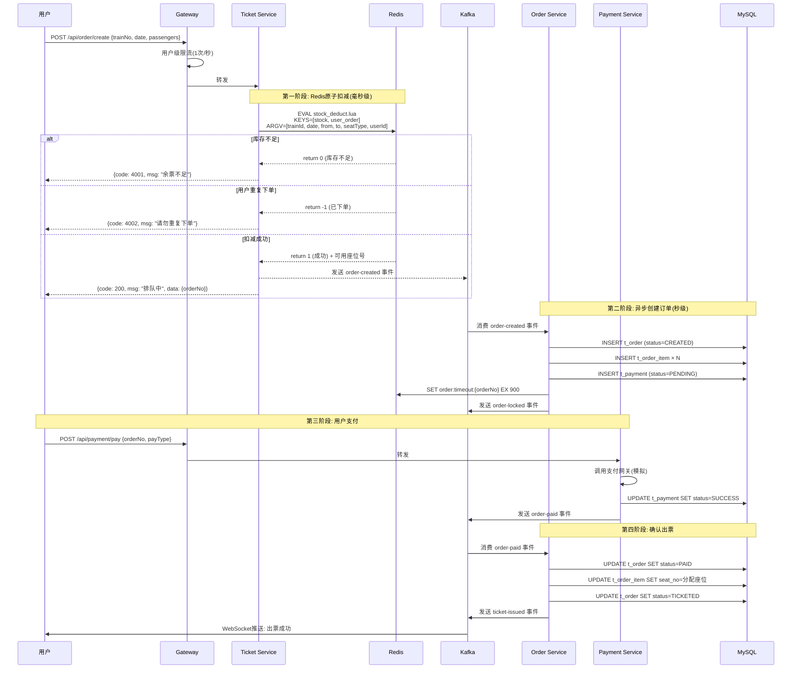
```mermaid
sequenceDiagram
    participant U as 用户
    participant G as Gateway
    participant T as Ticket Service
    participant R as Redis
    participant K as Kafka
    participant O as Order Service
    participant P as Payment Service
    participant DB as MySQL

    U->>G: POST /api/order/create {trainNo, date, passengers}
    G->>G: 用户级限流(1次/秒)
    G->>T: 转发

    Note over T,R: 第一阶段: Redis原子扣减(毫秒级)
    T->>R: EVAL stock_deduct.lua<br/>KEYS=[stock, user_order]<br/>ARGV=[trainId, date, from, to, seatType, userId]

    alt 库存不足
        R-->>T: return 0 (库存不足)
        T-->>U: {code: 4001, msg: "余票不足"}
    else 用户重复下单
        R-->>T: return -1 (已下单)
        T-->>U: {code: 4002, msg: "请勿重复下单"}
    else 扣减成功
        R-->>T: return 1 (成功) + 可用座位号
        T-->>K: 发送 order-created 事件
        T-->>U: {code: 200, msg: "排队中", data: {orderNo}}
    end

    Note over O,DB: 第二阶段: 异步创建订单(秒级)
    K->>O: 消费 order-created 事件
    O->>DB: INSERT t_order (status=CREATED)
    O->>DB: INSERT t_order_item × N
    O->>DB: INSERT t_payment (status=PENDING)
    O->>R: SET order:timeout:{orderNo} EX 900
    O->>K: 发送 order-locked 事件

    Note over U,P: 第三阶段: 用户支付
    U->>G: POST /api/payment/pay {orderNo, payType}
    G->>P: 转发
    P->>P: 调用支付网关(模拟)
    P->>DB: UPDATE t_payment SET status=SUCCESS
    P->>K: 发送 order-paid 事件

    Note over O,DB: 第四阶段: 确认出票
    K->>O: 消费 order-paid 事件
    O->>DB: UPDATE t_order SET status=PAID
    O->>DB: UPDATE t_order_item SET seat_no=分配座位
    O->>DB: UPDATE t_order SET status=TICKETED
    O->>K: 发送 ticket-issued 事件
    K->>U: WebSocket推送: 出票成功
```

### 4.3 Redis Lua 扣库存脚本

```lua
-- stock_deduct.lua
-- KEYS[1] = ticket:stock:{trainId}:{date}:{from}:{to}:{seatType}
-- KEYS[2] = user:ordered:{trainId}:{date}:{userId}
-- ARGV[1] = userId
-- ARGV[2] = expireSeconds (900)

local stock = tonumber(redis.call('GET', KEYS[1]))
if stock == nil then
    return -2  -- 库存Key不存在，系统异常
end

if stock <= 0 then
    return 0   -- 库存不足
end

local ordered = redis.call('GET', KEYS[2])
if ordered then
    return -1  -- 用户已下单(防重复)
end

redis.call('DECR', KEYS[1])
redis.call('SETEX', KEYS[2], ARGV[2], ARGV[1])
return 1  -- 扣减成功
```

### 4.4 超时取消流程

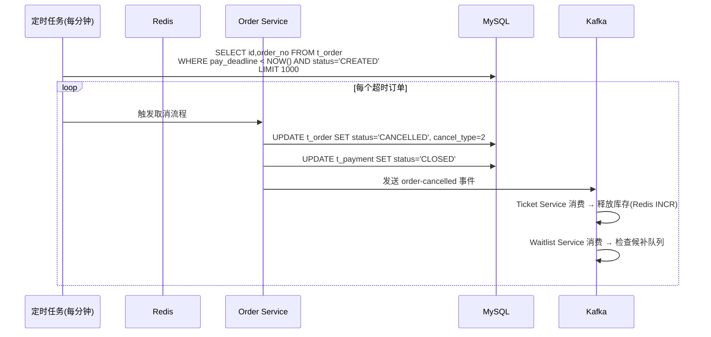
```mermaid
sequenceDiagram
    participant Job as 定时任务(每分钟)
    participant R as Redis
    participant O as Order Service
    participant DB as MySQL
    participant K as Kafka

    Job->>DB: SELECT id,order_no FROM t_order<br/>WHERE pay_deadline < NOW() AND status='CREATED'<br/>LIMIT 1000

    loop 每个超时订单
        Job->>O: 触发取消流程
        O->>DB: UPDATE t_order SET status='CANCELLED', cancel_type=2
        O->>DB: UPDATE t_payment SET status='CLOSED'
        O->>K: 发送 order-cancelled 事件
        K->>K: Ticket Service 消费 → 释放库存(Redis INCR)
        K->>K: Waitlist Service 消费 → 检查候补队列
    end
```

---

## 五、AI 流程

### 5.1 AI 整体架构

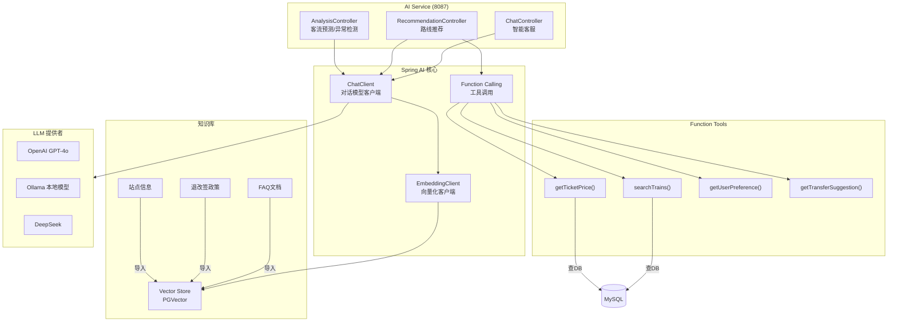
```mermaid
graph TB
    subgraph AI["AI Service (8087)"]
        Chat["ChatController<br/>智能客服"]
        Recommend["RecommendationController<br/>路线推荐"]
        Analysis["AnalysisController<br/>客流预测/异常检测"]
    end

    subgraph Core["Spring AI 核心"]
        ChatClient["ChatClient<br/>对话模型客户端"]
        EmbedClient["EmbeddingClient<br/>向量化客户端"]
        FuncCall["Function Calling<br/>工具调用"]
    end

    subgraph Tools["Function Tools"]
        T1["searchTrains()"]
        T2["getTicketPrice()"]
        T3["getUserPreference()"]
        T4["getTransferSuggestion()"]
    end

    subgraph Knowledge["知识库"]
        VS["Vector Store<br/>PGVector"]
        FAQ["FAQ文档"]
        Policy["退改签政策"]
        Station["站点信息"]
    end

    subgraph LLMProviders["LLM 提供者"]
        OpenAI["OpenAI GPT-4o"]
        Ollama["Ollama 本地模型"]
        DeepSeek["DeepSeek"]
    end

    Chat --> ChatClient
    Recommend --> ChatClient
    Recommend --> FuncCall
    Analysis --> ChatClient

    ChatClient --> EmbedClient
    ChatClient --> LLMProviders

    FuncCall --> T1
    FuncCall --> T2
    FuncCall --> T3
    FuncCall --> T4

    T1 -->|查DB| TrainDB[(MySQL)]
    T2 -->|查DB| TrainDB

    EmbedClient --> VS
    FAQ -->|导入| VS
    Policy -->|导入| VS
    Station -->|导入| VS
```

### 5.2 智能客服流程 (RAG)

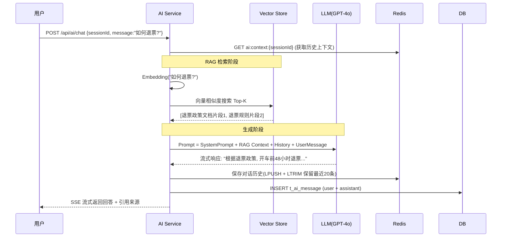
```mermaid
sequenceDiagram
    participant U as 用户
    participant AI as AI Service
    participant VS as Vector Store
    participant LLM as LLM(GPT-4o)
    participant Redis as Redis

    U->>AI: POST /api/ai/chat {sessionId, message:"如何退票?"}

    AI->>Redis: GET ai:context:{sessionId} (获取历史上下文)

    Note over AI,VS: RAG 检索阶段
    AI->>AI: Embedding("如何退票?")
    AI->>VS: 向量相似度搜索 Top-K
    VS-->>AI: [退票政策文档片段1, 退票规则片段2]

    Note over AI,LLM: 生成阶段
    AI->>LLM: Prompt = SystemPrompt + RAG Context + History + UserMessage
    LLM-->>AI: 流式响应: "根据退票政策, 开车前48小时退票..."

    AI->>Redis: 保存对话历史(LPUSH + LTRIM 保留最近20条)
    AI->>DB: INSERT t_ai_message (user + assistant)

    AI-->>U: SSE 流式返回回答 + 引用来源
```

### 5.3 智能路线推荐流程 (Function Calling)

```mermaid
sequenceDiagram
    participant U as 用户
    participant AI as AI Service
    participant LLM as LLM
    participant DB as MySQL

    U->>AI: POST /api/ai/recommend {from:"北京", to:"上海", date:"2026-07-15"}

    AI->>LLM: Prompt + 可用工具列表<br/>[searchTrains, getTicketPrice, getTransferSuggestion]

    LLM->>AI: function_call: searchTrains(from="BJP", to="SHH", date="2026-07-15")
    AI->>DB: 查询可用列车(直达+中转)
    DB-->>AI: [G1, G3, G5, D313...]

    AI->>LLM: function_result: 列车列表
    LLM->>AI: function_call: getTicketPrice(trainNo="G1", seatType="ZE")
    AI->>DB: 查询票价
    DB-->>AI: ¥553

    AI->>LLM: function_result: 票价信息

    LLM-->>AI: 推荐结果JSON<br/>{
        "直达方案": [{train:"G1", time:"4h30m", price:553, 余票:"充足"}],
        "中转方案": [{train1:"G101→南京南", train2:"G7→上海", ...}],
        "建议": "G1性价比最高，建议选二等座"
    }

    AI-->>U: 推荐结果
```

### 5.4 AI 模型切换

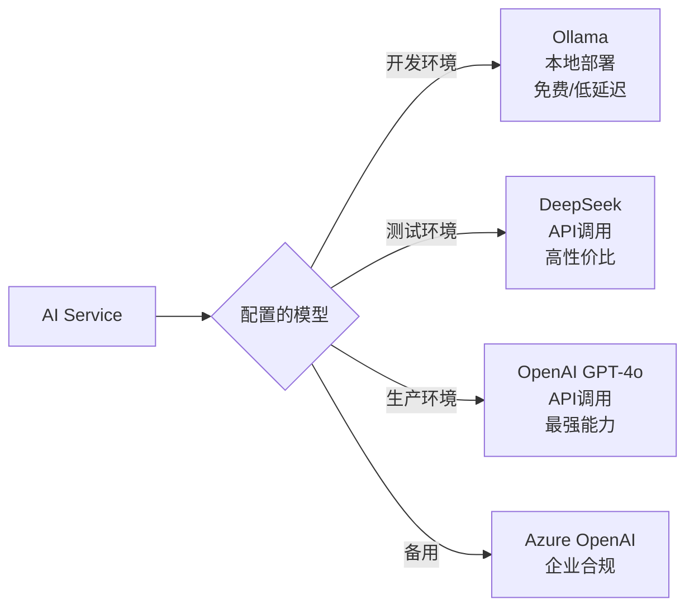
```mermaid
graph LR
    A["AI Service"] --> B{"配置的模型"}
    B -->|开发环境| C["Ollama<br/>本地部署<br/>免费/低延迟"]
    B -->|测试环境| D["DeepSeek<br/>API调用<br/>高性价比"]
    B -->|生产环境| E["OpenAI GPT-4o<br/>API调用<br/>最强能力"]
    B -->|备用| F["Azure OpenAI<br/>企业合规"]
```

---

## 六、支付流程

### 6.1 支付时序图

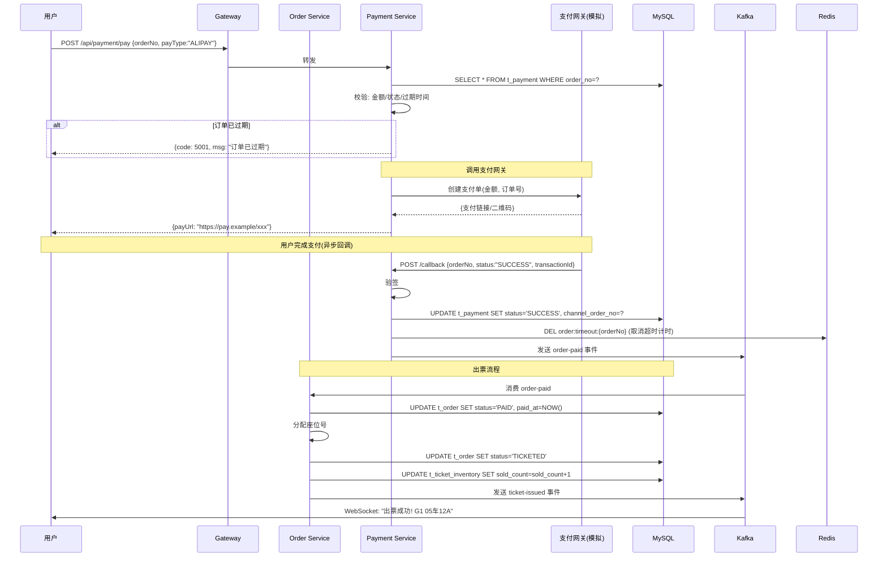
```mermaid
sequenceDiagram
    participant U as 用户
    participant G as Gateway
    participant O as Order Service
    participant P as Payment Service
    participant PayGW as 支付网关(模拟)
    participant DB as MySQL
    participant K as Kafka
    participant R as Redis

    U->>G: POST /api/payment/pay {orderNo, payType:"ALIPAY"}
    G->>P: 转发

    P->>DB: SELECT * FROM t_payment WHERE order_no=?
    P->>P: 校验: 金额/状态/过期时间

    alt 订单已过期
        P-->>U: {code: 5001, msg: "订单已过期"}
    end

    Note over P,PayGW: 调用支付网关
    P->>PayGW: 创建支付单(金额, 订单号)
    PayGW-->>P: {支付链接/二维码}

    P-->>U: {payUrl: "https://pay.example/xxx"}

    Note over U,PayGW: 用户完成支付(异步回调)
    PayGW->>P: POST /callback {orderNo, status:"SUCCESS", transactionId}
    P->>P: 验签
    P->>DB: UPDATE t_payment SET status='SUCCESS', channel_order_no=?
    P->>R: DEL order:timeout:{orderNo} (取消超时计时)
    P->>K: 发送 order-paid 事件

    Note over O,DB: 出票流程
    K->>O: 消费 order-paid
    O->>DB: UPDATE t_order SET status='PAID', paid_at=NOW()
    O->>O: 分配座位号
    O->>DB: UPDATE t_order SET status='TICKETED'
    O->>DB: UPDATE t_ticket_inventory SET sold_count=sold_count+1
    O->>K: 发送 ticket-issued 事件
    K->>U: WebSocket: "出票成功! G1 05车12A"
```

### 6.2 退款流程

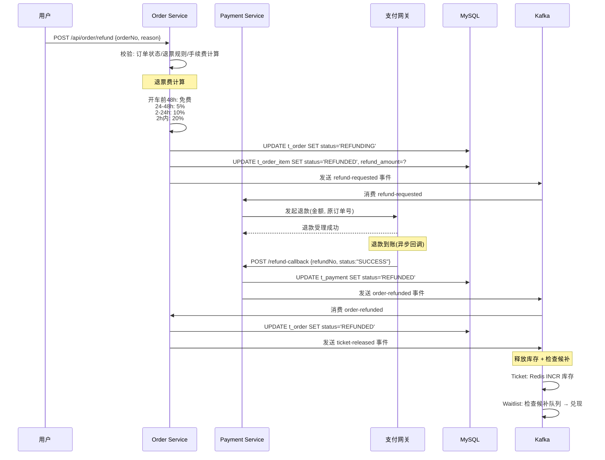
```mermaid
sequenceDiagram
    participant U as 用户
    participant O as Order Service
    participant P as Payment Service
    participant PayGW as 支付网关
    participant DB as MySQL
    participant K as Kafka

    U->>O: POST /api/order/refund {orderNo, reason}
    O->>O: 校验: 订单状态/退票规则/手续费计算

    Note over O: 退票费计算
    O->>O: 开车前48h: 免费<br/>24-48h: 5%<br/>2-24h: 10%<br/>2h内: 20%

    O->>DB: UPDATE t_order SET status='REFUNDING'
    O->>DB: UPDATE t_order_item SET status='REFUNDED', refund_amount=?
    O->>K: 发送 refund-requested 事件

    K->>P: 消费 refund-requested
    P->>PayGW: 发起退款(金额, 原订单号)
    PayGW-->>P: 退款受理成功

    Note over PayGW: 退款到账(异步回调)
    PayGW->>P: POST /refund-callback {refundNo, status:"SUCCESS"}
    P->>DB: UPDATE t_payment SET status='REFUNDED'
    P->>K: 发送 order-refunded 事件

    K->>O: 消费 order-refunded
    O->>DB: UPDATE t_order SET status='REFUNDED'
    O->>K: 发送 ticket-released 事件

    Note over K: 释放库存 + 检查候补
    K->>K: Ticket: Redis INCR 库存
    K->>K: Waitlist: 检查候补队列 → 兑现
```

---

## 七、消息流

### 7.1 Kafka Topic 全景

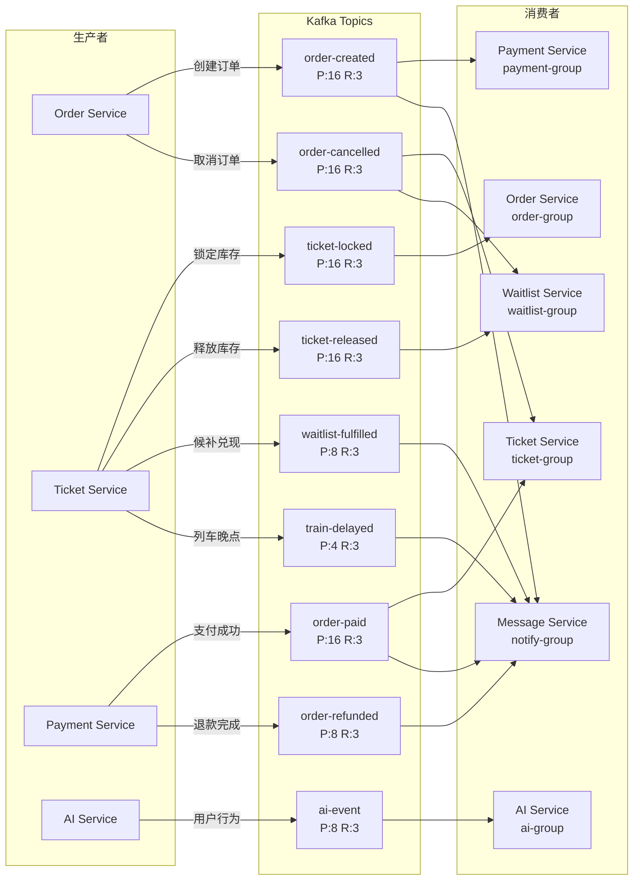
```mermaid
graph LR
    subgraph Producers["生产者"]
        P1["Order Service"]
        P2["Ticket Service"]
        P3["Payment Service"]
        P4["AI Service"]
    end

    subgraph Topics["Kafka Topics"]
        T1["order-created<br/>P:16 R:3"]
        T2["order-paid<br/>P:16 R:3"]
        T3["order-cancelled<br/>P:16 R:3"]
        T4["order-refunded<br/>P:8 R:3"]
        T5["ticket-locked<br/>P:16 R:3"]
        T6["ticket-released<br/>P:16 R:3"]
        T7["waitlist-fulfilled<br/>P:8 R:3"]
        T8["train-delayed<br/>P:4 R:3"]
        T9["ai-event<br/>P:8 R:3"]
    end

    subgraph Consumers["消费者"]
        C1["Payment Service<br/>payment-group"]
        C2["Order Service<br/>order-group"]
        C3["Ticket Service<br/>ticket-group"]
        C4["Waitlist Service<br/>waitlist-group"]
        C5["Message Service<br/>notify-group"]
        C6["AI Service<br/>ai-group"]
    end

    P1 -->|创建订单| T1
    P3 -->|支付成功| T2
    P1 -->|取消订单| T3
    P3 -->|退款完成| T4
    P2 -->|锁定库存| T5
    P2 -->|释放库存| T6
    P2 -->|候补兑现| T7
    P2 -->|列车晚点| T8
    P4 -->|用户行为| T9

    T1 --> C1
    T1 --> C5
    T2 --> C3
    T2 --> C5
    T3 --> C3
    T3 --> C4
    T4 --> C5
    T5 --> C2
    T6 --> C4
    T7 --> C5
    T8 --> C5
    T9 --> C6
```

### 7.2 消息流转时序

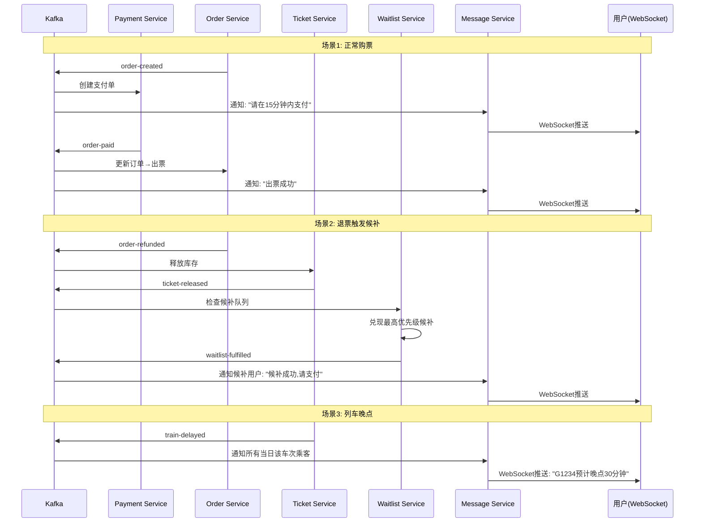
```mermaid
sequenceDiagram
    participant K as Kafka
    participant Pay as Payment Service
    participant Ord as Order Service
    participant Tkt as Ticket Service
    participant Wt as Waitlist Service
    participant Msg as Message Service
    participant U as 用户(WebSocket)

    Note over K,U: 场景1: 正常购票
    Ord->>K: order-created
    K->>Pay: 创建支付单
    K->>Msg: 通知: "请在15分钟内支付"
    Msg->>U: WebSocket推送

    Pay->>K: order-paid
    K->>Ord: 更新订单→出票
    K->>Msg: 通知: "出票成功"
    Msg->>U: WebSocket推送

    Note over K,U: 场景2: 退票触发候补
    Ord->>K: order-refunded
    K->>Tkt: 释放库存
    Tkt->>K: ticket-released
    K->>Wt: 检查候补队列
    Wt->>Wt: 兑现最高优先级候补
    Wt->>K: waitlist-fulfilled
    K->>Msg: 通知候补用户: "候补成功,请支付"
    Msg->>U: WebSocket推送

    Note over K,U: 场景3: 列车晚点
    Tkt->>K: train-delayed
    K->>Msg: 通知所有当日该车次乘客
    Msg->>U: WebSocket推送: "G1234预计晚点30分钟"
```

### 7.3 WebSocket 连接管理

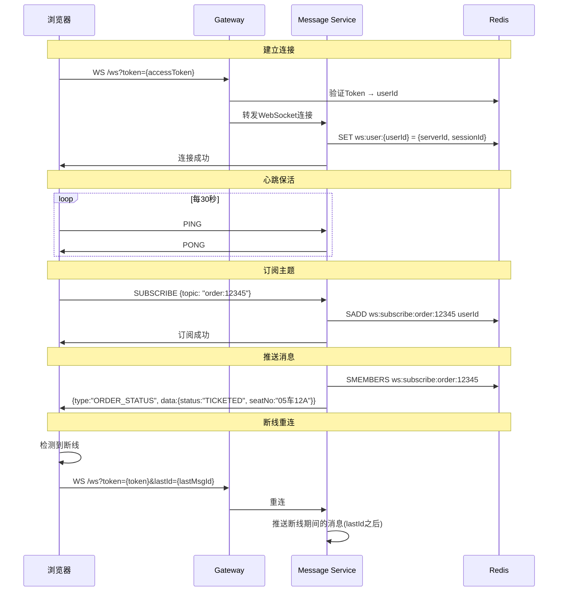
```mermaid
sequenceDiagram
    participant U as 浏览器
    participant GW as Gateway
    participant Msg as Message Service
    participant R as Redis

    Note over U,R: 建立连接
    U->>GW: WS /ws?token={accessToken}
    GW->>R: 验证Token → userId
    GW->>Msg: 转发WebSocket连接
    Msg->>R: SET ws:user:{userId} = {serverId, sessionId}
    Msg->>U: 连接成功

    Note over U,R: 心跳保活
    loop 每30秒
        U->>Msg: PING
        Msg->>U: PONG
    end

    Note over U,R: 订阅主题
    U->>Msg: SUBSCRIBE {topic: "order:12345"}
    Msg->>R: SADD ws:subscribe:order:12345 userId
    Msg->>U: 订阅成功

    Note over U,R: 推送消息
    Msg->>R: SMEMBERS ws:subscribe:order:12345
    Msg->>U: {type:"ORDER_STATUS", data:{status:"TICKETED", seatNo:"05车12A"}}

    Note over U,R: 断线重连
    U->>U: 检测到断线
    U->>GW: WS /ws?token={token}&lastId={lastMsgId}
    GW->>Msg: 重连
    Msg->>Msg: 推送断线期间的消息(lastId之后)
```

---

## 八、缓存架构

### 8.1 三级缓存体系

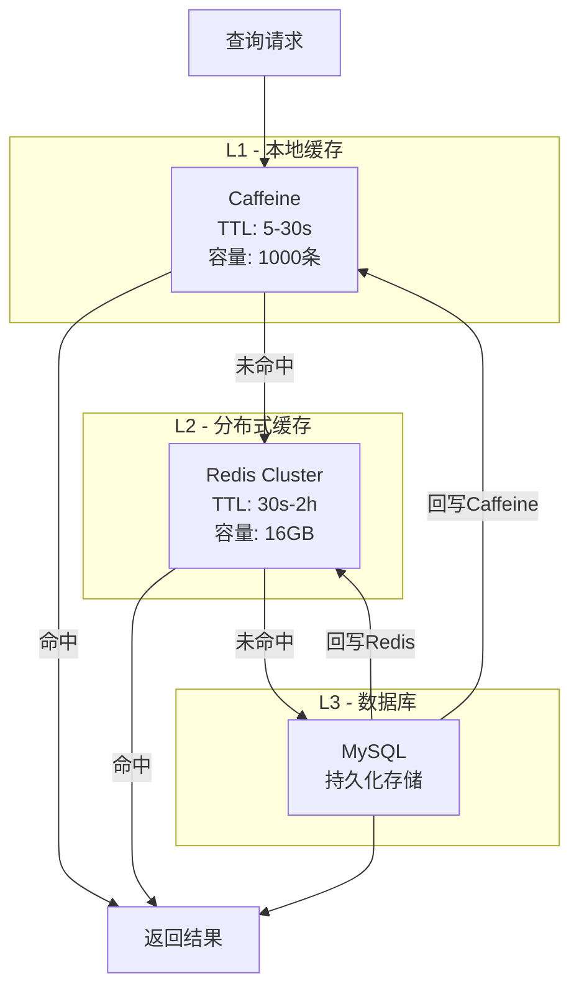
```mermaid
graph TB
    subgraph L1["L1 - 本地缓存"]
        Caffeine["Caffeine<br/>TTL: 5-30s<br/>容量: 1000条"]
    end

    subgraph L2["L2 - 分布式缓存"]
        Redis["Redis Cluster<br/>TTL: 30s-2h<br/>容量: 16GB"]
    end

    subgraph L3["L3 - 数据库"]
        MySQL["MySQL<br/>持久化存储"]
    end

    Request["查询请求"] --> Caffeine
    Caffeine -->|命中| Response["返回结果"]
    Caffeine -->|未命中| Redis
    Redis -->|命中| Response
    Redis -->|未命中| MySQL
    MySQL -->|回写Redis| Redis
    MySQL -->|回写Caffeine| Caffeine
    MySQL --> Response
```

### 8.2 Redis 数据分布

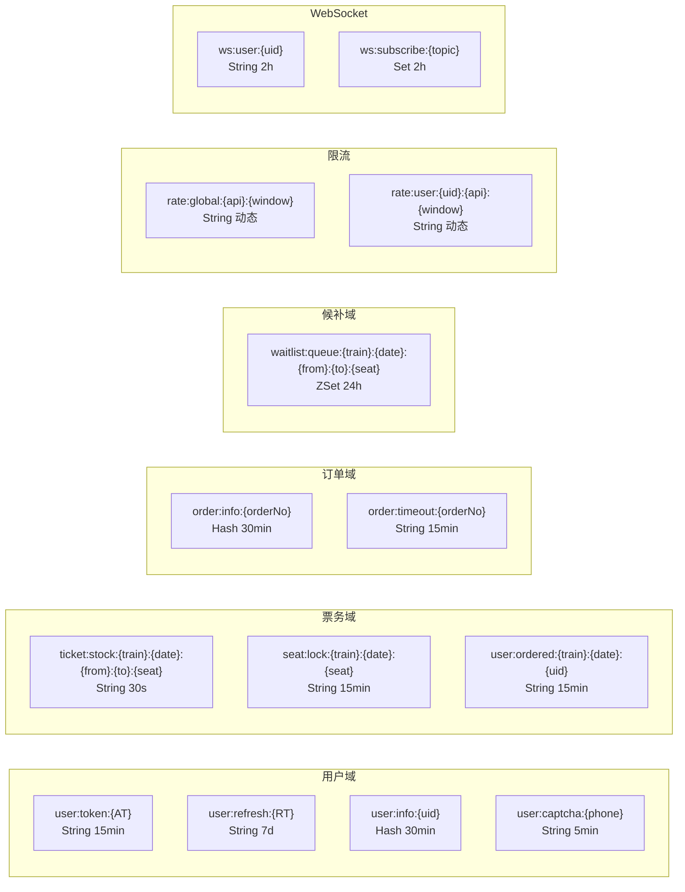
```mermaid
graph LR
    subgraph UserDomain["用户域"]
        U1["user:token:{AT}<br/>String 15min"]
        U2["user:refresh:{RT}<br/>String 7d"]
        U3["user:info:{uid}<br/>Hash 30min"]
        U4["user:captcha:{phone}<br/>String 5min"]
    end

    subgraph TicketDomain["票务域"]
        T1["ticket:stock:{train}:{date}:{from}:{to}:{seat}<br/>String 30s"]
        T2["seat:lock:{train}:{date}:{seat}<br/>String 15min"]
        T3["user:ordered:{train}:{date}:{uid}<br/>String 15min"]
    end

    subgraph OrderDomain["订单域"]
        O1["order:info:{orderNo}<br/>Hash 30min"]
        O2["order:timeout:{orderNo}<br/>String 15min"]
    end

    subgraph WaitlistDomain["候补域"]
        W1["waitlist:queue:{train}:{date}:{from}:{to}:{seat}<br/>ZSet 24h"]
    end

    subgraph RateLimit["限流"]
        R1["rate:global:{api}:{window}<br/>String 动态"]
        R2["rate:user:{uid}:{api}:{window}<br/>String 动态"]
    end

    subgraph WebSocket["WebSocket"]
        WS1["ws:user:{uid}<br/>String 2h"]
        WS2["ws:subscribe:{topic}<br/>Set 2h"]
    end
```

---

## 九、Docker 部署架构

### 9.1 容器编排

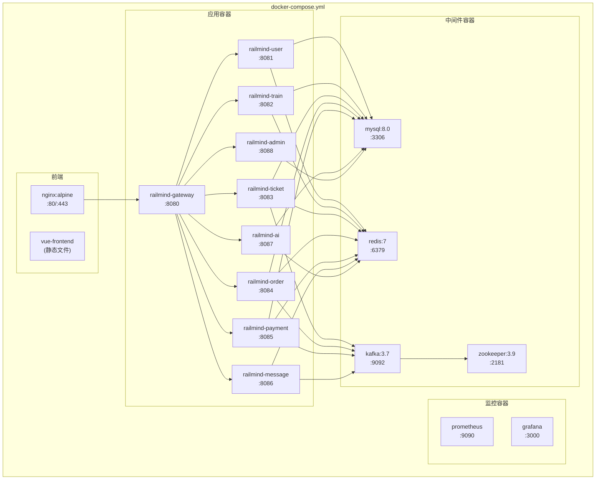
```mermaid
graph TB
    subgraph DockerCompose["docker-compose.yml"]
        subgraph AppContainers["应用容器"]
            GW["railmind-gateway<br/>:8080"]
            US["railmind-user<br/>:8081"]
            TS["railmind-train<br/>:8082"]
            TK["railmind-ticket<br/>:8083"]
            OS["railmind-order<br/>:8084"]
            PS["railmind-payment<br/>:8085"]
            MS["railmind-message<br/>:8086"]
            AS["railmind-ai<br/>:8087"]
            AD["railmind-admin<br/>:8088"]
        end

        subgraph MiddlewareContainers["中间件容器"]
            MySQL_C["mysql:8.0<br/>:3306"]
            Redis_C["redis:7<br/>:6379"]
            Kafka_C["kafka:3.7<br/>:9092"]
            ZK["zookeeper:3.9<br/>:2181"]
        end

        subgraph MonitorContainers["监控容器"]
            Prom["prometheus<br/>:9090"]
            Graf["grafana<br/>:3000"]
        end

        subgraph Frontend["前端"]
            Nginx_C["nginx:alpine<br/>:80/:443"]
            Vue["vue-frontend<br/>(静态文件)"]
        end
    end

    Nginx_C --> GW
    GW --> US & TS & TK & OS & PS & MS & AS & AD
    US & TS & TK & OS & PS & AS & AD --> MySQL_C
    US & TS & TK & OS & PS & MS & AS --> Redis_C
    TK & OS & PS & MS --> Kafka_C
    Kafka_C --> ZK
```

### 9.2 网络拓扑

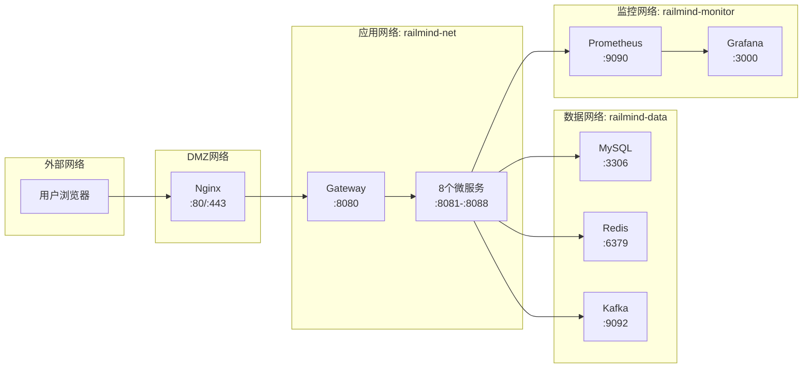
```mermaid
graph LR
    subgraph External["外部网络"]
        Client["用户浏览器"]
    end

    subgraph DMZ["DMZ网络"]
        Nginx["Nginx<br/>:80/:443"]
    end

    subgraph AppNetwork["应用网络: railmind-net"]
        Gateway["Gateway<br/>:8080"]
        Services["8个微服务<br/>:8081-:8088"]
    end

    subgraph DataNetwork["数据网络: railmind-data"]
        MySQL["MySQL<br/>:3306"]
        Redis["Redis<br/>:6379"]
        Kafka["Kafka<br/>:9092"]
    end

    subgraph MonitorNetwork["监控网络: railmind-monitor"]
        Prometheus["Prometheus<br/>:9090"]
        Grafana["Grafana<br/>:3000"]
    end

    Client --> Nginx
    Nginx --> Gateway
    Gateway --> Services
    Services --> MySQL
    Services --> Redis
    Services --> Kafka
    Services --> Prometheus
    Prometheus --> Grafana
```

---

## 十、监控体系

### 10.1 Prometheus 指标采集

```mermaid
graph LR
    subgraph Metrics["采集指标"]
        M1["JVM指标<br/>堆内存/GC/线程"]
        M2["HTTP指标<br/>QPS/延迟/错误率"]
        M3["业务指标<br/>订单数/库存/支付"]
        M4["中间件指标<br/>Redis命中率/Kafka Lag"]
    end

    subgraph Services["服务"]
        S1["User Service<br/>/actuator/prometheus"]
        S2["Order Service"]
        S3["Ticket Service"]
        S4["..."]
    end

    subgraph Monitor["监控"]
        P["Prometheus<br/>15s采集间隔"]
        G["Grafana<br/>Dashboard"]
        A["AlertManager<br/>告警"]
    end

    S1 & S2 & S3 & S4 --> P
    P --> G
    P --> A
```

### 10.2 Grafana Dashboard

```
┌──────────────────────────────────────────────────────────────┐
│  RailMind AI - 监控大屏                                        │
├──────────────┬──────────────┬──────────────┬─────────────────┤
│  总QPS       │  订单数/分钟  │  支付成功率   │  AI调用次数      │
│  ████████ 12k│  ████ 456    │  ████ 99.2%  │  ███ 89         │
├──────────────┴──────────────┴──────────────┴─────────────────┤
│  服务健康状态                                                   │
│  gateway: UP  user: UP  train: UP  ticket: UP                 │
│  order: UP    pay: UP   msg: UP    ai: UP    admin: UP        │
├───────────────────────────────┬───────────────────────────────┤
│  Redis 命中率                  │  Kafka Consumer Lag           │
│  ████████████████ 95.3%       │  order-group: 12              │
│                               │  payment-group: 3             │
├───────────────────────────────┼───────────────────────────────┤
│  P99 延迟(ms)                  │  错误率(5xx)                  │
│  ticket: 45ms  order: 120ms   │  ticket: 0.01%  order: 0.03%  │
│  pay: 200ms    ai: 1.2s       │  pay: 0.05%    ai: 1.2%       │
└───────────────────────────────┴───────────────────────────────┘
```

---

## 十一、技术栈全景

| 层级 | 组件 | 版本 | 用途 |
|------|------|------|------|
| **前端** | Vue 3 + Vite | 3.x | SPA 框架 |
| | Element Plus | 2.x | UI 组件库 |
| | Pinia | 2.x | 状态管理 |
| | Axios | 1.x | HTTP 客户端 |
| **网关** | Spring Cloud Gateway | 4.1.x | API 网关 |
| | Nginx | 1.25 | 反向代理/负载均衡 |
| **服务** | Spring Boot | 3.3.x | 微服务框架 |
| | Spring Security | 6.x | 认证授权 |
| | Spring Data JPA | 3.x | ORM |
| | Spring AI | 1.0.x | AI 集成 |
| **中间件** | Redis | 7.x | 缓存/锁/限流 |
| | Redisson | 3.x | 分布式锁客户端 |
| | Caffeine | 3.x | 本地缓存 |
| | Apache Kafka | 3.7 | 消息队列 |
| | Sentinel | 1.8.x | 限流熔断 |
| **数据库** | MySQL | 8.0 | 主数据库 |
| | PGVector | - | 向量数据库(RAG) |
| **AI** | OpenAI GPT-4o | - | 主力 LLM |
| | Ollama | - | 本地模型(开发) |
| | DeepSeek | - | 备用 LLM |
| **监控** | Prometheus | 2.x | 指标采集 |
| | Grafana | 10.x | 可视化 |
| | Micrometer | 1.x | 指点桥接 |
| **部署** | Docker | 24.x | 容器化 |
| | Docker Compose | 2.x | 编排 |
| **工具** | Lombok | - | 代码简化 |
| | MapStruct | - | 对象映射 |
| | springdoc-openapi | 2.x | Swagger UI |
| | jjwt | 0.12.x | JWT |
