# RailMind AI - 高并发抢票架构设计

> 版本：v1.0 | 日期：2026-06-27
> 目标：支撑 QPS 50,000（查询）+ QPS 5,000（下单），达到互联网中小厂水平

---

## 一、核心设计思想

### 1.1 为什么要这样设计？

12306 的核心难点不是"卖票"，而是 **在高并发下保证不多卖、不少卖、不超卖**。

传统做法：请求直接打到 MySQL → 行锁扣库存 → 超过 500 QPS 就崩。

我们的做法：**将请求层层拦截，最终只有极少数请求能到达数据库**。

```
50,000 个查询请求
  → Nginx 限流过滤 20,000
  → Gateway 限流过滤 15,000
  → Caffeine 本地缓存拦截 12,000
  → Redis 缓存拦截 2,800
  → 最终到 MySQL 的只有 ~200 个请求

5,000 个下单请求
  → Gateway 限流过滤 2,000
  → Redis Lua 预扣库存拦截 2,500（库存不足）
  → Kafka 削峰异步处理
  → MySQL 实际写入 ~500 个订单
```

### 1.2 分层拦截架构

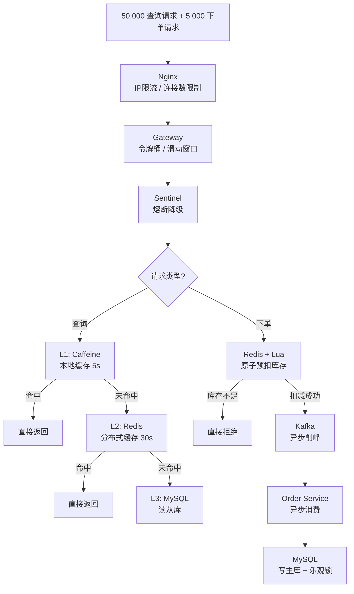
```mermaid
graph TB
    A["50,000 查询请求 + 5,000 下单请求"] --> B["Nginx<br/>IP限流 / 连接数限制"]
    B --> C["Gateway<br/>令牌桶 / 滑动窗口"]
    C --> D["Sentinel<br/>熔断降级"]
    D --> E{"请求类型?"}

    E -->|查询| F["L1: Caffeine<br/>本地缓存 5s"]
    F -->|命中| F1["直接返回"]
    F -->|未命中| G["L2: Redis<br/>分布式缓存 30s"]
    G -->|命中| G1["直接返回"]
    G -->|未命中| H["L3: MySQL<br/>读从库"]

    E -->|下单| I["Redis + Lua<br/>原子预扣库存"]
    I -->|库存不足| I1["直接拒绝"]
    I -->|扣减成功| J["Kafka<br/>异步削峰"]
    J --> K["Order Service<br/>异步消费"]
    K --> L["MySQL<br/>写主库 + 乐观锁"]
```

---

## 二、防止超卖（最核心问题）

### 2.1 超卖是怎么发生的？

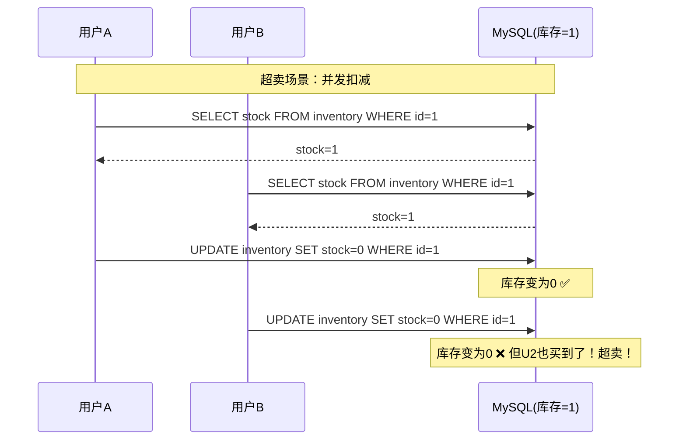
```mermaid
sequenceDiagram
    participant U1 as 用户A
    participant U2 as 用户B
    participant DB as MySQL(库存=1)

    Note over U1,DB: 超卖场景：并发扣减
    U1->>DB: SELECT stock FROM inventory WHERE id=1
    DB-->>U1: stock=1

    U2->>DB: SELECT stock FROM inventory WHERE id=1
    DB-->>U2: stock=1

    U1->>DB: UPDATE inventory SET stock=0 WHERE id=1
    Note over DB: 库存变为0 ✅

    U2->>DB: UPDATE inventory SET stock=0 WHERE id=1
    Note over DB: 库存变为0 ❌ 但U2也买到了！超卖！
```

**根本原因：读和写之间有时间差，并发时多个请求同时读到旧值。**

### 2.2 四重防超卖方案

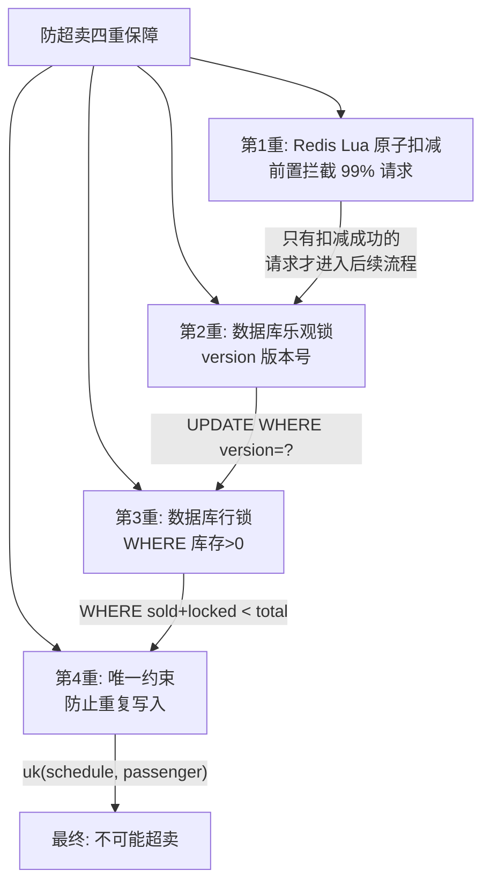
```mermaid
graph TB
    A["防超卖四重保障"] --> B["第1重: Redis Lua 原子扣减<br/>前置拦截 99% 请求"]
    A --> C["第2重: 数据库乐观锁<br/>version 版本号"]
    A --> D["第3重: 数据库行锁<br/>WHERE 库存>0"]
    A --> E["第4重: 唯一约束<br/>防止重复写入"]

    B -->|"只有扣减成功的<br/>请求才进入后续流程"| C
    C -->|"UPDATE WHERE version=?"| D
    D -->|"WHERE sold+locked < total"| E
    E -->|"uk(schedule, passenger)"| F["最终: 不可能超卖"]
```

#### 第1重：Redis Lua 原子扣减

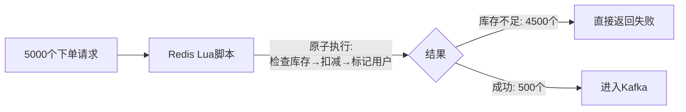
```mermaid
graph LR
    A["5000个下单请求"] --> B["Redis Lua脚本"]
    B -->|"原子执行:<br/>检查库存→扣减→标记用户"| C{"结果"}
    C -->|库存不足: 4500个| D["直接返回失败"]
    C -->|成功: 500个| E["进入Kafka"]
```

**为什么用 Lua？** Redis 单线程 + Lua 脚本 = 原子操作，不存在"检查和扣减之间被其他请求插入"的可能。5000 个并发请求在 Redis 层面被串行化，只有库存数量的请求能通过。

#### 第2重：数据库乐观锁

```sql
-- 乐观锁：通过 version 号防止并发覆盖
UPDATE t_ticket_inventory
SET sold_count = sold_count + 1,
    version = version + 1
WHERE id = 1001
  AND version = 5;  -- 只有版本号匹配才更新

-- 如果 version 已被其他请求变为 6，此条 UPDATE 影响行数=0
-- 应用层检测到影响行数=0 → 重试或返回失败
```

**为什么需要乐观锁？** Redis 预扣成功不代表最终扣减成功。从 Redis 到 MySQL 之间有延迟，乐观锁是 MySQL 层面的最后一道防线。

#### 第3重：数据库条件扣减

```sql
-- 即使乐观锁失效，条件扣减也能防住
UPDATE t_ticket_inventory
SET sold_count = sold_count + 1
WHERE id = 1001
  AND (total_count - sold_count - locked_count) > 0;
-- 库存为负数时此语句影响行数=0
```

#### 第4重：唯一约束

```sql
-- 同一乘车人同一车次只能买一张票
UNIQUE KEY uk_schedule_passenger (schedule_id, passenger_id, from_station, to_station)
-- 即使前三重全部失效，唯一约束也能防止重复购票
```

### 2.3 四重防超卖时序

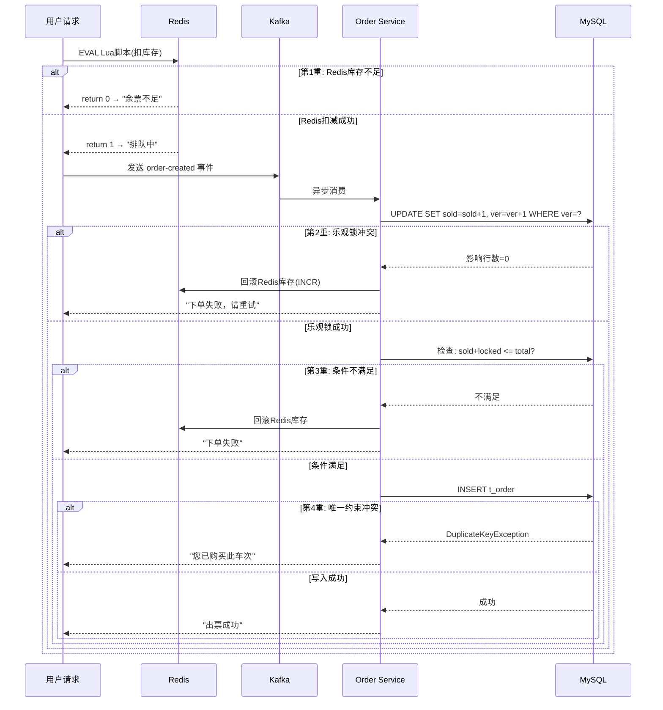
```mermaid
sequenceDiagram
    participant U as 用户请求
    participant R as Redis
    participant K as Kafka
    participant O as Order Service
    participant DB as MySQL

    U->>R: EVAL Lua脚本(扣库存)

    alt 第1重: Redis库存不足
        R-->>U: return 0 → "余票不足"
    else Redis扣减成功
        R-->>U: return 1 → "排队中"
        U->>K: 发送 order-created 事件

        K->>O: 异步消费
        O->>DB: UPDATE SET sold=sold+1, ver=ver+1 WHERE ver=?

        alt 第2重: 乐观锁冲突
            DB-->>O: 影响行数=0
            O->>R: 回滚Redis库存(INCR)
            O-->>U: "下单失败，请重试"
        else 乐观锁成功
            O->>DB: 检查: sold+locked <= total?

            alt 第3重: 条件不满足
                DB-->>O: 不满足
                O->>R: 回滚Redis库存
                O-->>U: "下单失败"
            else 条件满足
                O->>DB: INSERT t_order

                alt 第4重: 唯一约束冲突
                    DB-->>O: DuplicateKeyException
                    O-->>U: "您已购买此车次"
                else 写入成功
                    DB-->>O: 成功
                    O-->>U: "出票成功"
                end
            end
        end
    end
```

---

## 三、Redis 预扣库存

### 3.1 为什么需要预扣？

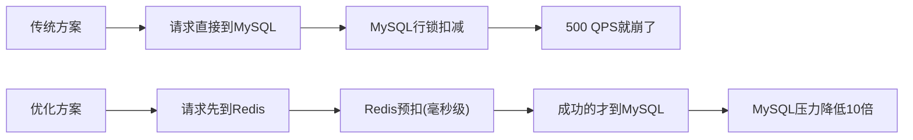
```mermaid
graph LR
    A["传统方案"] --> B["请求直接到MySQL"]
    B --> C["MySQL行锁扣减"]
    C --> D["500 QPS就崩了"]

    E["优化方案"] --> F["请求先到Redis"]
    F --> G["Redis预扣(毫秒级)"]
    G --> H["成功的才到MySQL"]
    H --> I["MySQL压力降低10倍"]
```

**核心逻辑：** Redis 是单线程的，天然串行化，并发请求在 Redis 层面被排队处理。扣减成功的请求才发往 Kafka → MySQL，极大降低数据库压力。

### 3.2 库存同步策略

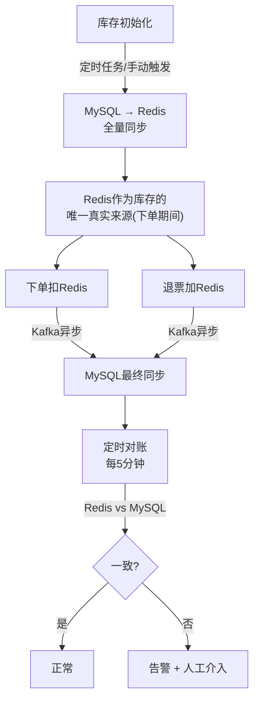
```mermaid
graph TB
    A["库存初始化"] -->|"定时任务/手动触发"| B["MySQL → Redis<br/>全量同步"]
    B --> C["Redis作为库存的<br/>唯一真实来源(下单期间)"]
    C --> D["下单扣Redis"]
    C --> E["退票加Redis"]
    D -->|"Kafka异步"| F["MySQL最终同步"]
    E -->|"Kafka异步"| F

    F --> G["定时对账<br/>每5分钟"]
    G -->|"Redis vs MySQL"| H{"一致?"}
    H -->|是| I["正常"]
    H -->|否| J["告警 + 人工介入"]
```

**为什么 Redis 是"唯一真实来源"？** 在抢票期间（如开售瞬间），所有库存变更都先走 Redis。MySQL 通过 Kafka 异步同步。这样 Redis 的库存就是最准确的，MySQL 是最终一致的备份。

### 3.3 库存回滚机制

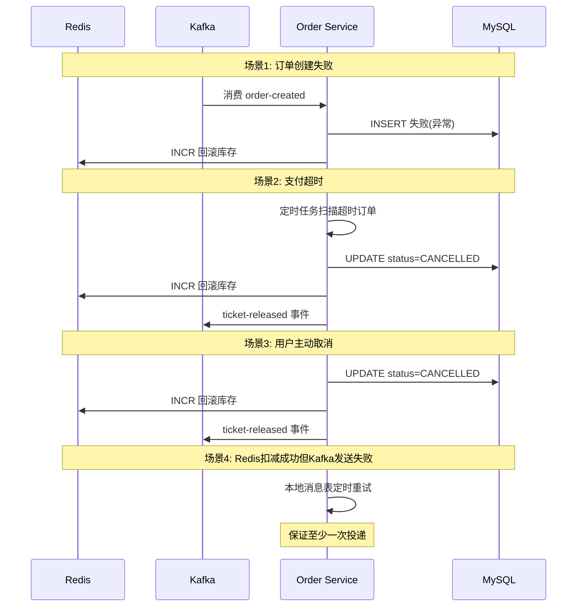
```mermaid
sequenceDiagram
    participant R as Redis
    participant K as Kafka
    participant O as Order Service
    participant DB as MySQL

    Note over R,DB: 场景1: 订单创建失败
    K->>O: 消费 order-created
    O->>DB: INSERT 失败(异常)
    O->>R: INCR 回滚库存

    Note over R,DB: 场景2: 支付超时
    O->>O: 定时任务扫描超时订单
    O->>DB: UPDATE status=CANCELLED
    O->>R: INCR 回滚库存
    O->>K: ticket-released 事件

    Note over R,DB: 场景3: 用户主动取消
    O->>DB: UPDATE status=CANCELLED
    O->>R: INCR 回滚库存
    O->>K: ticket-released 事件

    Note over R,DB: 场景4: Redis扣减成功但Kafka发送失败
    O->>O: 本地消息表定时重试
    Note over O: 保证至少一次投递
```

---

## 四、分布式锁（Redisson）

### 4.1 什么时候需要分布式锁？

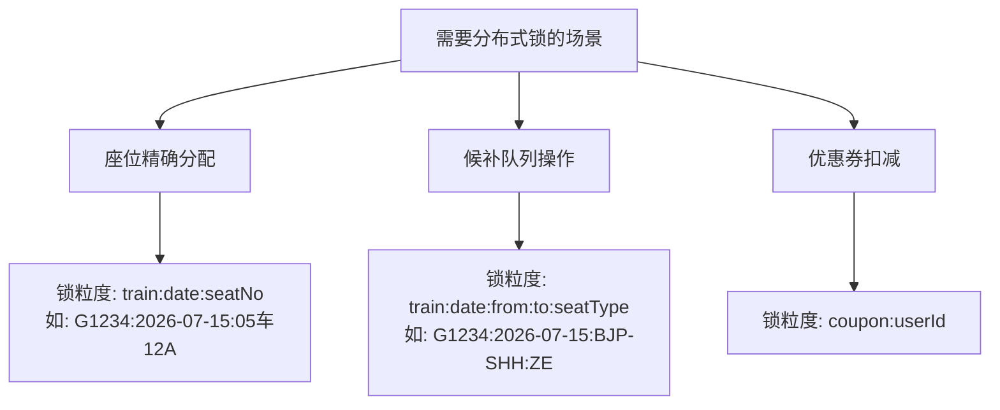
```mermaid
graph TB
    A["需要分布式锁的场景"] --> B["座位精确分配"]
    A --> C["候补队列操作"]
    A --> D["优惠券扣减"]

    B --> E["锁粒度: train:date:seatNo<br/>如: G1234:2026-07-15:05车12A"]
    C --> F["锁粒度: train:date:from:to:seatType<br/>如: G1234:2026-07-15:BJP-SHH:ZE"]
    D --> G["锁粒度: coupon:userId"]
```

### 4.2 为什么用 Redisson 而不是 SETNX？

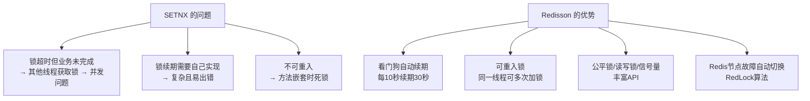
```mermaid
graph TB
    A["SETNX 的问题"] --> B["锁超时但业务未完成<br/>→ 其他线程获取锁 → 并发问题"]
    A --> C["锁续期需要自己实现<br/>→ 复杂且易出错"]
    A --> D["不可重入<br/>→ 方法嵌套时死锁"]

    E["Redisson 的优势"] --> F["看门狗自动续期<br/>每10秒续期30秒"]
    E --> G["可重入锁<br/>同一线程可多次加锁"]
    E --> H["公平锁/读写锁/信号量<br/>丰富API"]
    E --> I["Redis节点故障自动切换<br/>RedLock算法"]
```

### 4.3 座位锁定流程

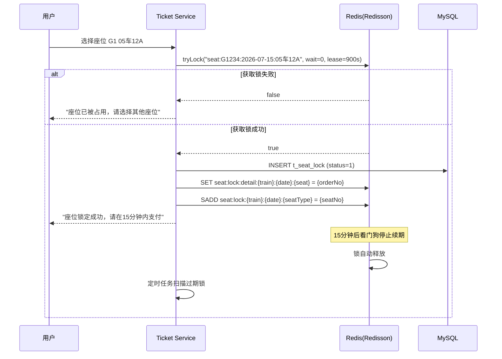
```mermaid
sequenceDiagram
    participant U as 用户
    participant S as Ticket Service
    participant R as Redis(Redisson)
    participant DB as MySQL

    U->>S: 选择座位 G1 05车12A

    S->>R: tryLock("seat:G1234:2026-07-15:05车12A", wait=0, lease=900s)

    alt 获取锁失败
        R-->>S: false
        S-->>U: "座位已被占用，请选择其他座位"
    else 获取锁成功
        R-->>S: true

        S->>DB: INSERT t_seat_lock (status=1)
        S->>R: SET seat:lock:detail:{train}:{date}:{seat} = {orderNo}
        S->>R: SADD seat:lock:{train}:{date}:{seatType} = {seatNo}

        S-->>U: "座位锁定成功，请在15分钟内支付"

        Note over R: 15分钟后看门狗停止续期
        R->>R: 锁自动释放
        S->>S: 定时任务扫描过期锁
    end
```

### 4.4 锁粒度设计

| 场景 | 锁 Key | 粒度 | 说明 |
|------|--------|------|------|
| 座位锁定 | `seat:{train}:{date}:{seatNo}` | 单个座位 | 最细粒度，并发最高 |
| 库存扣减 | 不需要锁 | - | Lua 脚本原子操作 |
| 候补入队 | `waitlist:{train}:{date}:{from}:{to}:{seatType}` | 区间 | 防止队列并发操作 |
| 优惠券 | `coupon:{couponId}:{userId}` | 用户级 | 防止重复领取 |

---

## 五、Kafka 削峰 + MQ 异步下单

### 5.1 为什么需要削峰？

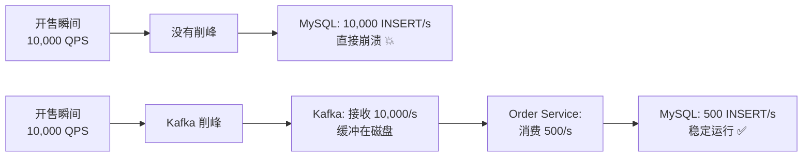
```mermaid
graph LR
    A["开售瞬间<br/>10,000 QPS"] --> B["没有削峰"]
    B --> C["MySQL: 10,000 INSERT/s<br/>直接崩溃 💥"]

    D["开售瞬间<br/>10,000 QPS"] --> E["Kafka 削峰"]
    E --> F["Kafka: 接收 10,000/s<br/>缓冲在磁盘"]
    F --> G["Order Service:<br/>消费 500/s"]
    G --> H["MySQL: 500 INSERT/s<br/>稳定运行 ✅"]
```

**核心原理：** Kafka 的吞吐量可达百万级 QPS，远超 MySQL。将瞬时洪峰先写入 Kafka，下游服务按自己的处理能力匀速消费，这就是"削峰填谷"。

### 5.2 异步下单完整流程

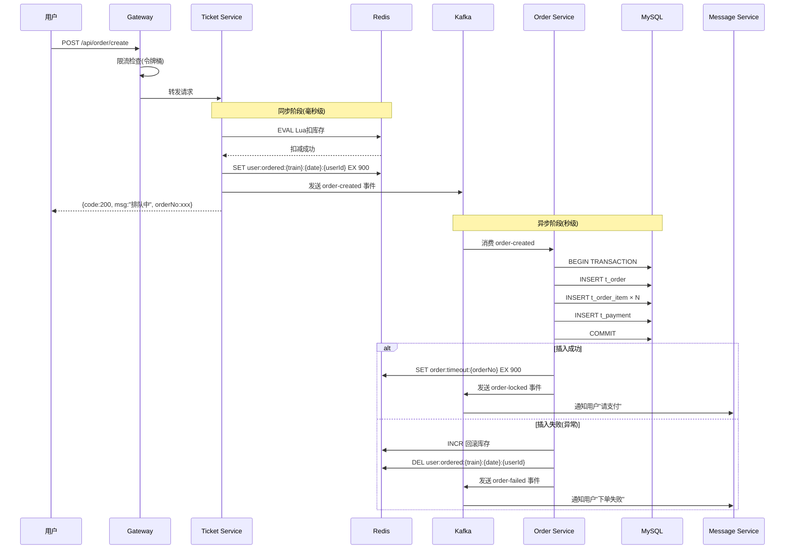
```mermaid
sequenceDiagram
    participant U as 用户
    participant G as Gateway
    participant T as Ticket Service
    participant R as Redis
    participant K as Kafka
    participant O as Order Service
    participant DB as MySQL
    participant Msg as Message Service

    U->>G: POST /api/order/create
    G->>G: 限流检查(令牌桶)

    G->>T: 转发请求

    Note over T,R: 同步阶段(毫秒级)
    T->>R: EVAL Lua扣库存
    R-->>T: 扣减成功

    T->>R: SET user:ordered:{train}:{date}:{userId} EX 900
    T->>K: 发送 order-created 事件
    T-->>U: {code:200, msg:"排队中", orderNo:xxx}

    Note over K,DB: 异步阶段(秒级)
    K->>O: 消费 order-created
    O->>DB: BEGIN TRANSACTION
    O->>DB: INSERT t_order
    O->>DB: INSERT t_order_item × N
    O->>DB: INSERT t_payment
    O->>DB: COMMIT

    alt 插入成功
        O->>R: SET order:timeout:{orderNo} EX 900
        O->>K: 发送 order-locked 事件
        K->>Msg: 通知用户"请支付"
    else 插入失败(异常)
        O->>R: INCR 回滚库存
        O->>R: DEL user:ordered:{train}:{date}:{userId}
        O->>K: 发送 order-failed 事件
        K->>Msg: 通知用户"下单失败"
    end
```

### 5.3 为什么是"先返回再处理"？

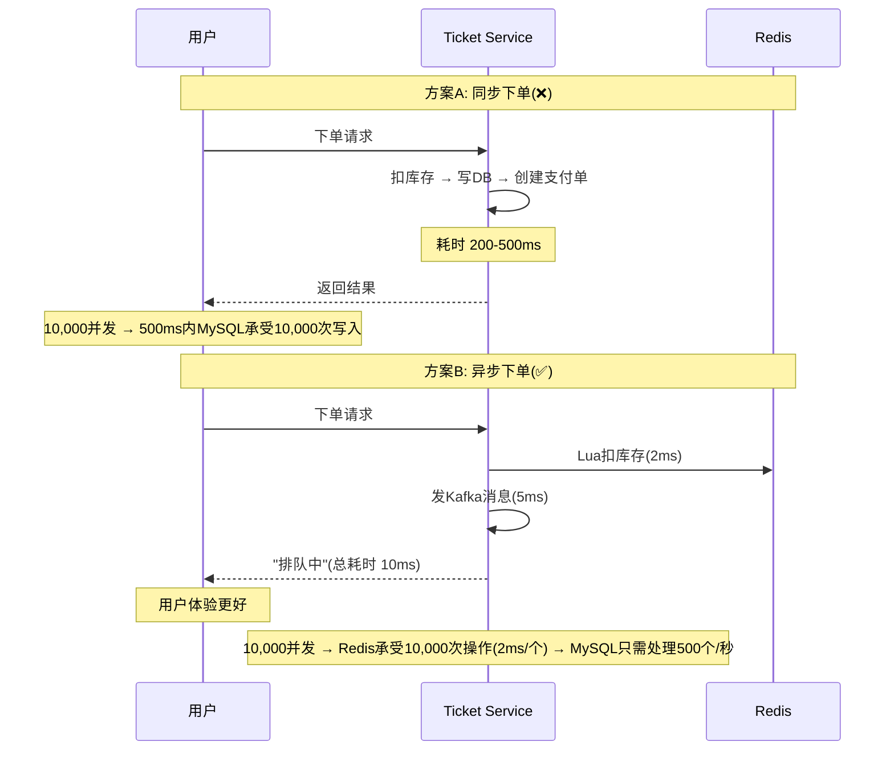
```mermaid
sequenceDiagram
    participant U as 用户
    participant T as Ticket Service
    participant R as Redis

    Note over U,R: 方案A: 同步下单(❌)
    U->>T: 下单请求
    T->>T: 扣库存 → 写DB → 创建支付单
    Note over T: 耗时 200-500ms
    T-->>U: 返回结果
    Note over U: 10,000并发 → 500ms内MySQL承受10,000次写入

    Note over U,R: 方案B: 异步下单(✅)
    U->>T: 下单请求
    T->>R: Lua扣库存(2ms)
    T->>T: 发Kafka消息(5ms)
    T-->>U: "排队中"(总耗时 10ms)
    Note over U: 用户体验更好
    Note over T: 10,000并发 → Redis承受10,000次操作(2ms/个) → MySQL只需处理500个/秒
```

**用户体验对比：**
- 方案A：用户等待 500ms，可能超时，体验差
- 方案B：用户 10ms 得到"排队中"，1-3秒后收到"出票成功"推送，体验好

---

## 六、数据最终一致性

### 6.1 一致性挑战

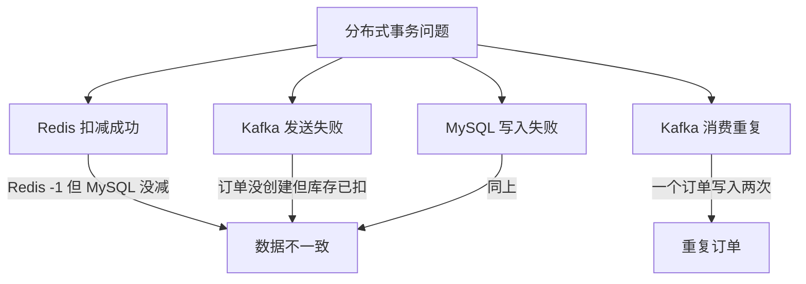
```mermaid
graph TB
    A["分布式事务问题"] --> B["Redis 扣减成功"]
    A --> C["Kafka 发送失败"]
    A --> D["MySQL 写入失败"]
    A --> E["Kafka 消费重复"]

    B -->|"Redis -1 但 MySQL 没减"| F["数据不一致"]
    C -->|"订单没创建但库存已扣"| F
    D -->|"同上"| F
    E -->|"一个订单写入两次"| G["重复订单"]
```

### 6.2 最终一致性保障方案

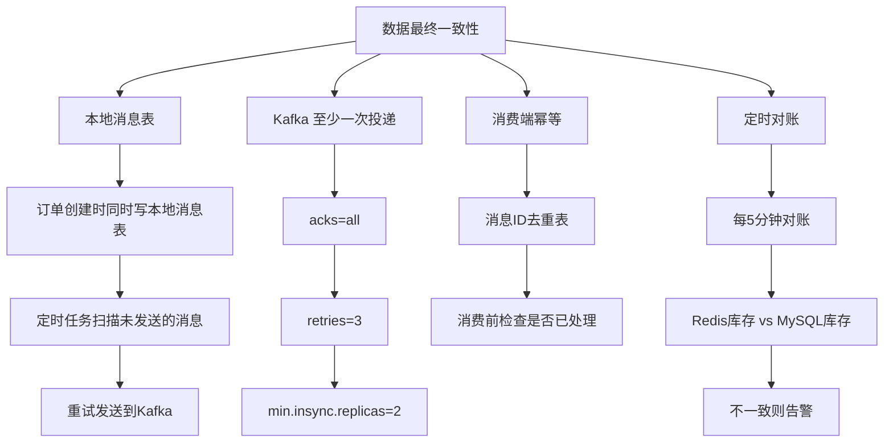
```mermaid
graph TB
    A["数据最终一致性"] --> B["本地消息表"]
    A --> C["Kafka 至少一次投递"]
    A --> D["消费端幂等"]
    A --> E["定时对账"]

    B --> B1["订单创建时同时写本地消息表"]
    B1 --> B2["定时任务扫描未发送的消息"]
    B2 --> B3["重试发送到Kafka"]

    C --> C1["acks=all"]
    C1 --> C2["retries=3"]
    C2 --> C3["min.insync.replicas=2"]

    D --> D1["消息ID去重表"]
    D1 --> D2["消费前检查是否已处理"]

    E --> E1["每5分钟对账"]
    E1 --> E2["Redis库存 vs MySQL库存"]
    E2 --> E3["不一致则告警"]
```

### 6.3 本地消息表

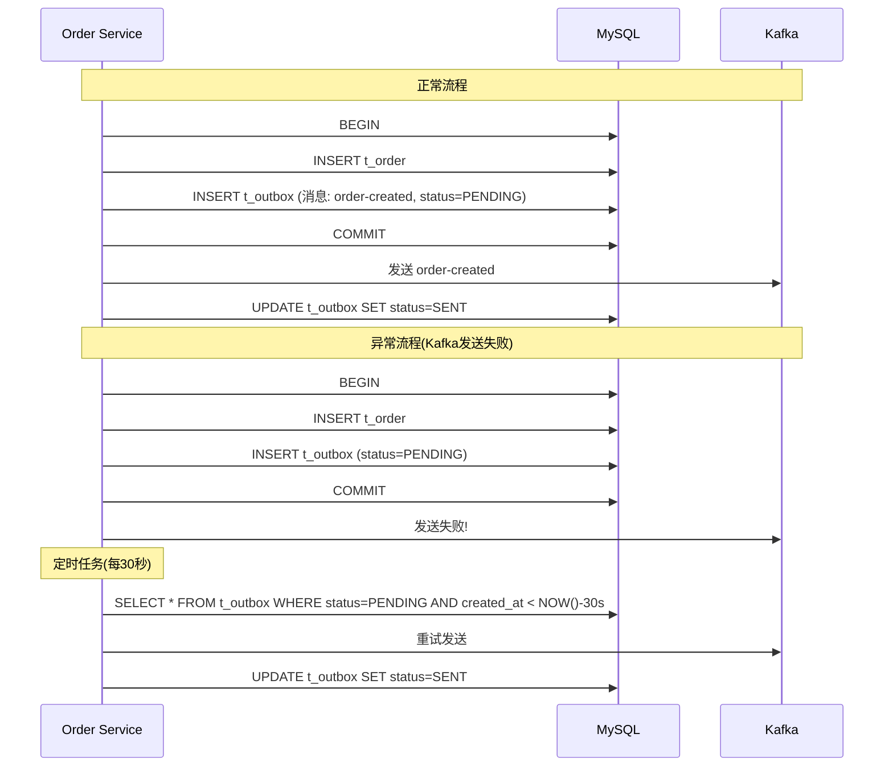
```mermaid
sequenceDiagram
    participant O as Order Service
    participant DB as MySQL
    participant K as Kafka

    Note over O,K: 正常流程
    O->>DB: BEGIN
    O->>DB: INSERT t_order
    O->>DB: INSERT t_outbox (消息: order-created, status=PENDING)
    O->>DB: COMMIT
    O->>K: 发送 order-created
    O->>DB: UPDATE t_outbox SET status=SENT

    Note over O,K: 异常流程(Kafka发送失败)
    O->>DB: BEGIN
    O->>DB: INSERT t_order
    O->>DB: INSERT t_outbox (status=PENDING)
    O->>DB: COMMIT
    O->>K: 发送失败!
    Note over O: 定时任务(每30秒)
    O->>DB: SELECT * FROM t_outbox WHERE status=PENDING AND created_at < NOW()-30s
    O->>K: 重试发送
    O->>DB: UPDATE t_outbox SET status=SENT
```

### 6.4 消费端幂等

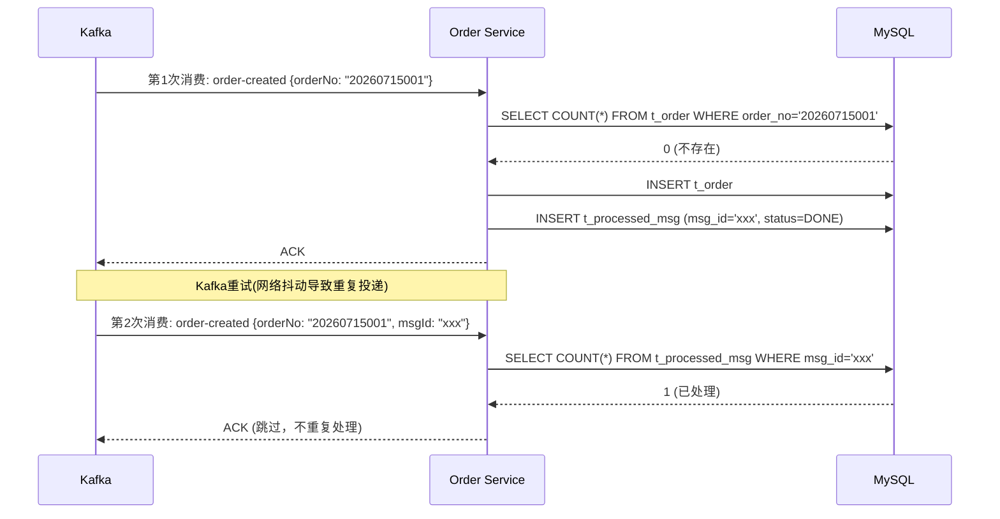
```mermaid
sequenceDiagram
    participant K as Kafka
    participant O as Order Service
    participant DB as MySQL

    K->>O: 第1次消费: order-created {orderNo: "20260715001"}
    O->>DB: SELECT COUNT(*) FROM t_order WHERE order_no='20260715001'
    DB-->>O: 0 (不存在)
    O->>DB: INSERT t_order
    O->>DB: INSERT t_processed_msg (msg_id='xxx', status=DONE)
    O-->>K: ACK

    Note over K,O: Kafka重试(网络抖动导致重复投递)
    K->>O: 第2次消费: order-created {orderNo: "20260715001", msgId: "xxx"}
    O->>DB: SELECT COUNT(*) FROM t_processed_msg WHERE msg_id='xxx'
    DB-->>O: 1 (已处理)
    O-->>K: ACK (跳过，不重复处理)
```

---

## 七、幂等设计

### 7.1 需要幂等的接口

| 接口 | 幂等Key | 策略 | 说明 |
|------|---------|------|------|
| 下单 | `userId + trainId + date` | Redis 标记 | 同一用户同一车次只能下一单 |
| 支付 | `orderNo` | 数据库唯一约束 | 一个订单只能支付一次 |
| 退票 | `orderNo + itemId` | 状态机 | 只有 PAID 状态才能退 |
| 领券 | `couponId + userId` | 数据库唯一约束 | 同一券不能重复领 |
| AI对话 | `requestId` | Redis 去重 | 防止重复提交 |

### 7.2 幂等实现策略

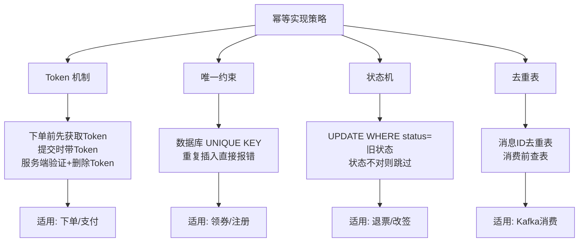
```mermaid
graph TB
    A["幂等实现策略"] --> B["Token 机制"]
    A --> C["唯一约束"]
    A --> D["状态机"]
    A --> E["去重表"]

    B --> B1["下单前先获取Token<br/>提交时带Token<br/>服务端验证+删除Token"]
    B1 --> B2["适用: 下单/支付"]

    C --> C1["数据库 UNIQUE KEY<br/>重复插入直接报错"]
    C1 --> C2["适用: 领券/注册"]

    D --> D1["UPDATE WHERE status=旧状态<br/>状态不对则跳过"]
    D1 --> D2["适用: 退票/改签"]

    E --> E1["消息ID去重表<br/>消费前查表"]
    E1 --> E2["适用: Kafka消费"]
```

### 7.3 下单幂等完整流程

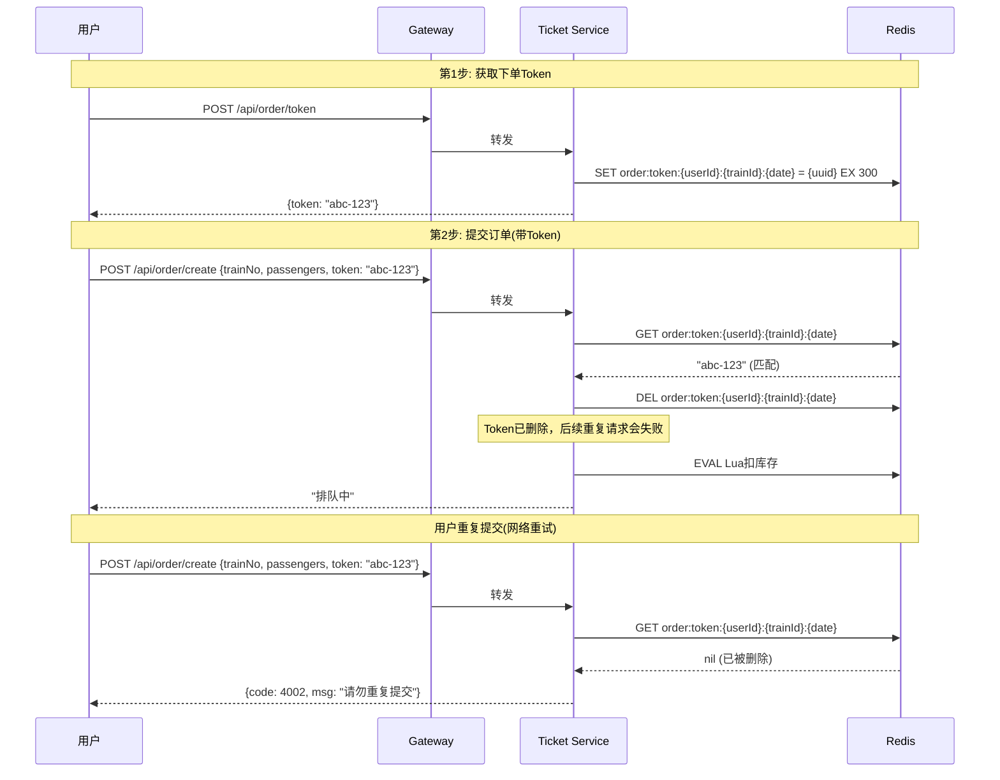
```mermaid
sequenceDiagram
    participant U as 用户
    participant G as Gateway
    participant T as Ticket Service
    participant R as Redis

    Note over U,R: 第1步: 获取下单Token
    U->>G: POST /api/order/token
    G->>T: 转发
    T->>R: SET order:token:{userId}:{trainId}:{date} = {uuid} EX 300
    T-->>U: {token: "abc-123"}

    Note over U,R: 第2步: 提交订单(带Token)
    U->>G: POST /api/order/create {trainNo, passengers, token: "abc-123"}
    G->>T: 转发

    T->>R: GET order:token:{userId}:{trainId}:{date}
    R-->>T: "abc-123" (匹配)

    T->>R: DEL order:token:{userId}:{trainId}:{date}
    Note over T: Token已删除，后续重复请求会失败

    T->>R: EVAL Lua扣库存
    T-->>U: "排队中"

    Note over U,R: 用户重复提交(网络重试)
    U->>G: POST /api/order/create {trainNo, passengers, token: "abc-123"}
    G->>T: 转发
    T->>R: GET order:token:{userId}:{trainId}:{date}
    R-->>T: nil (已被删除)
    T-->>U: {code: 4002, msg: "请勿重复提交"}
```

---

## 八、限流设计

### 8.1 多层限流架构

```mermaid
graph TB
    A["用户请求"] --> B["Nginx 限流"]
    B --> C["Gateway 限流"]
    C --> D["Sentinel 限流"]
    D --> E["业务层限流"]

    B --> B1["limit_req: 每IP 100次/秒"]
    B --> B2["limit_conn: 每IP 50个连接"]

    C --> C1["全局限流: 100,000 QPS"]
    C --> C2["接口限流: 查询50,000 / 下单5,000"]
    C --> C3["用户限流: 每用户 100次/分钟"]

    D --> D1["集群限流: 基于Redis"]
    D --> D2["熔断降级: 错误率>50%触发"]

    E --> E1["下单限流: 每用户每车次 1次/秒"]
    E --> E2["候补限流: 每用户每车次 1次"]
```

### 8.2 限流算法对比

```mermaid
graph LR
    A["限流算法"] --> B["固定窗口"]
    A --> C["滑动窗口"]
    A --> D["令牌桶"]
    A --> E["漏桶"]

    B --> B1["简单但有临界突刺问题"]
    C --> C1["精确但内存消耗大"]
    D --> D1["允许突发流量 ✅"]
    E --> E1["匀速输出，不允许突发"]

    D1 --> F["选择令牌桶:<br/>查询接口允许突发<br/>用户体验更好"]
```

### 8.3 不同层级的限流策略

| 层级 | 工具 | 算法 | 维度 | 参数 |
|------|------|------|------|------|
| Nginx | limit_req | 漏桶 | IP | 100次/秒 |
| Gateway | 自研 | 令牌桶 | 全局 | 100,000 QPS |
| Gateway | 自研 | 滑动窗口 | 接口 | 50,000 (查询) / 5,000 (下单) |
| Gateway | 自研 | 滑动窗口 | 用户 | 100次/分钟 |
| Service | Redis | 计数器 | 用户+车次 | 下单 1次/秒 |
| Sentinel | Sentinel | 滑动窗口 | 集群 | 动态配置 |

### 8.4 限流后的降级策略

```mermaid
graph TB
    A["请求被限流"] --> B{"限流层级"}
    B -->|Nginx| C["返回 503<br/>Retry-After: 1"]
    B -->|Gateway| D["返回 429<br/>{code: 4029, msg: '请求过于频繁'}"]
    B -->|Sentinel| E["返回降级结果<br/>如: 缓存数据 / 排队页面"]
    B -->|业务层| F["返回业务提示<br/>{code: 4003, msg: '请勿重复下单'}"]
```

---

## 九、Sentinel 熔断降级

### 9.1 Sentinel 集成架构

```mermaid
graph TB
    subgraph Sentinel["Sentinel 限流熔断"]
        Dashboard["Sentinel Dashboard<br/>动态配置规则"]
        Core["Sentinel Core<br/>流控/熔断/系统保护"]
    end

    subgraph Services["微服务"]
        GW["Gateway"]
        TS["Ticket Service"]
        OS["Order Service"]
    end

    subgraph Storage["规则存储"]
        Nacos["Nacos(可选)<br/>持久化规则"]
        R["Redis<br/>集群限流计数"]
    end

    Dashboard --> Core
    Core --> GW & TS & OS
    Core --> R
    Dashboard --> Nacos
```

### 9.2 熔断规则

```mermaid
graph TB
    A["熔断触发条件"] --> B["慢调用比例"]
    A --> C["异常比例"]
    A --> D["异常数"]

    B --> B1["RT > 500ms 的请求占比 > 50%<br/>触发熔断 10秒"]
    C --> C1["异常请求占比 > 30%<br/>触发熔断 10秒"]
    D --> D1["异常请求数 > 20<br/>触发熔断 10秒"]

    E["熔断状态机"] --> F["CLOSED(正常)"]
    F -->|达到阈值| G["OPEN(熔断)"]
    G -->|超时10秒| H["HALF-OPEN(试探)"]
    H -->|试探成功| F
    H -->|试探失败| G
```

### 9.3 降级策略

| 服务 | 熔断条件 | 降级策略 | 用户感知 |
|------|---------|---------|---------|
| 余票查询 | 错误率>50% | 返回本地缓存 + "数据可能延迟" | 能查到数据(稍旧) |
| 下单服务 | 错误率>30% | 返回排队页面 + "系统繁忙" | 看到排队动画 |
| 支付服务 | RT>3s | 异步支付 + 轮询结果 | "支付处理中" |
| AI服务 | RT>5s | 关闭AI推荐 + 返回基础结果 | 看不到AI推荐 |
| 通知服务 | 错误率>80% | 降级为批量推送(延迟) | 通知稍晚到达 |

---

## 十、缓存击穿 / 雪崩 / 热点缓存

### 10.1 缓存击穿

```mermaid
sequenceDiagram
    participant U as 10,000用户
    participant R as Redis
    participant DB as MySQL

    Note over U,DB: 问题: 热点Key过期瞬间
    U->>R: GET ticket:query:G1234:2026-07-15
    R-->>U: nil (刚过期)
    Note over U: 10,000个请求同时发现缓存为空
    U->>DB: 10,000个请求同时查库!
    Note over DB: MySQL 瞬间被打满 💥
```

**解决方案：互斥锁 + 逻辑过期**

```mermaid
sequenceDiagram
    participant U1 as 用户1
    participant U2 as 用户2
    participant R as Redis
    participant DB as MySQL

    Note over U1,DB: 解决方案: 互斥锁
    U1->>R: GET ticket:query:G1234:2026-07-15
    R-->>U1: nil
    U1->>R: SETNX lock:rebuild:G1234:2026-07-15 EX 10
    R-->>U1: true (获得锁)

    U2->>R: GET ticket:query:G1234:2026-07-15
    R-->>U2: nil
    U2->>R: SETNX lock:rebuild:G1234:2026-07-15 EX 10
    R-->>U2: false (未获得锁)
    U2->>U2: sleep 50ms 后重试

    U1->>DB: 查库
    DB-->>U1: 数据
    U1->>R: SET ticket:query:G1234:2026-07-15 = data EX 30
    U1->>R: DEL lock:rebuild:G1234:2026-07-15

    U2->>R: GET ticket:query:G1234:2026-07-15
    R-->>U2: data (缓存已重建)
```

**逻辑过期方案（更优）：**

```mermaid
graph TB
    A["缓存永不过期"] --> B["value 中存逻辑过期时间"]
    B --> C{"查询时判断"}
    C -->|未过期| D["直接返回"]
    C -->|已过期| E["返回旧数据(用户体验好)"]
    E --> F["异步重建缓存"]
    F --> G["其他请求仍返回旧数据"]
    G --> H["重建完成后自动更新"]
```

**为什么逻辑过期更优？** 用户永远能拿到数据（即使是稍旧的），不会看到"系统繁忙"。后台异步更新缓存，对用户无感。

### 10.2 缓存雪崩

```mermaid
graph TB
    A["缓存雪崩场景"] --> B["大量Key同一时间过期"]
    A --> C["Redis 宕机"]

    B --> D["请求全部打到MySQL"]
    C --> D
    D --> E["MySQL 被打崩"]
    E --> F["系统全面不可用 💥"]
```

**解决方案：**

```mermaid
graph TB
    A["防雪崩方案"] --> B["TTL 随机偏移"]
    A --> C["多级缓存"]
    A --> D["熔断降级"]
    A --> E["Redis 高可用"]

    B --> B1["基础TTL 30s<br/>+ 随机 0~5s<br/>= 30~35s"]
    B1 --> B2["避免同一时刻大量Key同时过期"]

    C --> C1["L1: Caffeine TTL 5s"]
    C1 --> C2["L2: Redis TTL 30s"]
    C2 --> C3["即使Redis全挂<br/>Caffeine还能扛5秒"]

    D --> D1["Redis不可用时<br/>Sentinel触发熔断"]
    D1 --> D2["返回降级结果<br/>保护MySQL"]

    E --> E1["Redis Cluster<br/>主从 + 哨兵"]
    E1 --> E2["单节点故障自动切换"]
```

### 10.3 热点缓存

```mermaid
graph TB
    A["热点问题"] --> B["京沪高铁G1<br/>80%的查询都查它"]
    B --> C["单个Redis Key承受<br/>40,000 QPS"]

    D["热点解决方案"] --> E["本地缓存(Caffeine)"]
    D --> F["热点Key拆分"]
    D --> G["永不过期 + 异步刷新"]

    E --> E1["Caffeine TTL 5s<br/>命中率 > 80%"]
    E1 --> E2["40,000 QPS<br/>→ 8,000 QPS 到Redis"]

    F --> F1["将1个Key拆成4个子Key"]
    F1 --> F2["round-robin 轮询读取"]

    G --> G1["热点Key不设TTL"]
    G1 --> G2["后台定时任务每30s刷新"]
```

**热点探测方案：**

```mermaid
sequenceDiagram
    participant App as 应用服务
    participant R as Redis
    participant Detector as 热点探测器

    App->>R: GET ticket:query:G1234:2026-07-15
    R-->>App: data

    Detector->>Detector: 统计Key访问频率
    Note over Detector: 每秒采样一次
    Note over Detector: 如果某Key 1秒内访问 > 1000次

    Detector->>App: 标记为热点Key
    App->>App: 加入本地Caffeine缓存
    Note over App: 后续请求直接走本地缓存
```

---

## 十一、乐观锁详解

### 11.1 乐观锁 vs 悲观锁

```mermaid
graph TB
    A["锁的选择"] --> B["悲观锁"]
    A --> C["乐观锁"]

    B --> B1["SELECT ... FOR UPDATE"]
    B1 --> B2["整个事务期间持有锁"]
    B2 --> B3["并发低时安全<br/>并发高时死锁/等待"]

    C --> C1["UPDATE WHERE version=?"]
    C1 --> C2["只在提交时检查"]
    C2 --> C3["并发高时冲突多但不死锁<br/>适合读多写少"]

    D["RailMind 选择"] --> E["乐观锁 + Lua 预扣"]
    E --> F["Redis Lua 先过滤大部分并发<br/>MySQL 乐观锁兜底"]
```

### 11.2 乐观锁在库存扣减中的应用

```mermaid
sequenceDiagram
    participant T1 as 线程A
    participant T2 as 线程B
    participant DB as MySQL

    T1->>DB: SELECT id, sold_count, version=5 FROM t_ticket_inventory WHERE id=1
    T2->>DB: SELECT id, sold_count, version=5 FROM t_ticket_inventory WHERE id=1

    T1->>DB: UPDATE SET sold=sold+1, version=6 WHERE id=1 AND version=5
    Note over DB: version=5 ✅ 更新成功, version变为6

    T2->>DB: UPDATE SET sold=sold+1, version=6 WHERE id=1 AND version=5
    Note over DB: version=5 ❌ 已被改为6, 影响行数=0

    DB-->>T2: 影响行数=0
    T2->>T2: 重试或返回失败
```

### 11.3 乐观锁 + 重试策略

```mermaid
graph TB
    A["乐观锁失败"] --> B{"重试次数 < 3?"}
    B -->|是| C["等待随机 10~50ms"]
    C --> D["重新读取最新version"]
    D --> E["再次尝试UPDATE"]
    E -->|成功| F["返回成功"]
    E -->|失败| B
    B -->|否| G["返回失败: 请稍后重试"]

    H["为什么随机等待?"] --> I["避免所有失败线程<br/>同时重试导致惊群效应"]
```

---

## 十二、完整抢票时序图（端到端）

```mermaid
sequenceDiagram
    participant U as 用户浏览器
    participant N as Nginx
    participant G as Gateway
    participant S as Sentinel
    participant T as Ticket Service
    participant C as Caffeine
    participant R as Redis
    participant K as Kafka
    participant O as Order Service
    participant DB as MySQL
    participant P as Payment Service
    participant WS as Message Service

    Note over U,WS: ===== 阶段1: 查询余票 =====
    U->>N: GET /api/ticket/query?train=G1234&date=2026-07-15
    N->>N: IP限流(100次/秒)
    N->>G: 转发
    G->>G: JWT校验 + 全局限流(50,000 QPS)
    G->>S: 流控检查
    S-->>G: 通过

    G->>T: 转发
    T->>C: 查本地缓存
    alt L1命中
        C-->>T: 返回缓存(5s内)
    else L1未命中
        T->>R: 查Redis缓存
        alt L2命中
            R-->>T: 返回缓存(30s内)
        else L2未命中
            T->>DB: 查MySQL从库
            DB-->>T: 返回数据
            T->>R: 写入Redis TTL=30~35s(随机偏移)
            T->>C: 写入Caffeine TTL=5s
        end
    end
    T-->>U: 返回余票信息

    Note over U,WS: ===== 阶段2: 提交订单 =====
    U->>G: POST /api/order/create {trainNo, passengers, token}
    G->>G: 用户级限流(1次/秒)
    G->>T: 转发

    T->>R: 验证幂等Token
    T->>R: DEL 幂等Token

    T->>R: EVAL Lua扣库存(原子操作)
    alt 库存不足
        R-->>T: return 0
        T-->>U: {code:4001, msg:"余票不足"}
    else 用户重复下单
        R-->>T: return -1
        T-->>U: {code:4002, msg:"请勿重复下单"}
    else 扣减成功
        R-->>T: return 1
        T->>R: SET user:ordered:G1234:20260715:{uid} EX 900
        T->>K: 发送 order-created 事件
        T-->>U: {code:200, msg:"排队中", orderNo:xxx}

        Note over U,WS: ===== 阶段3: 异步下单 =====
        K->>O: 消费 order-created
        O->>DB: BEGIN
        O->>DB: INSERT t_order (乐观锁: version=0)
        O->>DB: INSERT t_order_item × N
        O->>DB: INSERT t_payment
        O->>DB: INSERT t_outbox (本地消息表)
        O->>DB: COMMIT

        alt 写入成功
            O->>DB: UPDATE t_ticket_inventory SET sold=sold+1, ver=ver+1 WHERE ver=?
            alt 乐观锁成功
                O->>R: SET order:timeout:{orderNo} EX 900
                O->>K: 发送 order-locked
                K->>WS: 通知"请支付"
                WS->>U: WebSocket推送
            else 乐观锁失败(极低概率)
                O->>R: INCR 回滚库存
                O->>DB: UPDATE t_order SET status=CANCELLED
            end
        else 写入失败
            O->>R: INCR 回滚库存
            O->>R: DEL user:ordered
        end
    end

    Note over U,WS: ===== 阶段4: 支付 =====
    U->>G: POST /api/payment/pay {orderNo, payType}
    G->>P: 转发
    P->>P: 调用支付网关(模拟)
    P->>DB: UPDATE t_payment SET status=SUCCESS
    P->>R: DEL order:timeout:{orderNo}
    P->>K: 发送 order-paid

    Note over U,WS: ===== 阶段5: 出票 =====
    K->>O: 消费 order-paid
    O->>DB: UPDATE t_order SET status=PAID→TICKETED
    O->>DB: UPDATE t_order_item SET seat_no=分配座位
    O->>K: 发送 ticket-issued
    K->>WS: 通知"出票成功"
    WS->>U: WebSocket: "G1234 05车12A 出票成功!"

    Note over U,WS: ===== 超时取消(兜底) =====
    Note over O: 定时任务每分钟扫描
    O->>DB: SELECT WHERE pay_deadline < NOW() AND status=CREATED
    O->>DB: UPDATE status=CANCELLED
    O->>R: INCR 回滚库存
    O->>K: ticket-released
```

---

## 十三、设计方案总结

### 13.1 各技术点的作用

| # | 技术点 | 解决什么问题 | 在哪个环节 |
|---|--------|------------|-----------|
| ① | 防超卖 | 并发扣减导致库存为负 | 四重保障: Lua + 乐观锁 + 条件扣减 + 唯一约束 |
| ② | Redis预扣 | MySQL扛不住高并发写 | 下单前先在Redis扣减，成功的才到MySQL |
| ③ | Lua脚本 | 检查和扣减不是原子的 | Redis单线程+Lua=原子操作，5000请求串行化 |
| ④ | 分布式锁 | 座位不能同时分给两个人 | Redisson锁住单个座位，15分钟自动释放 |
| ⑤ | Redisson | SETNX没有续期/可重入 | 看门狗自动续期，可重入，RedLock高可用 |
| ⑥ | Kafka削峰 | 开售瞬间请求洪峰 | Kafka缓冲，下游匀速消费 |
| ⑦ | MQ异步下单 | 用户等待时间长 | 先返回"排队中"，异步创建订单 |
| ⑧ | 最终一致性 | Redis/MySQL数据不一致 | 本地消息表 + 消费幂等 + 定时对账 |
| ⑨ | 幂等设计 | 网络重试导致重复下单 | Token机制 + 唯一约束 + 状态机 |
| ⑩ | 限流设计 | 系统过载 | Nginx→Gateway→Sentinel→业务层四层限流 |
| ⑪ | Sentinel | 服务雪崩 | 熔断降级，故障服务自动隔离 |
| ⑫ | 缓存击穿 | 热点Key过期瞬间大量请求打到DB | 互斥锁 + 逻辑过期(永不过期) |
| ⑬ | 缓存雪崩 | 大量Key同时过期/Redis宕机 | TTL随机偏移 + 多级缓存 + 熔断降级 |
| ⑭ | 热点缓存 | 少数热门车次承受80%流量 | Caffeine本地缓存 + 热点探测 + 永不过期 |
| ⑮ | 乐观锁 | 并发更新覆盖 | version版本号 + 重试机制 |

### 13.2 性能预估

| 指标 | 目标 | 方案 | 预估 |
|------|------|------|------|
| 查询 QPS | 50,000 | Caffeine+Redis+MySQL | 55,000+ |
| 下单 QPS | 5,000 | Redis Lua + Kafka | 8,000+ |
| 查询 P99 | ≤50ms | 三级缓存 | ≤30ms |
| 下单 P99 | ≤200ms | Redis预扣+异步 | ≤100ms(用户感知) |
| 超卖概率 | 0 | 四重保障 | 0 |
