# RailMind AI - AI Agent 架构设计

> 版本：v1.0 | 日期：2026-06-27
> 目标：构建企业级 AI Agent 系统，不是"聊天机器人"，而是能**自主完成购票、改签、退票等业务操作**的智能体

---

## 一、AI Agent 核心理念

### 1.1 传统 AI vs AI Agent

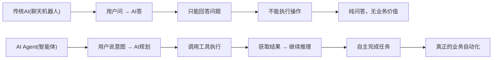
```mermaid
graph LR
    A["传统AI(聊天机器人)"] --> B["用户问 → AI答"]
    B --> C["只能回答问题"]
    C --> D["不能执行操作"]
    D --> E["纯问答，无业务价值"]

    F["AI Agent(智能体)"] --> G["用户说意图 → AI规划"]
    G --> H["调用工具执行"]
    H --> I["获取结果 → 继续推理"]
    I --> J["自主完成任务"]
    J --> K["真正的业务自动化"]
```

**本质区别：** 聊天机器人是"嘴"，AI Agent 是"手+脑"。用户说"帮我买明天去上海最便宜的票"，Agent 会自主完成：查余票 → 比价 → 选座 → 下单 → 支付，全程不需要用户介入。

### 1.2 Agent 思维模型

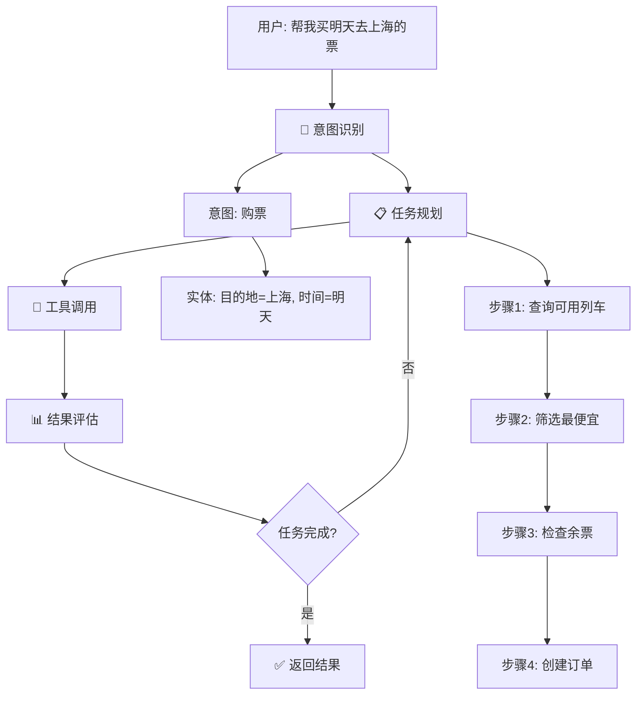
```mermaid
graph TB
    A["用户: 帮我买明天去上海的票"] --> B["🧠 意图识别"]
    B --> C["📋 任务规划"]
    C --> D["🔧 工具调用"]
    D --> E["📊 结果评估"]
    E --> F{"任务完成?"}
    F -->|否| C
    F -->|是| G["✅ 返回结果"]

    B --> B1["意图: 购票"]
    B1 --> B2["实体: 目的地=上海, 时间=明天"]

    C --> C1["步骤1: 查询可用列车"]
    C1 --> C2["步骤2: 筛选最便宜"]
    C2 --> C3["步骤3: 检查余票"]
    C3 --> C4["步骤4: 创建订单"]
```

这就是 **ReAct 模式**：Reasoning（推理）+ Acting（行动）交替进行。

---

## 二、Agent 全局架构

### 2.1 系统架构图

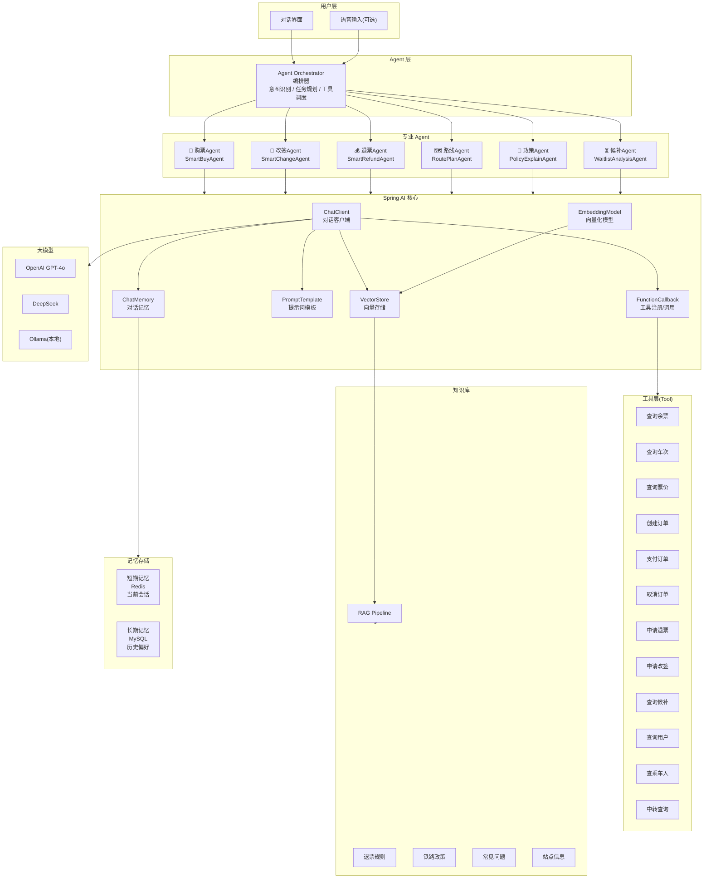
```mermaid
graph TB
    subgraph User["用户层"]
        Chat["对话界面"]
        Voice["语音输入(可选)"]
    end

    subgraph AgentLayer["Agent 层"]
        Orchestrator["Agent Orchestrator<br/>编排器<br/>意图识别 / 任务规划 / 工具调度"]
    end

    subgraph AgentTypes["专业 Agent"]
        BuyAgent["🎫 购票Agent<br/>SmartBuyAgent"]
        ChangeAgent["🔄 改签Agent<br/>SmartChangeAgent"]
        RefundAgent["💰 退票Agent<br/>SmartRefundAgent"]
        RouteAgent["🗺️ 路线Agent<br/>RoutePlanAgent"]
        PolicyAgent["📖 政策Agent<br/>PolicyExplainAgent"]
        WaitlistAgent["⏳ 候补Agent<br/>WaitlistAnalysisAgent"]
    end

    subgraph SpringAI["Spring AI 核心"]
        ChatClient["ChatClient<br/>对话客户端"]
        FunctionCallback["FunctionCallback<br/>工具注册/调用"]
        PromptTemplate["PromptTemplate<br/>提示词模板"]
        ChatMemory["ChatMemory<br/>对话记忆"]
        VectorStore["VectorStore<br/>向量存储"]
        EmbeddingModel["EmbeddingModel<br/>向量化模型"]
    end

    subgraph Tools["工具层(Tool)"]
        direction LR
        T1["查询余票"]
        T2["查询车次"]
        T3["查询票价"]
        T4["创建订单"]
        T5["支付订单"]
        T6["取消订单"]
        T7["申请退票"]
        T8["申请改签"]
        T9["查询候补"]
        T10["查询用户"]
        T11["查乘车人"]
        T12["中转查询"]
    end

    subgraph Knowledge["知识库"]
        RAG["RAG Pipeline"]
        KB1["退票规则"]
        KB2["铁路政策"]
        KB3["常见问题"]
        KB4["站点信息"]
    end

    subgraph LLM["大模型"]
        OpenAI["OpenAI GPT-4o"]
        DeepSeek["DeepSeek"]
        Ollama["Ollama(本地)"]
    end

    subgraph Memory["记忆存储"]
        ShortTerm["短期记忆<br/>Redis<br/>当前会话"]
        LongTerm["长期记忆<br/>MySQL<br/>历史偏好"]
    end

    Chat --> Orchestrator
    Voice --> Orchestrator

    Orchestrator --> BuyAgent & ChangeAgent & RefundAgent & RouteAgent & PolicyAgent & WaitlistAgent

    BuyAgent & ChangeAgent & RefundAgent & RouteAgent & PolicyAgent & WaitlistAgent --> SpringAI

    ChatClient --> FunctionCallback
    ChatClient --> PromptTemplate
    ChatClient --> ChatMemory
    ChatClient --> VectorStore

    FunctionCallback --> Tools
    VectorStore --> RAG
    RAG --> Knowledge
    EmbeddingModel --> VectorStore

    ChatClient --> LLM
    ChatMemory --> Memory
```

### 2.2 Agent 调度流程

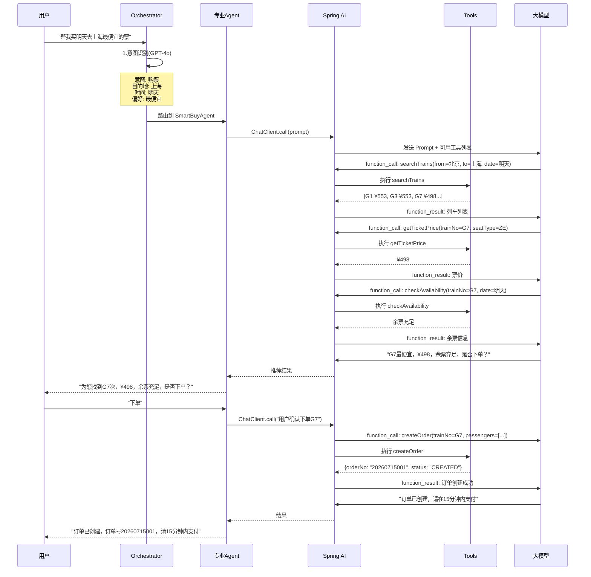
```mermaid
sequenceDiagram
    participant U as 用户
    participant O as Orchestrator
    participant A as 专业Agent
    participant AI as Spring AI
    participant T as Tools
    participant LLM as 大模型

    U->>O: "帮我买明天去上海最便宜的票"

    O->>O: 1.意图识别(GPT-4o)
    Note over O: 意图: 购票<br/>目的地: 上海<br/>时间: 明天<br/>偏好: 最便宜

    O->>A: 路由到 SmartBuyAgent

    A->>AI: ChatClient.call(prompt)
    AI->>LLM: 发送 Prompt + 可用工具列表

    LLM->>AI: function_call: searchTrains(from=北京, to=上海, date=明天)
    AI->>T: 执行 searchTrains
    T-->>AI: [G1 ¥553, G3 ¥553, G7 ¥498...]

    AI->>LLM: function_result: 列车列表
    LLM->>AI: function_call: getTicketPrice(trainNo=G7, seatType=ZE)
    AI->>T: 执行 getTicketPrice
    T-->>AI: ¥498

    AI->>LLM: function_result: 票价
    LLM->>AI: function_call: checkAvailability(trainNo=G7, date=明天)
    AI->>T: 执行 checkAvailability
    T-->>AI: 余票充足

    AI->>LLM: function_result: 余票信息
    LLM->>AI: "G7最便宜，¥498，余票充足。是否下单？"

    AI-->>A: 推荐结果
    A-->>U: "为您找到G7次，¥498，余票充足，是否下单？"

    U->>A: "下单"

    A->>AI: ChatClient.call("用户确认下单G7")
    AI->>LLM: function_call: createOrder(trainNo=G7, passengers=[...])
    AI->>T: 执行 createOrder
    T-->>AI: {orderNo: "20260715001", status: "CREATED"}

    AI->>LLM: function_result: 订单创建成功
    LLM->>AI: "订单已创建，请在15分钟内支付"

    AI-->>A: 结果
    A-->>U: "订单已创建，订单号20260715001，请15分钟内支付"
```

---

## 三、六大专业 Agent

### 3.1 Agent 职责总览

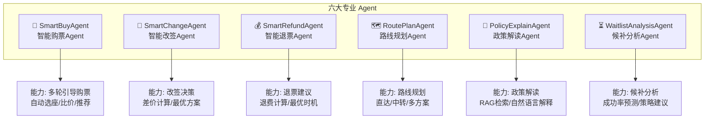
```mermaid
graph TB
    subgraph Agents["六大专业 Agent"]
        A1["🎫 SmartBuyAgent<br/>智能购票Agent"]
        A2["🔄 SmartChangeAgent<br/>智能改签Agent"]
        A3["💰 SmartRefundAgent<br/>智能退票Agent"]
        A4["🗺️ RoutePlanAgent<br/>路线规划Agent"]
        A5["📖 PolicyExplainAgent<br/>政策解读Agent"]
        A6["⏳ WaitlistAnalysisAgent<br/>候补分析Agent"]
    end

    A1 --> A1a["能力: 多轮引导购票<br/>自动选座/比价/推荐"]
    A2 --> A2a["能力: 改签决策<br/>差价计算/最优方案"]
    A3 --> A3a["能力: 退票建议<br/>退费计算/最优时机"]
    A4 --> A4a["能力: 路线规划<br/>直达/中转/多方案"]
    A5 --> A5a["能力: 政策解读<br/>RAG检索/自然语言解释"]
    A6 --> A6a["能力: 候补分析<br/>成功率预测/策略建议"]
```

---

### 3.2 🎫 智能购票 Agent (SmartBuyAgent)

#### 3.2.1 购票 Agent 工作流

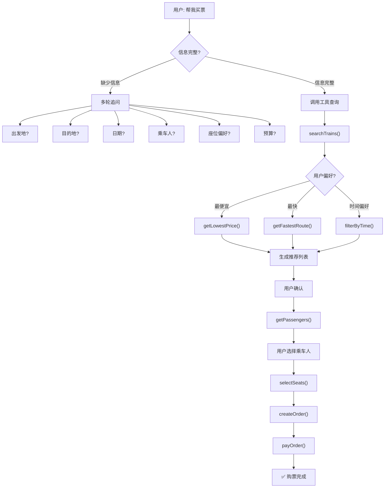
```mermaid
graph TB
    A["用户: 帮我买票"] --> B{"信息完整?"}
    B -->|缺少信息| C["多轮追问"]
    C --> C1["出发地?"]
    C --> C2["目的地?"]
    C --> C3["日期?"]
    C --> C4["乘车人?"]
    C --> C5["座位偏好?"]
    C --> C6["预算?"]
    B -->|信息完整| D["调用工具查询"]

    D --> E["searchTrains()"]
    E --> F{"用户偏好?"}
    F -->|最便宜| G["getLowestPrice()"]
    F -->|最快| H["getFastestRoute()"]
    F -->|时间偏好| I["filterByTime()"]

    G & H & I --> J["生成推荐列表"]
    J --> K["用户确认"]
    K --> L["getPassengers()"]
    L --> M["用户选择乘车人"]
    M --> N["selectSeats()"]
    N --> O["createOrder()"]
    O --> P["payOrder()"]
    P --> Q["✅ 购票完成"]
```

#### 3.2.2 购票多轮对话示例

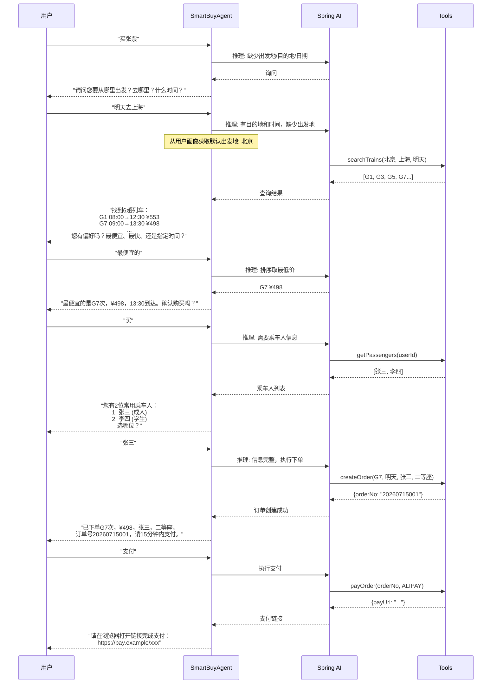
```mermaid
sequenceDiagram
    participant U as 用户
    participant A as SmartBuyAgent
    participant AI as Spring AI
    participant T as Tools

    U->>A: "买张票"
    A->>AI: 推理: 缺少出发地/目的地/日期
    AI-->>A: 询问
    A-->>U: "请问您要从哪里出发？去哪里？什么时间？"

    U->>A: "明天去上海"
    A->>AI: 推理: 有目的地和时间，缺少出发地
    Note over A: 从用户画像获取默认出发地: 北京
    AI->>T: searchTrains(北京, 上海, 明天)
    T-->>AI: [G1, G3, G5, G7...]

    AI-->>A: 查询结果
    A-->>U: "找到6趟列车：<br/>G1 08:00→12:30 ¥553<br/>G7 09:00→13:30 ¥498<br/>...<br/>您有偏好吗？最便宜、最快、还是指定时间？"

    U->>A: "最便宜的"
    A->>AI: 推理: 排序取最低价
    AI-->>A: G7 ¥498
    A-->>U: "最便宜的是G7次，¥498，13:30到达。确认购买吗？"

    U->>A: "买"
    A->>AI: 推理: 需要乘车人信息
    AI->>T: getPassengers(userId)
    T-->>AI: [张三, 李四]
    AI-->>A: 乘车人列表
    A-->>U: "您有2位常用乘车人：<br/>1. 张三 (成人)<br/>2. 李四 (学生)<br/>选哪位？"

    U->>A: "张三"
    A->>AI: 推理: 信息完整，执行下单
    AI->>T: createOrder(G7, 明天, 张三, 二等座)
    T-->>AI: {orderNo: "20260715001"}
    AI-->>A: 订单创建成功
    A-->>U: "已下单G7次，¥498，张三，二等座。<br/>订单号20260715001，请15分钟内支付。"

    U->>A: "支付"
    A->>AI: 执行支付
    AI->>T: payOrder(orderNo, ALIPAY)
    T-->>AI: {payUrl: "..."}
    AI-->>A: 支付链接
    A-->>U: "请在浏览器打开链接完成支付：<br/>https://pay.example/xxx"
```

#### 3.2.3 购票 Agent 工具列表

| 工具名 | 输入 | 输出 | 说明 |
|--------|------|------|------|
| `searchTrains` | from, to, date | 列车列表 | 查询可用列车 |
| `getLowestPrice` | from, to, date | 最低价列车 | 按票价排序 |
| `getFastestRoute` | from, to, date | 最快列车 | 按耗时排序 |
| `checkAvailability` | trainNo, date, seatType | 余票数量 | 检查余票 |
| `getPassengers` | userId | 乘车人列表 | 获取常用乘车人 |
| `selectSeats` | trainNo, date, passengers | 座位推荐 | 智能选座 |
| `createOrder` | trainNo, date, passengers, seatType | 订单号 | 创建订单 |
| `payOrder` | orderNo, payType | 支付链接 | 发起支付 |
| `getUserPreference` | userId | 用户偏好 | 获取历史偏好 |

---

### 3.3 🔄 智能改签 Agent (SmartChangeAgent)

#### 3.3.1 改签 Agent 工作流

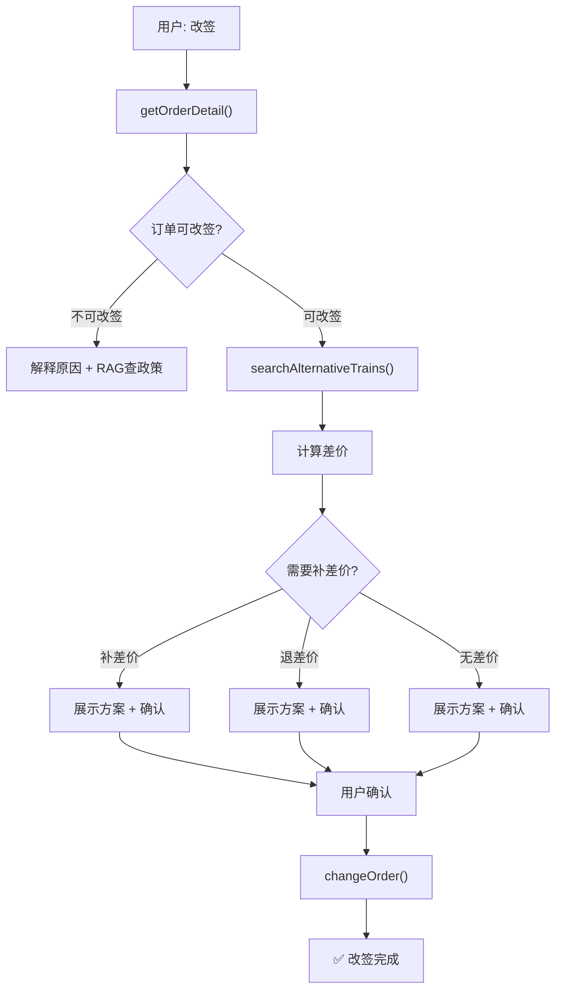
```mermaid
graph TB
    A["用户: 改签"] --> B["getOrderDetail()"]
    B --> C{"订单可改签?"}
    C -->|不可改签| D["解释原因 + RAG查政策"]
    C -->|可改签| E["searchAlternativeTrains()"]
    E --> F["计算差价"]
    F --> G{"需要补差价?"}
    G -->|补差价| H["展示方案 + 确认"]
    G -->|退差价| I["展示方案 + 确认"]
    G -->|无差价| J["展示方案 + 确认"]
    H & I & J --> K["用户确认"]
    K --> L["changeOrder()"]
    L --> M["✅ 改签完成"]
```

#### 3.3.2 改签时序图

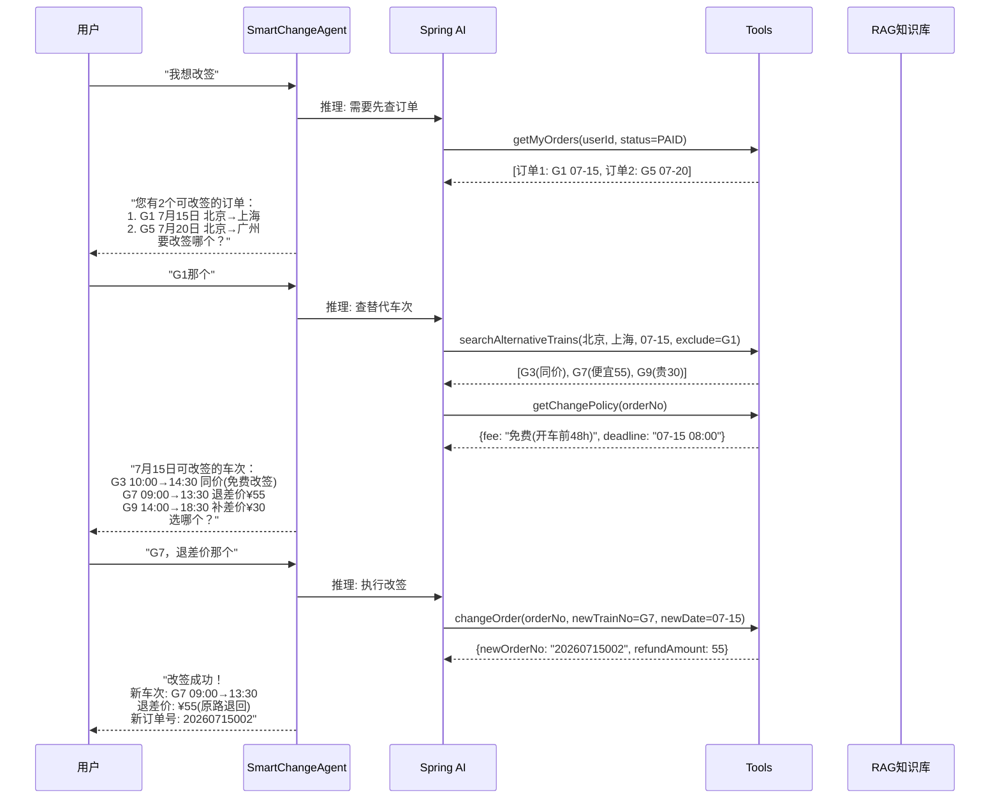
```mermaid
sequenceDiagram
    participant U as 用户
    participant A as SmartChangeAgent
    participant AI as Spring AI
    participant T as Tools
    participant RAG as RAG知识库

    U->>A: "我想改签"

    A->>AI: 推理: 需要先查订单
    AI->>T: getMyOrders(userId, status=PAID)
    T-->>AI: [订单1: G1 07-15, 订单2: G5 07-20]

    A-->>U: "您有2个可改签的订单：<br/>1. G1 7月15日 北京→上海<br/>2. G5 7月20日 北京→广州<br/>要改签哪个？"

    U->>A: "G1那个"

    A->>AI: 推理: 查替代车次
    AI->>T: searchAlternativeTrains(北京, 上海, 07-15, exclude=G1)
    T-->>AI: [G3(同价), G7(便宜55), G9(贵30)]

    AI->>T: getChangePolicy(orderNo)
    T-->>AI: {fee: "免费(开车前48h)", deadline: "07-15 08:00"}

    A-->>U: "7月15日可改签的车次：<br/>G3 10:00→14:30 同价(免费改签)<br/>G7 09:00→13:30 退差价¥55<br/>G9 14:00→18:30 补差价¥30<br/>选哪个？"

    U->>A: "G7，退差价那个"

    A->>AI: 推理: 执行改签
    AI->>T: changeOrder(orderNo, newTrainNo=G7, newDate=07-15)
    T-->>AI: {newOrderNo: "20260715002", refundAmount: 55}

    A-->>U: "改签成功！<br/>新车次: G7 09:00→13:30<br/>退差价: ¥55(原路退回)<br/>新订单号: 20260715002"
```

#### 3.3.3 改签 Agent 工具列表

| 工具名 | 输入 | 输出 | 说明 |
|--------|------|------|------|
| `getMyOrders` | userId, status | 订单列表 | 查询可改签订单 |
| `searchAlternativeTrains` | from, to, date, exclude | 替代车次 | 排除原车次 |
| `getChangePolicy` | orderNo | 改签规则 | 改签手续费/截止时间 |
| `calculatePriceDiff` | oldOrder, newTrain | 差价 | 计算补退差价 |
| `changeOrder` | orderNo, newTrain, newDate | 新订单 | 执行改签 |
| `selectNewSeat` | newTrainNo, date, passenger | 座位 | 新车次选座 |

---

### 3.4 💰 智能退票 Agent (SmartRefundAgent)

#### 3.4.1 退票 Agent 决策流程

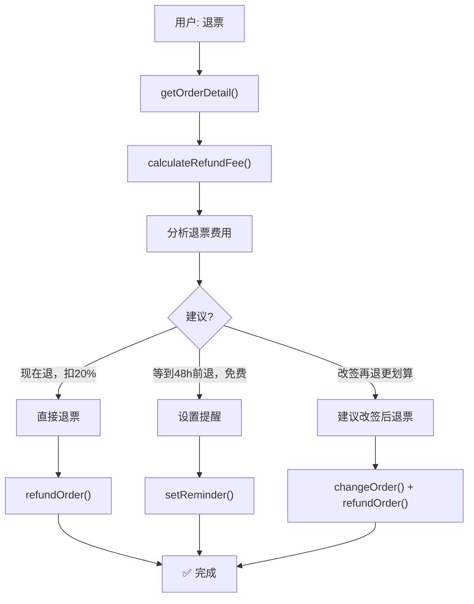
```mermaid
graph TB
    A["用户: 退票"] --> B["getOrderDetail()"]
    B --> C["calculateRefundFee()"]
    C --> D["分析退票费用"]
    D --> E{"建议?"}
    E -->|"现在退，扣20%"| F["直接退票"]
    E -->|"等到48h前退，免费"| G["设置提醒"]
    E -->|"改签再退更划算"| H["建议改签后退票"]

    F --> I["refundOrder()"]
    G --> J["setReminder()"]
    H --> K["changeOrder() + refundOrder()"]

    I & J & K --> L["✅ 完成"]
```

#### 3.4.2 退票决策时序图

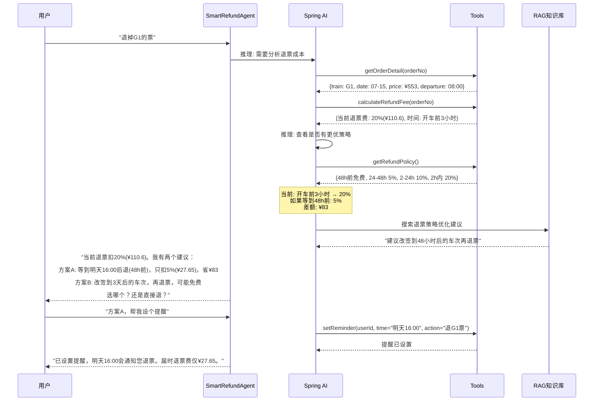
```mermaid
sequenceDiagram
    participant U as 用户
    participant A as SmartRefundAgent
    participant AI as Spring AI
    participant T as Tools
    participant RAG as RAG知识库

    U->>A: "退掉G1的票"

    A->>AI: 推理: 需要分析退票成本
    AI->>T: getOrderDetail(orderNo)
    T-->>AI: {train: G1, date: 07-15, price: ¥553, departure: 08:00}

    AI->>T: calculateRefundFee(orderNo)
    T-->>AI: {当前退票费: 20%(¥110.6), 时间: 开车前3小时}

    AI->>AI: 推理: 查看是否有更优策略
    AI->>T: getRefundPolicy()
    T-->>AI: {48h前免费, 24-48h 5%, 2-24h 10%, 2h内 20%}

    Note over AI: 当前: 开车前3小时 → 20%<br/>如果等到48h前: 5%<br/>差额: ¥83

    AI->>RAG: 搜索退票策略优化建议
    RAG-->>AI: "建议改签到48小时后的车次再退票"

    A-->>U: "当前退票扣20%(¥110.6)。我有两个建议：<br/><br/>方案A: 等到明天16:00后退(48h前)，只扣5%(¥27.65)，省¥83<br/><br/>方案B: 改签到3天后的车次，再退票，可能免费<br/><br/>选哪个？还是直接退？"

    U->>A: "方案A，帮我设个提醒"

    AI->>T: setReminder(userId, time="明天16:00", action="退G1票")
    T-->>AI: 提醒已设置

    A-->>U: "已设置提醒，明天16:00会通知您退票。届时退票费仅¥27.65。"
```

#### 3.4.3 退票 Agent 工具列表

| 工具名 | 输入 | 输出 | 说明 |
|--------|------|------|------|
| `getOrderDetail` | orderNo | 订单详情 | 获取订单完整信息 |
| `calculateRefundFee` | orderNo | 退票费 | 按时间阶梯计算 |
| `getRefundPolicy` | - | 退票规则 | 退票政策全文 |
| `suggestBestRefundTime` | orderNo | 最优退票时间 | 找退费最低的时间点 |
| `calculateChangeFirst` | orderNo | 改签再退方案 | 计算是否改签再退更划算 |
| `refundOrder` | orderNo, reason | 退款结果 | 执行退票 |
| `setReminder` | userId, time, action | 提醒ID | 设置定时提醒 |

---

### 3.5 🗺️ 路线规划 Agent (RoutePlanAgent)

#### 3.5.1 路线规划决策树

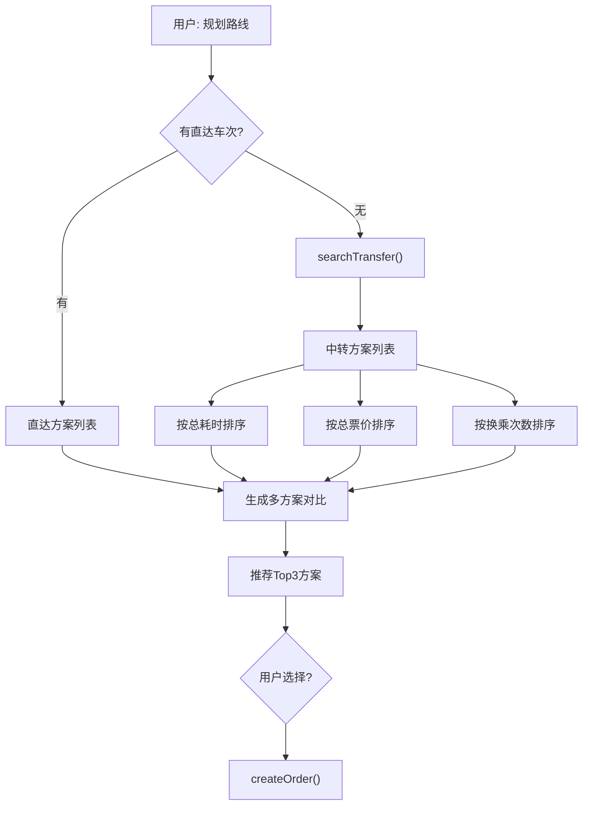
```mermaid
graph TB
    A["用户: 规划路线"] --> B{"有直达车次?"}
    B -->|有| C["直达方案列表"]
    B -->|无| D["searchTransfer()"]

    D --> E["中转方案列表"]
    E --> F["按总耗时排序"]
    E --> G["按总票价排序"]
    E --> H["按换乘次数排序"]

    C --> I["生成多方案对比"]
    F & G & H --> I

    I --> J["推荐Top3方案"]
    J --> K{"用户选择?"}
    K --> L["createOrder()"]
```

#### 3.5.2 路线规划时序图

```mermaid
sequenceDiagram
    participant U as 用户
    participant A as RoutePlanAgent
    participant AI as Spring AI
    participant T as Tools

    U->>A: "帮我规划从北京到大理的路线"

    A->>AI: 推理: 北京到大理没有直达高铁
    AI->>T: searchTrains(北京, 大理, 07-15)
    T-->>AI: [] (无直达)

    AI->>T: searchTransfer(北京, 大理, 07-15)
    T-->>AI: [
      {方案1: 北京→昆明(G1 ¥1100 8h) + 明明→大理(D ¥150 2h), 总¥1250 10h},
      {方案2: 北京→成都(G3 ¥800 6h) + 成都→大理(D ¥350 4h), 总¥1150 10h},
      {方案3: 北京→重庆(G5 ¥750 5h) + 重庆→大理(D ¥400 5h), 总¥1150 10h}
    ]

    AI->>AI: 推理: 综合分析
    Note over AI: 方案1: 最快但最贵<br/>方案2: 最便宜且换乘方便<br/>方案3: 最便宜但换乘时间紧

    A-->>U: "北京到大理没有直达，推荐3个中转方案：<br/><br/>🏆 推荐方案: 经成都中转<br/>北京→成都 G3 08:00→14:00 ¥800<br/>成都→大理 D2345 16:00→20:00 ¥350<br/>总耗时: 12h | 总价: ¥1150<br/>换乘等待: 2小时(充足)<br/><br/>最快方案: 经昆明中转<br/>总价: ¥1250 | 总耗时: 10h<br/><br/>最省方案: 经重庆中转<br/>总价: ¥1150 | 换乘仅1小时(较紧)<br/><br/>选哪个？"

    U->>A: "推荐方案，帮我买"

    AI->>T: createOrder({train1: G3, train2: D2345, passengers: [张三]})
    T-->>AI: {orderNo1: "001", orderNo2: "002"}

    A-->>U: "已下单：<br/>订单1: 北京→成都 G3 ¥800<br/>订单2: 成都→大理 D2345 ¥350<br/>总计: ¥1150，请15分钟内支付"
```

#### 3.5.3 路线规划 Agent 工具列表

| 工具名 | 输入 | 输出 | 说明 |
|--------|------|------|------|
| `searchTrains` | from, to, date | 直达列车 | 查询直达车次 |
| `searchTransfer` | from, to, date | 中转方案 | 计算最优中转 |
| `getTransferStation` | from, to | 中转站列表 | 推荐中转城市 |
| `calculateTotalTime` | train1, train2 | 总耗时 | 含换乘等待 |
| `calculateTotalPrice` | train1, train2 | 总票价 | 两段票价之和 |
| `checkTransferFeasibility` | arrival1, departure2 | 是否可行 | 换乘时间是否充足 |
| `createMultiOrder` | trains[], passengers | 订单列表 | 一次性创建多段订单 |

---

### 3.6 📖 政策解读 Agent (PolicyExplainAgent)

#### 3.6.1 RAG 检索流程

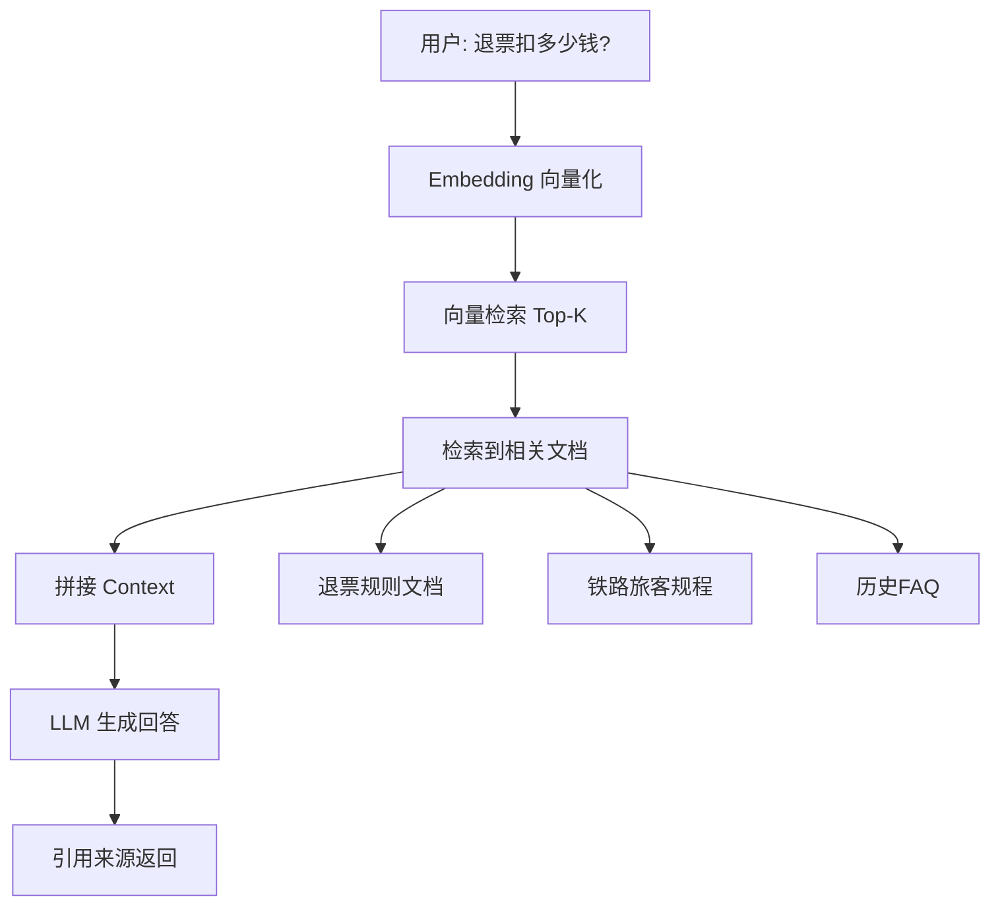
```mermaid
graph TB
    A["用户: 退票扣多少钱?"] --> B["Embedding 向量化"]
    B --> C["向量检索 Top-K"]
    C --> D["检索到相关文档"]
    D --> E["拼接 Context"]
    E --> F["LLM 生成回答"]
    F --> G["引用来源返回"]

    D --> D1["退票规则文档"]
    D --> D2["铁路旅客规程"]
    D --> D3["历史FAQ"]
```

#### 3.6.2 政策解读时序图

```mermaid
sequenceDiagram
    participant U as 用户
    participant A as PolicyExplainAgent
    participant AI as Spring AI
    participant VS as 向量数据库
    participant LLM as GPT-4o

    U->>A: "我带了个3岁小孩，怎么买票？"

    A->>AI: 推理: 这是政策类问题，需要RAG检索

    AI->>AI: Embedding("3岁小孩怎么买票")
    AI->>VS: 向量相似度搜索 Top-5
    VS-->>AI: [
      "儿童票规则: 身高1.2m以下免票...",
      "随行儿童购票: 每位成人可带1名免票儿童...",
      "儿童票价格: 半价硬座...",
      "儿童乘车规定: 需有成人陪同...",
      "学生票/儿童票区别..."
    ]

    AI->>LLM: SystemPrompt + RAG Context + 用户问题
    LLM-->>AI: "根据铁路旅客规程：<br/>1. 每位成人旅客可免费携带1名身高不足1.2米的儿童乘车<br/>2. 超过1名时，超过的人数应购买儿童票<br/>3. 身高1.2-1.5米的儿童应购买儿童票(半价)<br/>4. 超过1.5米的儿童应购买全价票<br/><br/>您的3岁小孩一般身高在1米左右，可以免票。<br/><br/>参考: 《铁路旅客运输规程》第19条"

    A-->>U: LLM的回答
```

#### 3.6.3 政策 Agent 知识库

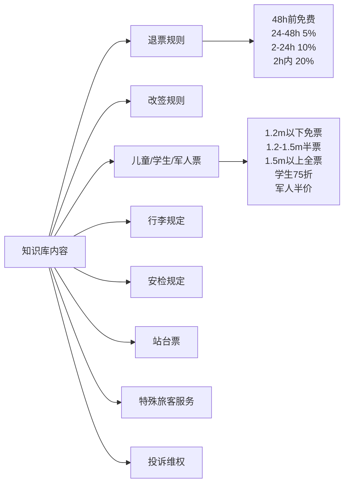
```mermaid
graph LR
    A["知识库内容"] --> B["退票规则"]
    A --> C["改签规则"]
    A --> D["儿童/学生/军人票"]
    A --> E["行李规定"]
    A --> F["安检规定"]
    A --> G["站台票"]
    A --> H["特殊旅客服务"]
    A --> I["投诉维权"]

    B --> B1["48h前免费<br/>24-48h 5%<br/>2-24h 10%<br/>2h内 20%"]

    D --> D1["1.2m以下免票<br/>1.2-1.5m半票<br/>1.5m以上全票<br/>学生75折<br/>军人半价"]
```

---

### 3.7 ⏳ 候补分析 Agent (WaitlistAnalysisAgent)

#### 3.7.1 候补分析流程

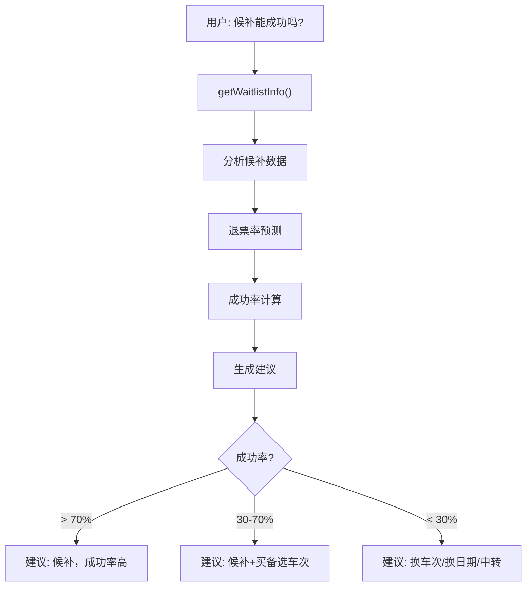
```mermaid
graph TB
    A["用户: 候补能成功吗?"] --> B["getWaitlistInfo()"]
    B --> C["分析候补数据"]
    C --> D["退票率预测"]
    D --> E["成功率计算"]
    E --> F["生成建议"]

    F --> G{"成功率?"}
    G -->|"> 70%"| H["建议: 候补，成功率高"]
    G -->|"30-70%"| I["建议: 候补+买备选车次"]
    G -->|"< 30%"| J["建议: 换车次/换日期/中转"]
```

#### 3.7.2 候补分析时序图

```mermaid
sequenceDiagram
    participant U as 用户
    participant A as WaitlistAnalysisAgent
    participant AI as Spring AI
    participant T as Tools

    U->>A: "G1明天的票没了，候补能成功吗？"

    AI->>T: getWaitlistStats(trainNo=G1, date=明天)
    T-->>AI: {
      总票数: 1000,
      已售: 1000,
      候补人数: 256,
      历史退票率: 8%,
      平均退票时间: 开车前6小时
    }

    AI->>T: getWaitlistPosition(userId, trainNo=G1, date=明天)
    T-->>AI: {position: 156, total: 256}

    AI->>AI: 推理分析
    Note over AI: 预计退票数: 1000 × 8% = 80张<br/>您的位置: 156/256<br/>成功概率: 80/256 = 31%<br/>退票高峰: 开车前6小时

    A-->>U: "G1候补分析：<br/><br/>📊 数据：<br/>总票: 1000张 | 已售: 1000张<br/>候补队列: 256人 | 您排第156位<br/><br/>📈 预测：<br/>历史退票率: 8%(约80张)<br/>您成功概率: 约31%<br/>预计兑现时间: 开车前6小时左右<br/><br/>💡 建议：<br/>成功率偏低，建议同时候补G3次(成功率68%)<br/>或考虑北京→上海中转方案(有票)<br/><br/>要我帮您同时候补G3吗？"

    U->>A: "好，帮我候补G1和G3"

    AI->>T: joinWaitlist(userId, G1, 明天)
    AI->>T: joinWaitlist(userId, G3, 明天)
    T-->>AI: 候补成功

    A-->>U: "已为您加入候补：<br/>✅ G1 候补中(第156位)<br/>✅ G3 候补中(第12位)<br/>G3成功率更高，建议优先等待G3"
```

#### 3.7.3 候补 Agent 工具列表

| 工具名 | 输入 | 输出 | 说明 |
|--------|------|------|------|
| `getWaitlistStats` | trainNo, date | 候补统计 | 候补人数/退票率 |
| `getWaitlistPosition` | userId, trainNo | 排队位置 | 用户当前位置 |
| `predictSuccessRate` | trainNo, date, position | 成功率 | 基于历史数据预测 |
| `getAlternativeOptions` | from, to, date | 替代方案 | 其他有票车次 |
| `joinWaitlist` | userId, trainNo, date | 候补ID | 加入候补 |
| `cancelWaitlist` | waitlistId | 取消结果 | 退出候补 |
| `getHistoricalData` | trainNo | 历史退票数据 | 近期退票趋势 |

---

## 四、Spring AI 技术架构

### 4.1 Spring AI 核心组件

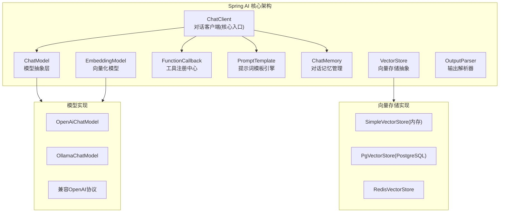
```mermaid
graph TB
    subgraph SpringAI["Spring AI 核心架构"]
        ChatClient["ChatClient<br/>对话客户端(核心入口)"]
        ChatModel["ChatModel<br/>模型抽象层"]
        EmbeddingModel["EmbeddingModel<br/>向量化模型"]
        FunctionCallback["FunctionCallback<br/>工具注册中心"]
        PromptTemplate["PromptTemplate<br/>提示词模板引擎"]
        ChatMemory["ChatMemory<br/>对话记忆管理"]
        VectorStore["VectorStore<br/>向量存储抽象"]
        OutputParser["OutputParser<br/>输出解析器"]
    end

    subgraph Models["模型实现"]
        OpenAI["OpenAiChatModel"]
        Ollama["OllamaChatModel"]
        DeepSeek["兼容OpenAI协议"]
    end

    subgraph Stores["向量存储实现"]
        Simple["SimpleVectorStore(内存)"]
        PG["PgVectorStore(PostgreSQL)"]
        Redis_V["RedisVectorStore"]
    end

    ChatClient --> ChatModel
    ChatClient --> FunctionCallback
    ChatClient --> PromptTemplate
    ChatClient --> ChatMemory

    ChatModel --> Models
    EmbeddingModel --> Models
    VectorStore --> Stores
```

### 4.2 Function Calling 机制

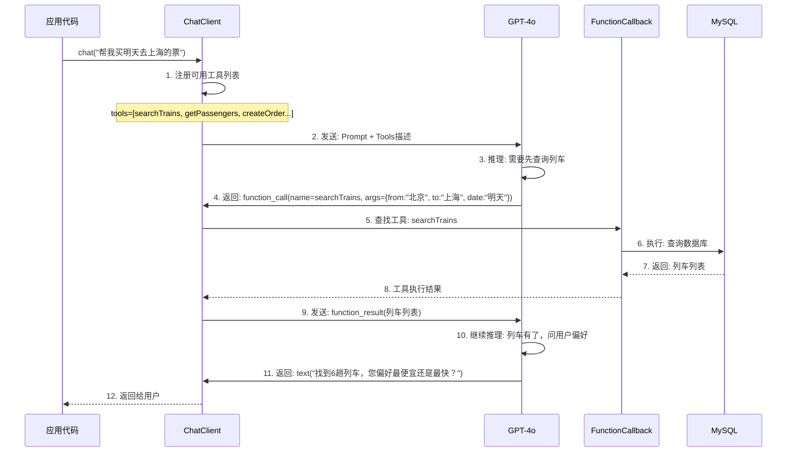
```mermaid
sequenceDiagram
    participant App as 应用代码
    participant CC as ChatClient
    participant LLM as GPT-4o
    participant FC as FunctionCallback
    participant DB as MySQL

    App->>CC: chat("帮我买明天去上海的票")

    CC->>CC: 1. 注册可用工具列表
    Note over CC: tools=[searchTrains, getPassengers, createOrder...]

    CC->>LLM: 2. 发送: Prompt + Tools描述

    LLM->>LLM: 3. 推理: 需要先查询列车
    LLM->>CC: 4. 返回: function_call(name=searchTrains, args={from:"北京", to:"上海", date:"明天"})

    CC->>FC: 5. 查找工具: searchTrains
    FC->>DB: 6. 执行: 查询数据库
    DB-->>FC: 7. 返回: 列车列表
    FC-->>CC: 8. 工具执行结果

    CC->>LLM: 9. 发送: function_result(列车列表)
    LLM->>LLM: 10. 继续推理: 列车有了，问用户偏好
    LLM->>CC: 11. 返回: text("找到6趟列车，您偏好最便宜还是最快？")
    CC-->>App: 12. 返回给用户
```

### 4.3 Function Calling 工具注册方式

```mermaid
graph TB
    A["工具注册方式"] --> B["@Bean 注册"]
    A --> C["@Description 注解"]
    A --> D["FunctionCallback 手动注册"]

    B --> B1["Spring Bean 自动注册<br/>适合: 全局通用工具"]
    C --> C1["方法注解声明<br/>适合: 单个Agent专属工具"]
    D --> D1["编程式注册<br/>适合: 动态工具/运行时决定"]
```

### 4.4 ChatClient 使用模式

```mermaid
graph TB
    A["ChatClient 构建"] --> B["ChatClient.builder(chatModel)"]
    B --> C[".defaultSystem(systemPrompt)"]
    C --> D[".defaultFunctions(tools)"]
    D --> E[".defaultAdvisors(memoryAdvisor)"]
    E --> F[".build()"]

    F --> G["使用方式"]
    G --> H["chat().user(msg).call()"]
    G --> I["chat().user(msg).stream()"]
    G --> J["chat().user(msg).functions().call()"]
```

---

## 五、MCP (Model Context Protocol)

### 5.1 MCP 在 RailMind 中的应用

```mermaid
graph TB
    subgraph MCP["MCP 协议层"]
        Host["MCP Host<br/>AI 应用"]
        Client["MCP Client<br/>协议客户端"]
        Server1["MCP Server: 票务服务"]
        Server2["MCP Server: 用户服务"]
        Server3["MCP Server: 政策知识库"]
    end

    subgraph External["外部 MCP Server"]
        Weather["天气服务 MCP"]
        Map["地图服务 MCP"]
        Pay["支付服务 MCP"]
    end

    Host --> Client
    Client --> Server1 & Server2 & Server3
    Client --> External

    Server1 --> T1["查询余票<br/>创建订单<br/>退票改签"]
    Server2 --> T2["用户信息<br/>乘车人管理"]
    Server3 --> T3["政策检索<br/>FAQ问答"]

    Weather --> T4["天气查询"]
    Map --> T5["地图/导航"]
```

### 5.2 MCP Server 能力

```mermaid
graph LR
    subgraph MCP["MCP Server: railmind-ticket"]
        Tools["Tools(工具)"]
        Resources["Resources(资源)"]
        Prompts["Prompts(模板)"]

        Tools --> T1["search_trains"]
        Tools --> T2["check_availability"]
        Tools --> T3["create_order"]
        Tools --> T4["cancel_order"]

        Resources --> R1["列车时刻表"]
        Resources --> R2["票价表"]
        Resources --> R3["库存数据"]

        Prompts --> P1["购票引导模板"]
        Prompts --> P2["退票建议模板"]
    end
```

### 5.3 MCP 与 Function Calling 的关系

```mermaid
graph TB
    A["Function Calling"] --> B["Spring AI 内置机制"]
    B --> C["工具注册在应用内部"]
    C --> D["适合: 同进程工具调用"]

    E["MCP"] --> F["标准化协议"]
    F --> G["工具注册在外部服务"]
    G --> H["适合: 跨服务/跨语言工具调用"]

    I["RailMind 选择"] --> J["核心购票工具: Function Calling<br/>(同进程，延迟低)"]
    I --> K["外部服务: MCP<br/>(天气/地图等第三方)"]
    I --> L["政策知识库: MCP Server<br/>(可独立部署/复用)"]
```

---

## 六、Memory 记忆系统

### 6.1 三层记忆架构

```mermaid
graph TB
    subgraph L1["短期记忆(会话级)"]
        ConvHistory["对话历史<br/>Redis List<br/>最近20条消息"]
    end

    subgraph L2["中期记忆(用户级)"]
        UserPref["用户偏好<br/>MySQL<br/>购票习惯/常坐车次/常用座位"]
    end

    subgraph L3["长期记忆(全局级)"]
        GlobalKB["全局知识<br/>向量数据库<br/>历史对话摘要/常见问题"]
    end

    A["用户消息"] --> B["Agent"]
    B --> C["加载记忆"]
    C --> L1
    C --> L2
    C --> L3

    B --> D["对话结束"]
    D --> E["保存记忆"]
    E --> L1
    E --> F["更新偏好"]
    F --> L2
    E --> G["摘要归档"]
    G --> L3
```

### 6.2 记忆生命周期

```mermaid
sequenceDiagram
    participant U as 用户
    participant A as Agent
    participant R as Redis(短期)
    participant DB as MySQL(中期)
    participant VS as 向量库(长期)

    Note over U,VS: 第1次对话
    U->>A: "帮我买明天去上海的票"
    A->>R: 获取对话历史(空)
    A->>DB: 获取用户偏好(首次)
    A->>A: 完成购票
    A->>R: 保存对话: [user:买票, agent:已下单G1]
    A->>DB: 保存偏好: {常去:上海, 偏好:二等座}

    Note over U,VS: 第2次对话(新会话)
    U->>A: "买去上海的票"
    A->>R: 获取对话历史(新会话,空)
    A->>DB: 获取用户偏好: {常去:上海, 偏好:二等座}
    Note over A: 已知目的地=上海，只需确认日期
    A-->>U: "您常去上海，请问哪天的票？"

    Note over U,VS: 记忆归档(定期)
    R->>R: 对话历史超过20条
    R->>VS: 摘要: "用户于7月15日购买了G1次北京→上海二等座票"
    R->>R: 只保留最近20条
```

### 6.3 用户画像

```mermaid
graph LR
    A["用户画像数据"] --> B["出行习惯"]
    A --> C["座位偏好"]
    A --> D["价格敏感度"]
    A --> E["时间偏好"]
    A --> F["乘车人组合"]

    B --> B1["常去: 上海/广州<br/>频率: 每月2次"]
    C --> C1["偏好: 靠窗(F/A)<br/>座位: 二等座"]
    D --> D1["价格敏感: 高<br/>总是选最便宜"]
    E --> E1["偏好: 早班车<br/>通常选8:00前"]
    F --> F1["常带: 张三(同事)<br/>出差为主"]
```

---

## 七、RAG 知识库

### 7.1 RAG 完整流程

```mermaid
graph TB
    subgraph Ingestion["知识库构建(离线)"]
        Doc1["退票规则.md"]
        Doc2["铁路旅客规程.md"]
        Doc3["常见问题FAQ.md"]
        Doc4["站点信息.md"]
        Doc5["票价规则.md"]

        Doc1 & Doc2 & Doc3 & Doc4 & Doc5 --> Split["文档切片<br/>每段300-500字"]
        Split --> Embed["Embedding向量化"]
        Embed --> Store["存入向量数据库"]
    end

    subgraph Retrieval["检索增强生成(在线)"]
        Q["用户提问"] --> QEmbed["问题向量化"]
        QEmbed --> Search["向量相似度搜索<br/>Top-K=5"]
        Store --> Search
        Search --> Context["拼接检索结果为Context"]
        Context --> Prompt["SystemPrompt + Context + 用户问题"]
        Prompt --> LLM["GPT-4o生成回答"]
        LLM --> Answer["带引用来源的回答"]
    end
```

### 7.2 知识库内容

| 知识库 | 内容 | 切片策略 | 更新频率 |
|--------|------|---------|---------|
| 退票规则 | 退票费阶梯、退票时限、特殊情况 | 按规则条目切片 | 政策变更时 |
| 改签规则 | 改签条件、改签费、改签次数限制 | 按规则条目切片 | 政策变更时 |
| 旅客规程 | 铁路旅客运输规程全文 | 按条款切片 | 年度更新 |
| FAQ | 100+常见问题及标准回答 | Q&A对切片 | 月度更新 |
| 站点信息 | 车站设施、交通接驳、服务时间 | 按站点切片 | 季度更新 |
| 特殊旅客 | 儿童/学生/军人/残疾人/孕妇规定 | 按类型切片 | 政策变更时 |

### 7.3 RAG 优化策略

```mermaid
graph TB
    A["RAG优化"] --> B["切片优化"]
    A --> C["检索优化"]
    A --> D["生成优化"]

    B --> B1["重叠切片(overlap 50字)<br/>避免上下文断裂"]
    B --> B2["按语义切片<br/>而非固定长度"]
    B --> B3["元数据标注<br/>标签: 退票/儿童/学生"]

    C --> C1["混合检索<br/>向量相似度 + 关键词匹配"]
    C --> C2["重排序(Rerank)<br/>对Top-K结果二次排序"]
    C --> C3["多路召回<br/>同时查多个知识库"]

    D --> D1["引用来源<br/>回答中标注出自哪条规则"]
    D --> D2["置信度<br/>低置信度时提示用户核实"]
    D --> D3["拒绝回答<br/>超出知识范围时坦诚说明"]
```

---

## 八、Prompt 模板设计

### 8.1 System Prompt 结构

```mermaid
graph TB
    A["System Prompt 组成"] --> B["角色定义"]
    A --> C["能力边界"]
    A --> D["行为规范"]
    A --> E["输出格式"]
    A --> F["安全约束"]

    B --> B1["你是RailMind AI智能助手..."]
    C --> C1["你可以: 购票/退票/改签/查票/政策咨询..."]
    C --> C2["你不能: 修改票价/绕过规则/泄露他人信息..."]
    D --> D1["多轮引导收集信息<br/>不确定时追问<br/>给出具体建议而非泛泛而谈"]
    E --> E1["结构化输出<br/>方案对比表格<br/>明确的行动建议"]
    F --> F1["不泄露他人订单<br/>不执行未授权操作<br/>敏感信息脱敏"]
```

### 8.2 各 Agent 的 Prompt 模板

```mermaid
graph LR
    subgraph Prompts["Prompt 模板"]
        P1["购票Agent Prompt"]
        P2["改签Agent Prompt"]
        P3["退票Agent Prompt"]
        P4["路线Agent Prompt"]
        P5["政策Agent Prompt"]
        P6["候补Agent Prompt"]
    end

    P1 --> P1a["角色: 热情的售票员<br/>目标: 引导用户完成购票<br/>工具: searchTrains, createOrder...<br/>行为: 缺信息时追问,有信息时推荐"]

    P2 --> P2a["角色: 专业的改签顾问<br/>目标: 帮用户找到最优改签方案<br/>工具: searchAlternative, calculateDiff...<br/>行为: 分析差价,给出对比"]

    P3 --> P3a["角色: 精明的财务顾问<br/>目标: 最小化退票损失<br/>工具: calculateRefundFee, suggestBestTime...<br/>行为: 分析退费,建议最佳时机"]

    P4 --> P4a["角色: 旅行规划师<br/>目标: 规划最优路线<br/>工具: searchTrains, searchTransfer...<br/>行为: 多方案对比,考虑时间/价格/舒适度"]

    P5 --> P5a["角色: 铁路政策专家<br/>目标: 准确解读政策<br/>工具: RAG检索知识库<br/>行为: 引用原文,通俗解释"]

    P6 --> P6a["角色: 数据分析师<br/>目标: 预测候补成功率<br/>工具: getWaitlistStats, predictRate...<br/>行为: 用数据说话,给出概率"]
```

### 8.3 Prompt 动态注入

```mermaid
sequenceDiagram
    participant App as 应用
    participant PT as PromptTemplate
    participant AI as ChatClient

    App->>PT: 加载模板文件
    Note over PT: templates/purchase-agent.st

    PT->>PT: 变量替换
    Note over PT: {{user_name}} → 张三<br/>{{user_level}} → 金卡<br/>{{current_time}} → 2026-07-14 10:00<br/>{{user_preference}} → 偏好二等座<br/>{{available_tools}} → [searchTrains...]

    PT->>AI: 注入为 System Prompt
    AI->>AI: 发送给LLM
```

---

## 九、Agent 工具总表

### 9.1 所有工具一览

```mermaid
graph TB
    subgraph TrainTools["🚂 车次工具"]
        T1["searchTrains<br/>查询列车"]
        T2["getTrainDetail<br/>列车详情"]
        T3["getTicketPrice<br/>查询票价"]
        T4["checkAvailability<br/>检查余票"]
        T5["searchTransfer<br/>中转查询"]
        T6["getSchedule<br/>运行图查询"]
    end

    subgraph OrderTools["📋 订单工具"]
        O1["createOrder<br/>创建订单"]
        O2["getOrderDetail<br/>订单详情"]
        O3["getMyOrders<br/>我的订单"]
        O4["cancelOrder<br/>取消订单"]
        O5["changeOrder<br/>改签订单"]
        O6["refundOrder<br/>退票"]
    end

    subgraph PayTools["💳 支付工具"]
        P1["payOrder<br/>支付订单"]
        P2["getPayStatus<br/>支付状态"]
        P3["getRefundStatus<br/>退款状态"]
    end

    subgraph UserTools["👤 用户工具"]
        U1["getUserInfo<br/>用户信息"]
        U2["getPassengers<br/>乘车人列表"]
        U3["getUserPreference<br/>用户偏好"]
        U4["updatePreference<br/>更新偏好"]
    end

    subgraph WaitlistTools["⏳ 候补工具"]
        W1["joinWaitlist<br/>加入候补"]
        W2["cancelWaitlist<br/>取消候补"]
        W3["getWaitlistStats<br/>候补统计"]
        W4["predictSuccessRate<br/>成功率预测"]
    end

    subgraph PolicyTools["📖 政策工具(Only RAG)"]
        R1["searchPolicy<br/>政策检索"]
        R2["searchFAQ<br/>FAQ检索"]
        R3["explainRule<br/>规则解释"]
    end

    subgraph SeatTools["💺 座位工具"]
        S1["getSeatMap<br/>座位图"]
        S2["selectSeat<br/>选座"]
        S3["recommendSeat<br/>智能推荐座位"]
    end
```

### 9.2 工具与 Agent 的关系

| Agent | 可用工具 |
|-------|---------|
| SmartBuyAgent | searchTrains, getTicketPrice, checkAvailability, getPassengers, getUserPreference, selectSeat, createOrder, payOrder, getSeatMap, recommendSeat |
| SmartChangeAgent | getMyOrders, searchTrains, getTicketPrice, getChangePolicy, calculatePriceDiff, changeOrder, selectSeat |
| SmartRefundAgent | getOrderDetail, calculateRefundFee, getRefundPolicy, suggestBestRefundTime, refundOrder, setReminder |
| RoutePlanAgent | searchTrains, searchTransfer, getTransferStation, calculateTotalTime, calculateTotalPrice, createMultiOrder |
| PolicyExplainAgent | searchPolicy, searchFAQ, explainRule (纯RAG，不调业务工具) |
| WaitlistAnalysisAgent | getWaitlistStats, getWaitlistPosition, predictSuccessRate, getAlternativeOptions, joinWaitlist, cancelWaitlist |

---

## 十、Agent 路由与编排

### 10.1 意图识别 → Agent 路由

```mermaid
graph TB
    A["用户输入"] --> B["意图识别"]
    B --> C{"意图分类"}

    C -->|"买票/购票/订票"| D["SmartBuyAgent"]
    C -->|"改签/换车"| E["SmartChangeAgent"]
    C -->|"退票/退款"| F["SmartRefundAgent"]
    C -->|"路线/怎么去/中转"| G["RoutePlanAgent"]
    C -->|"规则/政策/规定/可以吗"| H["PolicyExplainAgent"]
    C -->|"候补/排队/能买到吗"| I["WaitlistAnalysisAgent"]
    C -->|"混合意图"| J["Orchestrator编排"]
    C -->|"闲聊/问候"| K["通用对话"]

    J --> J1["例: '帮我退票然后买明天的'<br/>→ RefundAgent + BuyAgent 串行"]
```

### 10.2 混合意图编排

```mermaid
sequenceDiagram
    participant U as 用户
    participant O as Orchestrator
    participant RA as RefundAgent
    participant BA as BuyAgent

    U->>O: "把G1的票退了，帮我买明天G3的"

    O->>O: 意图识别: 退票(G1) + 购票(G3, 明天)

    O->>RA: 任务1: 退G1
    RA->>RA: 执行退票流程
    RA-->>O: 退票成功

    O->>BA: 任务2: 买明天G3
    BA->>BA: 执行购票流程
    BA-->>O: 购票成功

    O-->>U: "已完成：<br/>✅ G1退票成功，退款¥553(预计1-3个工作日到账)<br/>✅ 明天G3已下单，请15分钟内支付"
```

---

## 十一、完整 AI 交互架构图

```mermaid
graph TB
    subgraph Input["用户输入"]
        Text["文字输入"]
        Voice["语音(ASR)"]
    end

    subgraph Gateway["AI Gateway"]
        IntentRouter["意图路由器<br/>LLM分类"]
    end

    subgraph Agents["Agent 层"]
        direction TB
        Buy["🎫 购票"]
        Change["🔄 改签"]
        Refund["💰 退票"]
        Route["🗺️ 路线"]
        Policy["📖 政策"]
        Waitlist["⏳ 候补"]
    end

    subgraph Core["Spring AI 核心"]
        CC["ChatClient"]
        FC["FunctionCallback"]
        PT["PromptTemplate"]
        CM["ChatMemory"]
        VS["VectorStore"]
    end

    subgraph Tools["工具层"]
        direction LR
        DBTool["数据库工具<br/>查票/查订单/查用户"]
        BizTool["业务工具<br/>下单/退票/改签"]
        ExtTool["外部工具<br/>天气/地图"]
    end

    subgraph Knowledge["知识库"]
        RAG["RAG Pipeline"]
        KB["退改签规则<br/>旅客规程<br/>FAQ"]
    end

    subgraph Storage["存储"]
        Redis["Redis<br/>短期记忆"]
        MySQL["MySQL<br/>用户画像"]
        VecDB["向量库<br/>长期记忆+知识"]
    end

    subgraph LLM["大模型"]
        GPT["GPT-4o"]
        DS["DeepSeek"]
        Local["Ollama"]
    end

    Text & Voice --> IntentRouter
    IntentRouter --> Agents

    Agents --> CC
    CC --> FC & PT & CM & VS
    FC --> Tools
    VS --> RAG
    RAG --> KB

    CM --> Redis & MySQL
    VS --> VecDB

    CC --> LLM
```

---

## 十二、设计决策总结

### 12.1 为什么这样设计？

| 决策 | 原因 |
|------|------|
| **6个专业Agent而非1个万能Agent** | 每个Agent有专属Prompt/工具/记忆，专注一个领域效果更好 |
| **Orchestrator路由而非硬编码** | LLM做意图识别比正则匹配更灵活，支持混合意图 |
| **Function Calling而非纯对话** | Agent能真正执行业务操作，不只是"建议" |
| **RAG而非微调** | 知识库更新不需要重新训练模型，运维成本低 |
| **三层记忆** | 短期(对话) + 中期(偏好) + 长期(知识)，各有存储策略 |
| **MCP协议** | 工具服务标准化，可被其他AI应用复用 |
| **Prompt模板** | 每个Agent有专属SystemPrompt，行为可控可调 |

### 12.2 AI Agent vs 传统接口

| 维度 | 传统REST API | AI Agent |
|------|-------------|----------|
| 用户操作 | 10步点击 | 1句话完成 |
| 新功能 | 需要开发前端 | Agent自动组合工具 |
| 异常处理 | 返回错误码 | 自动重试/换方案 |
| 个性化 | 需要推荐系统 | 记忆+推理自然个性化 |
| 学习成本 | 需要学习界面 | 自然语言交互 |
