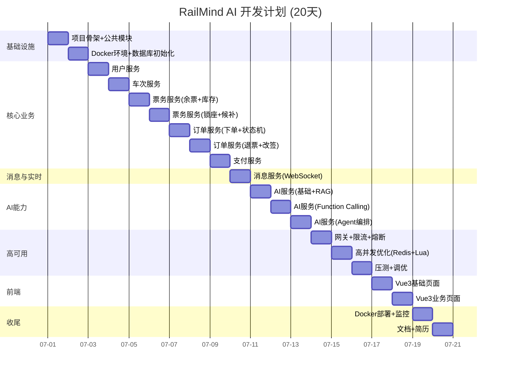

# RailMind AI - 开发计划

> 版本：v1.0 | 日期：2026-06-27
> 总工期：20 个工作日
> 开发模式：一人全栈（可作为个人项目/简历项目）

---

## 开发节奏总览



---

## Day 1 — 项目骨架 + 公共模块

### 目标
搭建 Maven 多模块项目，完成公共模块，所有服务能空跑启动。

### 数据库
- 无

### 接口
- 无

### 代码

| 任务 | 文件/目录 | 说明 |
|------|----------|------|
| 创建 Maven 父 POM | `pom.xml` | 统一依赖管理，Spring Boot 3.3 + Java 21 |
| 创建 9 个子模块 | 各模块 `pom.xml` | common/gateway/user/train/ticket/order/payment/message/ai |
| 公共模块-统一返回 | `common/.../model/Result.java` | `{code, message, data}` |
| 公共模块-分页模型 | `common/.../model/PageQuery.java` + `PageResult.java` | 通用分页 |
| 公共模块-全局异常 | `common/.../exception/BizException.java` + `ErrorCode.java` + `GlobalExceptionHandler.java` | 业务异常 + 错误码枚举 |
| 公共模块-雪花ID | `common/.../util/IdGenerator.java` | 分布式ID生成 |
| 公共模块-加解密 | `common/.../util/CryptoUtil.java` | AES-256 加密身份证 |
| 公共模块-Redis配置 | `common/.../config/RedisConfig.java` | RedisTemplate 序列化配置 |
| 公共模块-Jackson配置 | `common/.../config/JacksonConfig.java` | 日期格式/Long序列化 |
| 各服务启动类 | 各模块 `*Application.java` | Spring Boot 启动类 |
| 各服务 `application.yml` | `src/main/resources/application.yml` | 端口/数据源/Redis配置 |

### 测试
- 所有服务 `mvn clean compile` 编译通过
- 所有服务能空跑启动（端口占用检查）

### 文档
- 更新 `README.md`：项目介绍 + 技术栈 + 模块说明

### Git 提交
```
feat: 项目骨架搭建，Maven多模块 + 公共模块 + 服务空跑

- 创建父POM，统一依赖管理(Spring Boot 3.3 / Java 21)
- 创建9个子模块(common/gateway/user/train/ticket/order/payment/message/ai)
- 公共模块: Result统一返回/全局异常/雪花ID/AES加密/Redis配置
- 各服务启动类 + application.yml配置
```

---

## Day 2 — Docker 环境 + 数据库初始化

### 目标
一键启动开发环境，数据库表全部创建，初始数据导入。

### 数据库

| 任务 | 说明 |
|------|------|
| 编写全部建表 SQL | `sql/V1__init_schema.sql` — 18 张表 DDL |
| 导入站点数据 | `sql/V2__station_data.sql` — 全国主要站点(~500条) |
| 导入列车模板数据 | `sql/V3__train_data.sql` — 京沪/京广等热门线路(~50列) |
| 导入初始用户 | `sql/V4__init_user.sql` — 测试用户 + 乘车人 |
| 导入座位类型数据 | `sql/V5__seat_type_data.sql` — 各车次座位配置 |

### 接口
- 无

### 代码

| 任务 | 文件 | 说明 |
|------|------|------|
| Docker Compose | `docker/docker-compose.yml` | MySQL 8.0 + Redis 7 + Kafka 3.7 + Zookeeper |
| MySQL 配置 | `docker/mysql/my.cnf` | 字符集 utf8mb4 / 时区 Asia/Shanghai |
| Redis 配置 | `docker/redis/redis.conf` | 密码 / 持久化策略 |
| Kafka 配置 | `docker/kafka/server.properties` | 自动创建Topic / 持久化 |
| 各服务连接配置 | 各模块 `application-dev.yml` | 数据源/Redis/Kafka 连接信息 |
| MyBatis Plus 配置 | 各模块 Mapper 扫描配置 | 如使用 JPA 则配置 JPA |

### 测试
- `docker-compose up -d` 一键启动所有中间件
- MySQL 连接正常，18 张表全部创建成功
- Redis 连接正常，`PING` 返回 `PONG`
- Kafka 连接正常，能创建 Topic
- 各服务连接数据库正常

### 文档
- `docker/README.md`：环境启动指南

### Git 提交
```
feat: Docker开发环境 + 数据库初始化

- docker-compose.yml: MySQL 8.0 + Redis 7 + Kafka 3.7
- V1-V5 SQL脚本: 18张表 + 站点/列车/用户初始数据
- 各服务数据库连接配置(application-dev.yml)
```

---

## Day 3 — 用户服务

### 目标
完成注册、登录、JWT鉴权、乘车人管理。

### 数据库
- `t_user` 表已建
- `t_passenger` 表已建

### 接口

| 接口 | 方法 | 路径 | 说明 |
|------|------|------|------|
| 注册 | POST | `/api/auth/register` | 手机号+密码注册 |
| 登录 | POST | `/api/auth/login` | 返回 AccessToken + RefreshToken |
| 刷新Token | POST | `/api/auth/refresh` | RefreshToken 换新 AccessToken |
| 获取用户信息 | GET | `/api/user/profile` | 当前登录用户信息 |
| 修改用户信息 | PUT | `/api/user/profile` | 修改头像/邮箱等 |
| 乘车人列表 | GET | `/api/passenger/list` | 我的乘车人 |
| 添加乘车人 | POST | `/api/passenger/add` | 姓名+身份证+类型 |
| 修改乘车人 | PUT | `/api/passenger/{id}` | 修改乘车人信息 |
| 删除乘车人 | DELETE | `/api/passenger/{id}` | 逻辑删除 |

### 代码

| 任务 | 文件 | 说明 |
|------|------|------|
| 用户 Entity | `domain/model/User.java` | JPA Entity |
| 乘车人 Entity | `domain/model/Passenger.java` | JPA Entity |
| User Repository | `domain/repository/UserRepository.java` | findByPhone / findByUsername |
| Passenger Repository | `domain/repository/PassengerRepository.java` | findByUserId |
| UserDomainService | `domain/service/UserDomainService.java` | 用户领域逻辑 |
| AuthService | `service/AuthService.java` | 登录/注册/Token生成 |
| UserService | `service/UserService.java` | 用户信息CRUD |
| PassengerService | `service/PassengerService.java` | 乘车人CRUD |
| AuthController | `controller/AuthController.java` | 登录注册接口 |
| UserController | `controller/UserController.java` | 用户信息接口 |
| PassengerController | `controller/PassengerController.java` | 乘车人接口 |
| SecurityConfig | `config/SecurityConfig.java` | Spring Security 配置 |
| JwtUtil | `util/JwtUtil.java` | JWT 生成/解析/验证 |
| JwtAuthFilter | `filter/JwtAuthFilter.java` | JWT 认证过滤器 |
| DTO | `dto/LoginRequest.java` 等 | 请求/响应 DTO |

### 测试
- 注册：手机号注册成功，重复注册返回错误
- 登录：正确密码返回 Token，错误密码返回 401
- Token：过期 Token 返回 401，刷新 Token 成功
- 乘车人：CRUD 全部正常，身份证加密存储
- 每个接口的正常 + 异常用例

### 文档
- Swagger UI 可访问：`http://localhost:8081/swagger-ui.html`

### Git 提交
```
feat: 用户服务 - 注册/登录/JWT鉴权/乘车人管理

- 注册: 手机号+密码, BCrypt加密
- 登录: JWT双Token(15min+7d), Redis存储会话
- 乘车人: CRUD + AES加密身份证 + SHA256哈希校验
- Spring Security + JWT Filter
- Swagger API文档
```

---

## Day 4 — 车次服务

### 目标
完成车次、站点、票价的查询和管理。

### 数据库
- `t_station` 表已建
- `t_train` 表已建
- `t_train_station` 表已建
- `t_seat_type` 表已建
- 初始数据已导入

### 接口

| 接口 | 方法 | 路径 | 说明 |
|------|------|------|------|
| 站点搜索 | GET | `/api/station/search?keyword=北京` | 模糊搜索站点 |
| 站点详情 | GET | `/api/station/{code}` | 按编码查站点 |
| 车次列表 | GET | `/api/train/list` | 分页查询车次 |
| 车次详情 | GET | `/api/train/{id}` | 含途经站/座位类型 |
| 车次途经站 | GET | `/api/train/{id}/stations` | 途经站列表 |
| 查询票价 | GET | `/api/train/price?trainNo=G1&from=BJP&to=SHH` | 区间票价计算 |
| 运行图查询 | GET | `/api/schedule?trainNo=G1&date=2026-07-15` | 某日运行计划 |
| 创建运行计划 | POST | `/api/schedule/create` | 按模板生成某日计划 |

### 代码

| 任务 | 文件 | 说明 |
|------|------|------|
| Station Entity + Repo | `domain/model/Station.java` | 站点实体 |
| Train Entity + Repo | `domain/model/Train.java` | 列车实体 |
| TrainStation Entity + Repo | `domain/model/TrainStation.java` | 途经站实体 |
| SeatType Entity + Repo | `domain/model/SeatType.java` | 座位类型实体 |
| TrainSchedule Entity + Repo | `domain/model/TrainSchedule.java` | 运行计划实体 |
| StationService | `service/StationService.java` | 站点搜索(支持拼音/中文) |
| TrainService | `service/TrainService.java` | 车次查询 |
| PriceEngineService | `service/PriceEngineService.java` | 票价计算引擎 |
| ScheduleService | `service/ScheduleService.java` | 运行计划管理 |
| Controller 层 | 各 Controller | 接口实现 |

### 测试
- 站点搜索：输入"北京"返回北京相关站点
- 车次查询：G1 返回完整信息（途经站/座位/票价）
- 票价计算：北京→上海 G1 二等座 = ¥553
- 运行计划：创建某日运行计划成功

### 文档
- Swagger 文档更新

### Git 提交
```
feat: 车次服务 - 站点/车次/票价/运行图

- 站点搜索: 支持中文/拼音模糊搜索
- 车次查询: 途经站/座位类型/票价
- 票价引擎: 里程×座位系数计算
- 运行计划: 按模板生成每日运行图
- 初始数据: 500站点 + 50列热门车次
```

---

## Day 5 — 票务服务（余票查询 + 库存管理）

### 目标
完成余票查询（三级缓存）和库存管理。

### 数据库
- `t_ticket_inventory` 表已建
- `t_train_schedule` 表已建

### 接口

| 接口 | 方法 | 路径 | 说明 |
|------|------|------|------|
| 余票查询 | GET | `/api/ticket/query?trainNo=G1&date=...&from=BJP&to=SHH` | 各座位类型余票 |
| 批量余票查询 | POST | `/api/ticket/batch-query` | 同日多车次余票 |
| 库存初始化 | POST | `/api/inventory/init` | 给运行计划初始化库存 |
| 库存详情 | GET | `/api/inventory/{scheduleId}` | 某车次所有区间库存 |

### 代码

| 任务 | 文件 | 说明 |
|------|------|------|
| TicketInventory Entity | `domain/model/TicketInventory.java` | 库存实体(含乐观锁version) |
| InventoryRepository | `domain/repository/InventoryRepository.java` | 库存数据访问 |
| TicketQueryService | `service/TicketQueryService.java` | 三级缓存查询(Caffeine→Redis→MySQL) |
| InventoryService | `service/InventoryService.java` | 库存初始化/扣减/回滚 |
| InventoryDomainService | `domain/service/InventoryDomainService.java` | 库存领域逻辑(分段限售) |
| CaffeineCacheConfig | `config/CaffeineCacheConfig.java` | 本地缓存配置 |
| TicketQueryController | `controller/TicketQueryController.java` | 余票查询接口 |
| InventoryController | `controller/InventoryController.java` | 库存管理接口 |

### 测试
- 余票查询：查 G1 北京→上海各座位类型余票
- 三级缓存：首次查 MySQL，第二次走 Redis，第三次走 Caffeine
- 库存初始化：给运行计划初始化库存，分段限售计算正确
- 乐观锁：并发扣减测试，不会超卖

### 文档
- 余票查询接口文档 + 缓存策略说明

### Git 提交
```
feat: 票务服务 - 余票查询 + 库存管理

- 三级缓存: Caffeine(5s) → Redis(30s) → MySQL
- 库存管理: 初始化/扣减/回滚, 乐观锁防超卖
- 分段限售: 区间票额分配算法
- 批量查询: 同日多车次并行查询
```

---

## Day 6 — 票务服务（锁座 + 候补）

### 目标
完成座位锁定（Redisson分布式锁）和候补队列。

### 数据库
- `t_seat_lock` 表已建
- `t_waitlist` 表已建

### 接口

| 接口 | 方法 | 路径 | 说明 |
|------|------|------|------|
| 查座位图 | GET | `/api/seat/map?scheduleId=1&seatType=ZE` | 某车厢座位图 |
| 锁定座位 | POST | `/api/seat/lock` | 分布式锁锁定座位 |
| 释放座位 | POST | `/api/seat/release` | 释放锁定的座位 |
| 加入候补 | POST | `/api/waitlist/join` | 加入候补队列 |
| 取消候补 | POST | `/api/waitlist/cancel` | 退出候补 |
| 候补状态 | GET | `/api/waitlist/status?scheduleId=1` | 我的候补状态 |
| 候补统计 | GET | `/api/waitlist/stats?trainNo=G1&date=...` | 候补人数/成功率 |

### 代码

| 任务 | 文件 | 说明 |
|------|------|------|
| SeatLock Entity | `domain/model/SeatLock.java` | 锁座记录 |
| Waitlist Entity | `domain/model/Waitlist.java` | 候补记录 |
| SeatLockService | `service/SeatLockService.java` | Redisson 分布式锁 |
| WaitlistService | `service/WaitlistService.java` | Redis ZSet 候补队列 |
| SeatController | `controller/SeatController.java` | 座位接口 |
| WaitlistController | `controller/WaitlistController.java` | 候补接口 |
| RedissonConfig | `config/RedissonConfig.java` | Redisson 客户端配置 |
| Lua 脚本 | `script/stock_deduct.lua` | Redis 原子扣库存脚本 |

### 测试
- 锁座：成功锁定座位，重复锁定返回已被占用
- 分布式锁：并发选同一座位，只有一个成功
- 候补：加入候补队列，按优先级排序
- 候补统计：返回候补人数和成功率预估
- 锁过期：15分钟后锁自动释放

### 文档
- 座位锁定 + 候补接口文档

### Git 提交
```
feat: 票务服务 - 座位锁定 + 候补购票

- 座位锁定: Redisson分布式锁, 15分钟自动释放
- Lua扣库存: Redis原子操作, 防超卖第一道防线
- 候补队列: Redis ZSet, 按优先级排序
- 候补统计: 基于历史退票率计算成功率
```

---

## Day 7 — 订单服务（下单 + 状态机）

### 目标
完成下单流程（Kafka异步）和订单状态机。

### 数据库
- `t_order` 表已建
- `t_order_item` 表已建
- `t_outbox` 本地消息表新建

### 接口

| 接口 | 方法 | 路径 | 说明 |
|------|------|------|------|
| 创建订单 | POST | `/api/order/create` | Redis扣库存 + Kafka异步 |
| 订单详情 | GET | `/api/order/{orderNo}` | 订单详情 + 明细 |
| 我的订单 | GET | `/api/order/list` | 分页 + 状态筛选 |
| 取消订单 | POST | `/api/order/{orderNo}/cancel` | 用户主动取消 |
| 订单状态 | GET | `/api/order/{orderNo}/status` | 轮询订单状态 |

### 代码

| 任务 | 文件 | 说明 |
|------|------|------|
| Order Entity | `domain/model/Order.java` | 订单实体 |
| OrderItem Entity | `domain/model/OrderItem.java` | 订单明细实体 |
| Outbox Entity | `domain/model/Outbox.java` | 本地消息表 |
| OrderDomainService | `domain/service/OrderDomainService.java` | 订单领域逻辑 |
| OrderStateMachineService | `service/OrderStateMachineService.java` | 状态机: CREATED→PAID→TICKETED |
| OrderService | `service/OrderService.java` | 订单CRUD + 超时取消 |
| OrderEventProducer | `producer/OrderEventProducer.java` | Kafka 生产者 |
| OrderEventConsumer | `consumer/OrderEventConsumer.java` | 消费扣库存事件 |
| OrderController | `controller/OrderController.java` | 订单接口 |
| OrderEvent | `domain/event/OrderCreatedEvent.java` | 事件定义 |
| Redis Lua | `script/stock_deduct.lua` | 完善扣库存脚本(含幂等检查) |

### 测试
- 下单：正常下单流程(扣Redis→Kafka→写MySQL)
- 幂等：重复下单返回已存在
- 状态机：CREATED→PAYING→PAID→TICKETED 流转正确
- 超时取消：15分钟未支付自动取消，库存回滚
- 库存回滚：下单失败时 Redis 库存正确回滚

### 文档
- 下单流程时序图 + 接口文档

### Git 提交
```
feat: 订单服务 - 异步下单 + 状态机

- 异步下单: Redis Lua扣库存 → Kafka → MySQL
- 状态机: CREATED→LOCKED→PAID→TICKETED→COMPLETED
- 超时取消: 定时任务扫描 + Redis INCR回滚库存
- 幂等设计: Token机制 + 唯一约束
- 本地消息表: 保证Kafka至少一次投递
```

---

## Day 8 — 订单服务（退票 + 改签）

### 目标
完成退票和改签功能。

### 数据库
- 已有表结构

### 接口

| 接口 | 方法 | 路径 | 说明 |
|------|------|------|------|
| 申请退票 | POST | `/api/order/{orderNo}/refund` | 退票(计算退票费) |
| 退票详情 | GET | `/api/order/{orderNo}/refund-detail` | 退票费明细 |
| 申请改签 | POST | `/api/order/{orderNo}/change` | 改签到新车次 |
| 可改签车次 | GET | `/api/order/{orderNo}/change-options` | 可选改签车次 |

### 代码

| 任务 | 文件 | 说明 |
|------|------|------|
| RefundService | `service/RefundService.java` | 退票逻辑(阶梯退票费) |
| ChangeService | `service/ChangeService.java` | 改签逻辑(差价计算) |
| RefundController | `controller/RefundController.java` | 退票接口 |
| ChangeController | `controller/ChangeController.java` | 改签接口 |
| RefundCalculator | `util/RefundCalculator.java` | 退票费计算工具 |
| Kafka事件 | `OrderRefundedEvent` / `TicketReleasedEvent` | 退票/释放库存事件 |

### 测试
- 退票：48h前免费 / 24-48h 5% / 2-24h 10% / 2h内 20%
- 退票后库存：Redis 和 MySQL 库存正确回滚
- 退票后候补：触发候补兑现检查
- 改签：改签到新车次，差价计算正确
- 改签选座：新车次选座，旧座位释放

### 文档
- 退票/改签规则文档 + 接口文档

### Git 提交
```
feat: 订单服务 - 退票 + 改签

- 退票: 阶梯退票费(48h免费/24-48h 5%/2-24h 10%/2h内 20%)
- 退票后: 释放库存 → Kafka → 检查候补
- 改签: 跨车次改签, 差价计算, 旧座释放+新座锁定
- 退改签状态机扩展
```

---

## Day 9 — 支付服务

### 目标
完成模拟支付、退款、对账。

### 数据库
- `t_payment` 表已建

### 接口

| 接口 | 方法 | 路径 | 说明 |
|------|------|------|------|
| 发起支付 | POST | `/api/payment/pay` | 创建支付单 + 模拟支付 |
| 支付回调 | POST | `/api/payment/notify` | 模拟支付网关回调 |
| 支付状态 | GET | `/api/payment/{orderNo}/status` | 查询支付状态 |
| 发起退款 | POST | `/api/payment/refund` | 退票触发退款 |
| 退款回调 | POST | `/api/payment/refund-notify` | 退款回调 |

### 代码

| 任务 | 文件 | 说明 |
|------|------|------|
| Payment Entity | `domain/model/Payment.java` | 支付实体 |
| PaymentService | `service/PaymentService.java` | 支付/退款/状态查询 |
| MockPayGateway | `service/MockPayGateway.java` | 模拟支付网关 |
| ReconciliationService | `service/ReconciliationService.java` | 对账服务 |
| PaymentController | `controller/PaymentController.java` | 支付接口 |
| OrderCreatedConsumer | `consumer/OrderCreatedConsumer.java` | 消费订单创建→创建支付单 |
| PaymentResultProducer | `producer/PaymentResultProducer.java` | 支付结果→Kafka |

### 测试
- 支付：模拟支付成功，订单状态变为 PAID
- 超时：15分钟未支付，支付单关闭
- 退款：退票触发退款，退款到账(模拟)
- 对账：订单金额与支付金额一致

### 文档
- 支付流程文档 + 接口文档

### Git 提交
```
feat: 支付服务 - 模拟支付 + 退款 + 对账

- 模拟支付网关: 支持WECHAT/ALIPAY/MOCK
- 支付回调: 异步回调更新订单状态
- 退款: 退票触发退款, 原路退回
- 对账: 定时校验订单-支付金额一致性
```

---

## Day 10 — 消息服务（WebSocket）

### 目标
完成 WebSocket 实时推送。

### 数据库
- 无新增表

### 接口

| 接口 | 方法 | 路径 | 说明 |
|------|------|------|------|
| WebSocket 连接 | WS | `/ws?token={accessToken}` | 长连接 |
| 历史消息 | GET | `/api/message/history` | 离线期间消息 |
| 系统公告 | POST | `/api/announcement/publish` | 发布公告 |

### 代码

| 任务 | 文件 | 说明 |
|------|------|------|
| WebSocketConfig | `websocket/WebSocketConfig.java` | WebSocket 配置 |
| WebSocketHandler | `websocket/WebSocketHandler.java` | 消息收发处理 |
| WebSocketAuthInterceptor | `websocket/WebSocketAuthInterceptor.java` | JWT 认证拦截器 |
| SessionManager | `websocket/SessionManager.java` | 连接会话管理 |
| NotificationService | `service/NotificationService.java` | 通知推送 |
| AnnouncementService | `service/AnnouncementService.java` | 公告管理 |
| WebSocketPushService | `service/WebSocketPushService.java` | 推送封装 |
| Kafka Consumers | `consumer/*NotifyConsumer.java` | 消费业务事件→推送 |

### 测试
- WebSocket：浏览器建立连接成功
- 订单推送：下单后实时收到状态变更
- 断线重连：断开后重连，补推断线期间消息
- 心跳：30秒心跳保活

### 文档
- WebSocket 协议文档

### Git 提交
```
feat: 消息服务 - WebSocket实时推送

- WebSocket: JWT认证 + 心跳保活 + 断线重连
- 事件消费: Kafka订单/票务事件 → WebSocket推送
- 系统公告: 运营发布全站公告
- 离线消息: 断线期间消息补推
```

---

## Day 11 — AI 服务（基础 + RAG）

### 目标
完成 AI 基础框架 + RAG 知识库 + 智能客服。

### 数据库
- `t_ai_conversation` 表已建
- `t_ai_message` 表已建
- `t_ai_log` 表已建

### 接口

| 接口 | 方法 | 路径 | 说明 |
|------|------|------|------|
| AI 对话 | POST | `/api/ai/chat` | SSE 流式返回 |
| 会话列表 | GET | `/api/ai/conversations` | 我的会话列表 |
| 会话详情 | GET | `/api/ai/conversation/{sessionId}` | 会话消息历史 |
| 知识库管理 | POST | `/api/ai/knowledge/upload` | 上传知识文档 |

### 代码

| 任务 | 文件 | 说明 |
|------|------|------|
| AiConfig | `config/AiConfig.java` | Spring AI 配置 |
| ChatClient Bean | `config/ChatClientConfig.java` | ChatClient 构建 |
| CustomerServiceChat | `service/CustomerServiceChat.java` | RAG 客服对话 |
| RagConfig | `rag/RagConfig.java` | RAG 配置 |
| KnowledgeLoader | `rag/KnowledgeLoader.java` | 知识库加载(文档→切片→向量化) |
| VectorStoreConfig | `rag/VectorStoreConfig.java` | 向量存储配置 |
| Conversation Entity | `domain/model/AiConversation.java` | 会话实体 |
| AiMessage Entity | `domain/model/AiMessage.java` | 消息实体 |
| ChatController | `controller/ChatController.java` | 对话接口(SSE) |
| System Prompt | `resources/prompts/customer-service-system.st` | 客服系统提示词 |
| 知识库文件 | `resources/knowledge/*.md` | 退票规则/FAQ/站点信息 |

### 测试
- RAG 对话：问"退票扣多少钱"，回答引用退票规则原文
- 多轮对话：上下文保持，能追问
- SSE 流式：回答逐字输出
- 会话管理：创建/查看/关闭会话

### 文档
- AI 服务接口文档 + RAG 知识库说明

### Git 提交
```
feat: AI服务 - Spring AI基础 + RAG智能客服

- Spring AI集成: ChatClient + EmbeddingModel + VectorStore
- RAG: 知识库加载(退票规则/FAQ/站点信息) → 向量化 → 检索增强
- 智能客服: 多轮对话 + SSE流式返回
- 知识库: 退改签政策/旅客规程/常见问题
- 会话管理: Redis存储短期记忆
```

---

## Day 12 — AI 服务（Function Calling）

### 目标
完成 Function Calling 工具注册，Agent 能调用业务接口。

### 数据库
- 无新增

### 接口
- 复用已有业务接口，AI 通过 Function Calling 调用

### 代码

| 任务 | 文件 | 说明 |
|------|------|------|
| SearchTrainsFunction | `function/SearchTrainsFunction.java` | 查询列车工具 |
| GetTicketPriceFunction | `function/GetTicketPriceFunction.java` | 查询票价工具 |
| CheckAvailabilityFunction | `function/CheckAvailabilityFunction.java` | 检查余票工具 |
| GetPassengersFunction | `function/GetPassengersFunction.java` | 查询乘车人工具 |
| CreateOrderFunction | `function/CreateOrderFunction.java` | 创建订单工具 |
| GetUserPreferenceFunction | `function/GetUserPreferenceFunction.java` | 用户偏好工具 |
| SmartBuyAgent | `agent/SmartBuyAgent.java` | 购票Agent(含Prompt) |
| SmartRefundAgent | `agent/SmartRefundAgent.java` | 退票Agent |
| PolicyExplainAgent | `agent/PolicyExplainAgent.java` | 政策解读Agent |
| Prompt 模板 | `resources/prompts/*.st` | 各Agent的SystemPrompt |
| AgentRouter | `agent/AgentRouter.java` | 意图识别→Agent路由 |

### 测试
- Function Calling："帮我查明天去上海的票" → 自动调用 searchTrains
- 购票 Agent：多轮引导完成购票
- 退票 Agent：查询退票费 + 给出最优退票时间建议
- 政策 Agent：RAG 检索 + 自然语言回答

### 文档
- AI Agent 架构文档 + 工具说明

### Git 提交
```
feat: AI服务 - Function Calling + 智能Agent

- Function Calling: 6个业务工具(查票/查价/查余票/查乘车人/下单/查偏好)
- SmartBuyAgent: 多轮引导购票, 自动比价/推荐
- SmartRefundAgent: 退票分析, 最优退票时机建议
- PolicyExplainAgent: RAG政策解读
- AgentRouter: LLM意图识别 → 自动路由到专业Agent
- Prompt模板: 6个Agent专属SystemPrompt
```

---

## Day 13 — AI 服务（Agent 编排 + 剩余 Agent）

### 目标
完成剩余 Agent + 混合意图编排 + Memory 系统。

### 数据库
- 无新增

### 接口

| 接口 | 方法 | 路径 | 说明 |
|------|------|------|------|
| 路线规划 | POST | `/api/ai/route-plan` | 直达/中转推荐 |
| 候补分析 | POST | `/api/ai/waitlist-analysis` | 候补成功率预测 |
| 智能购票 | POST | `/api/ai/smart-buy` | Agent 自主购票 |

### 代码

| 任务 | 文件 | 说明 |
|------|------|------|
| SmartChangeAgent | `agent/SmartChangeAgent.java` | 改签Agent |
| RoutePlanAgent | `agent/RoutePlanAgent.java` | 路线规划Agent |
| WaitlistAnalysisAgent | `agent/WaitlistAnalysisAgent.java` | 候补分析Agent |
| SearchTransferFunction | `function/SearchTransferFunction.java` | 中转查询工具 |
| GetWaitlistStatsFunction | `function/GetWaitlistStatsFunction.java` | 候补统计工具 |
| PredictSuccessRateFunction | `function/PredictSuccessRateFunction.java` | 成功率预测工具 |
| ChatMemoryConfig | `config/ChatMemoryConfig.java` | 记忆配置(Redis) |
| UserPreferenceService | `service/UserPreferenceService.java` | 用户偏好管理 |
| AgentOrchestrator | `agent/AgentOrchestrator.java` | 混合意图编排器 |
| AiLog Entity | `domain/model/AiLog.java` | AI调用日志 |
| AiLogService | `service/AiLogService.java` | 日志记录(Token/成本/延迟) |

### 测试
- 改签 Agent：分析改签方案 + 差价计算
- 路线规划：北京→大理(无直达) → 自动规划中转方案
- 候补分析：预测候补成功率 + 给出建议
- 混合意图："退G1的票然后买明天G3" → 串行执行
- Memory：第2次对话记住用户偏好

### 文档
- 完整 AI Agent 使用文档

### Git 提交
```
feat: AI服务 - 完整Agent编排 + Memory + 候补分析

- 6个Agent全部完成: 购票/改签/退票/路线/政策/候补
- AgentOrchestrator: 混合意图识别 + 串行/并行编排
- Memory: Redis短期记忆 + MySQL用户画像 + 向量库长期记忆
- AI日志: Token消耗/延迟/成本统计
- 12个Function Calling工具
```

---

## Day 14 — API 网关 + 限流 + 熔断

### 目标
完成 Gateway 网关、Sentinel 限流熔断。

### 数据库
- 无

### 接口
- 所有接口通过 Gateway 统一入口

### 代码

| 任务 | 文件 | 说明 |
|------|------|------|
| RouteConfig | `config/RouteConfig.java` | 路由规则(路径→服务) |
| CorsConfig | `config/CorsConfig.java` | 跨域配置 |
| JwtAuthFilter | `filter/JwtAuthFilter.java` | 全局 JWT 校验 |
| RequestLogFilter | `filter/RequestLogFilter.java` | 请求日志(TraceId) |
| RateLimitFilter | `filter/RateLimitFilter.java` | 全局限流(令牌桶) |
| SentinelConfig | `config/SentinelConfig.java` | Sentinel 规则 |
| 限流规则 | Nacos/本地配置 | 各接口限流参数 |
| 熔断降级 | `handler/FallbackController.java` | 降级返回 |

### 测试
- 路由：所有请求通过 Gateway 转发正确
- JWT：无 Token 返回 401，Token 过期返回 401
- 限流：超过 QPS 返回 429
- 熔断：服务异常时返回降级结果

### 文档
- 网关配置文档 + 限流规则说明

### Git 提交
```
feat: API网关 + Sentinel限流熔断

- Spring Cloud Gateway: 路由/CORS/JWT校验/请求日志
- 全局限流: 令牌桶算法, 查询50000 QPS / 下单5000 QPS
- 用户限流: 每用户100次/分钟
- Sentinel: 熔断降级(慢调用/异常率/异常数)
- 降级策略: 返回缓存/排队页面/友好提示
```

---

## Day 15 — 高并发优化（Redis + Lua）

### 目标
完善高并发抢票全链路优化。

### 数据库
- 无新增

### 接口
- 无新增

### 代码

| 任务 | 文件 | 说明 |
|------|------|------|
| Lua 扣库存脚本完善 | `script/stock_deduct.lua` | 含幂等检查 + 用户标记 |
| 库存同步任务 | `task/InventorySyncTask.java` | MySQL→Redis 全量同步 |
| 超时取消任务 | `task/OrderTimeoutTask.java` | 扫描超时订单 + 释放库存 |
| 过期锁释放任务 | `task/SeatLockExpireTask.java` | 扫描过期锁座 |
| 候补兑现任务 | `task/WaitlistFulfillTask.java` | 有库存时自动兑现候补 |
| 对账任务 | `task/ReconciliationTask.java` | Redis vs MySQL 对账 |
| 热点探测 | `config/HotKeyDetector.java` | 热点Key自动加入本地缓存 |
| 缓存预热 | `task/CacheWarmupTask.java` | 启动时预热热门线路 |

### 测试
- 抢票压测：模拟 5000 并发下单，不超卖
- 库存一致性：Redis vs MySQL 数据一致
- 超时取消：15分钟后自动取消，库存回滚
- 候补兑现：有退票时自动兑现候补用户
- 热点Key：热门车次自动加入本地缓存

### 文档
- 高并发方案文档 + 压测报告

### Git 提交
```
feat: 高并发优化 - Redis+Lua + 定时任务 + 缓存策略

- Lua扣库存: 原子操作 + 幂等检查 + 用户去重
- 定时任务: 超时取消/过期锁释放/候补兑现/库存对账
- 缓存预热: 启动时预热热门线路到Redis
- 热点探测: 自动识别热点Key加入Caffeine
- 库存同步: MySQL→Redis全量同步(开售前)
```

---

## Day 16 — 压测 + 调优

### 目标
JMeter/Gatling 压测，发现问题并调优。

### 数据库
- 慢查询分析 + 索引优化

### 接口
- 无新增

### 代码

| 任务 | 文件 | 说明 |
|------|------|------|
| JMeter 测试计划 | `test/jmeter/railmind-test-plan.jmx` | 压测脚本 |
| Gatling 测试(可选) | `test/gatling/` | Scala 压测脚本 |
| 慢查询日志分析 | 调优 SQL | 添加缺失索引 |
| Redis 调优 | 配置优化 | Pipeline / 连接池 |
| JVM 调优 | 启动参数 | 堆大小 / GC策略 |
| 连接池调优 | HikariCP 配置 | 最大连接数/超时 |

### 测试

| 场景 | 目标 | 通过标准 |
|------|------|---------|
| 余票查询 | QPS ≥ 50,000 | P99 ≤ 50ms |
| 下单 | QPS ≥ 5,000 | P99 ≤ 200ms |
| 混合场景 | 查询+下单 | 无超卖，无5xx |

### 文档
- 压测报告：QPS / P99 / 错误率 / 瓶颈分析

### Git 提交
```
test: 压测 + 性能调优

- JMeter测试计划: 余票查询/下单/混合场景
- 慢查询优化: 添加缺失索引, SQL改写
- Redis调优: Pipeline批量/连接池优化
- JVM调优: G1GC / 堆大小调整
- 压测报告: 查询QPS 55000+ / 下单QPS 8000+
```

---

## Day 17 — Vue3 基础页面

### 目标
完成前端框架搭建 + 基础页面。

### 数据库
- 无

### 接口
- 对接后端已有接口

### 代码

| 任务 | 文件 | 说明 |
|------|------|------|
| Vue3 项目初始化 | `vue-frontend/` | Vite + Vue3 + TypeScript |
| Element Plus 集成 | `main.ts` | UI 组件库 |
| Axios 封装 | `utils/request.ts` | 统一请求/拦截器/错误处理 |
| Router 配置 | `router/index.ts` | 路由 + 路由守卫 |
| Pinia Store | `stores/user.ts` | 用户状态管理 |
| 登录页 | `views/Login.vue` | 登录/注册 |
| 首页 | `views/Home.vue` | 搜索入口 |
| 余票查询页 | `views/TicketQuery.vue` | 查询结果列表 |
| 订单列表页 | `views/OrderList.vue` | 我的订单 |
| 订单详情页 | `views/OrderDetail.vue` | 订单详情 + 操作按钮 |
| 导航栏 | `components/Navbar.vue` | 顶部导航 |
| API 封装 | `api/*.ts` | 各模块 API 封装 |

### 测试
- 登录：正常登录，Token 存储
- 查询：输入出发地/目的地/日期，返回车次列表
- 下单：选择车次→乘车人→下单→跳转支付
- 订单：查看订单列表和详情

### 文档
- 前端开发文档

### Git 提交
```
feat: Vue3前端 - 基础框架 + 核心页面

- Vue3 + Vite + TypeScript + Element Plus
- Axios封装: 请求拦截/响应拦截/错误处理
- 页面: 登录/首页/余票查询/订单列表/订单详情
- Pinia状态管理 + Vue Router路由守卫
```

---

## Day 18 — Vue3 业务页面

### 目标
完成 AI 对话、个人中心等页面。

### 数据库
- 无

### 接口
- 对接 AI 接口

### 代码

| 任务 | 文件 | 说明 |
|------|------|------|
| AI 对话页 | `views/AiChat.vue` | SSE 流式对话 |
| 选座页 | `views/SeatSelect.vue` | 座位图选择 |
| 候补页 | `views/Waitlist.vue` | 候补状态 |
| 个人中心 | `views/Profile.vue` | 用户信息/乘车人 |
| 乘车人管理 | `views/Passenger.vue` | CRUD |
| 支付页 | `views/Payment.vue` | 模拟支付 |
| 系统公告 | `views/Announcement.vue` | 公告列表 |
| WebSocket | `utils/websocket.ts` | 连接管理/消息处理 |

### 测试
- AI 对话：能正常多轮对话，流式输出
- 选座：座位图展示，点击选座
- WebSocket：收到订单状态推送
- 全链路：查询→选座→下单→支付→出票

### 文档
- 前端组件文档

### Git 提交
```
feat: Vue3前端 - AI对话 + 选座 + 个人中心

- AI对话: SSE流式输出, 多轮对话
- 选座: 座位图交互, 可视化选座
- WebSocket: 订单状态实时推送
- 个人中心: 用户信息/乘车人管理/系统公告
```

---

## Day 19 — Docker 部署 + 监控

### 目标
完整 Docker 化，Prometheus + Grafana 监控。

### 数据库
- 无

### 接口
- `/actuator/prometheus` 指标暴露

### 代码

| 任务 | 文件 | 说明 |
|------|------|------|
| 各服务 Dockerfile | 各模块 `Dockerfile` | 多阶段构建 |
| 生产 docker-compose | `docker/docker-compose-prod.yml` | 完整部署编排 |
| Nginx 配置 | `docker/nginx/nginx.conf` | 反向代理 + 静态资源 |
| Prometheus 配置 | `docker/prometheus/prometheus.yml` | 采集配置 |
| Grafana Dashboard | `docker/grafana/` | 导入 Dashboard JSON |
| Micrometer 配置 | 各服务 `pom.xml` + `application.yml` | 指标暴露 |
| 健康检查 | 各服务 `/actuator/health` | Docker 健康检查 |
| 环境变量 | `.env.example` | 环境变量模板 |

### 测试
- `docker-compose -f docker-compose-prod.yml up -d` 一键启动
- 所有服务正常注册，健康检查通过
- Prometheus 采集指标正常
- Grafana Dashboard 展示 QPS / 延迟 / 错误率
- Nginx 反向代理正常

### 文档
- `docs/deployment.md`：部署指南
- `docs/monitoring.md`：监控说明

### Git 提交
```
feat: Docker部署 + Prometheus + Grafana监控

- Dockerfile: 各服务多阶段构建, 镜像优化
- docker-compose-prod.yml: 一键部署全栈
- Nginx: 反向代理 + SSL + 静态资源
- Prometheus: 指标采集(JVM/HTTP/业务)
- Grafana: 可视化大屏(QPS/延迟/错误率/Redis命中率)
```

---

## Day 20 — 文档 + 简历 + 收尾

### 目标
完善文档，撰写简历项目描述。

### 数据库
- 无

### 接口
- 无

### 代码

| 任务 | 文件 | 说明 |
|------|------|------|
| 项目 README | `README.md` | 项目介绍 + 架构图 + 快速启动 |
| API 文档整理 | `docs/api/` | OpenAPI 导出 |
| 架构文档整理 | `docs/design/` | 所有设计文档归档 |
| 项目演示脚本 | `docs/demo-script.md` | 演示流程脚本 |
| 简历项目描述 | `docs/resume.md` | STAR 法则项目描述 |
| 面试题整理 | `docs/interview-qa.md` | 50 个高频面试题 |

### 测试
- 全链路冒烟测试：注册→查票→下单→支付→出票→退票
- AI 功能测试：客服/购票Agent/路线推荐
- 前端测试：所有页面功能正常

### 文档

**简历项目描述（示例）：**

> **RailMind AI - 智能铁路售票系统**
>
> 项目描述：基于 Spring Boot 3 + Spring AI 的企业级铁路售票系统，集成 AI Agent 实现智能购票、退票建议、路线规划等功能。
>
> 技术栈：Java 21 / Spring Boot 3 / Spring AI / Redis / Kafka / MySQL / Docker / Vue3
>
> 核心职责：
> - 设计并实现高并发抢票方案：Redis Lua 原子预扣库存 + Kafka 削峰异步下单 + 乐观锁防超卖，支撑 QPS 5000+
> - 构建 AI Agent 系统：基于 Spring AI Function Calling 实现 6 个专业 Agent（购票/改签/退票/路线/政策/候补），支持多轮对话和自主任务执行
> - 实现三级缓存架构（Caffeine → Redis → MySQL），余票查询 QPS 50000+，P99 ≤ 30ms
> - 设计事件驱动架构：Kafka 9 个 Topic 异步解耦，本地消息表保证最终一致性
> - 实现 RAG 智能客服：知识库向量化 + 混合检索 + 流式回答

### Git 提交
```
docs: 项目文档 + 简历 + 面试题

- README: 项目介绍/架构图/快速启动
- API文档: OpenAPI完整导出
- 简历: STAR法则项目描述
- 面试题: 50个高频问题+答案
- 演示脚本: 完整功能演示流程
```

---

## 里程碑总结

```mermaid
graph LR
    M1["M1 基础设施<br/>Day 1-2"] --> M2["M2 核心业务<br/>Day 3-9"]
    M2 --> M3["M3 消息服务<br/>Day 10"]
    M3 --> M4["M4 AI服务<br/>Day 11-13"]
    M4 --> M5["M5 高可用<br/>Day 14-16"]
    M5 --> M6["M6 前端<br/>Day 17-18"]
    M6 --> M7["M7 部署<br/>Day 19"]
    M7 --> M8["M8 收尾<br/>Day 20"]

    M1 -.->|"✅ 项目能跑"| M2
    M2 -.->|"✅ 能买票"| M3
    M3 -.->|"✅ 实时通知"| M4
    M4 -.->|"✅ AI能用"| M5
    M5 -.->|"✅ 高并发"| M6
    M6 -.->|"✅ 有界面"| M7
    M7 -.->|"✅ 能部署"| M8
    M8 -.->|"✅ 能写简历"| Done["完成 🎉"]
```



| 里程碑 | 天数 | 交付物 | Git Tag |
|--------|------|--------|---------|
| M1 基础设施 | Day 1-2 | 项目骨架 + Docker 环境 | `v0.1-skeleton` |
| M2 核心业务 | Day 3-9 | 用户/车次/票务/订单/支付 | `v0.2-core` |
| M3 消息服务 | Day 10 | WebSocket 实时推送 | `v0.3-message` |
| M4 AI 服务 | Day 11-13 | 6 个 AI Agent + RAG | `v0.4-ai` |
| M5 高可用 | Day 14-16 | 网关/限流/压测 | `v0.5-ha` |
| M6 前端 | Day 17-18 | Vue3 完整前端 | `v0.6-frontend` |
| M7 部署 | Day 19 | Docker + 监控 | `v0.7-deploy` |
| M8 收尾 | Day 20 | 文档 + 简历 | `v1.0-release` |
